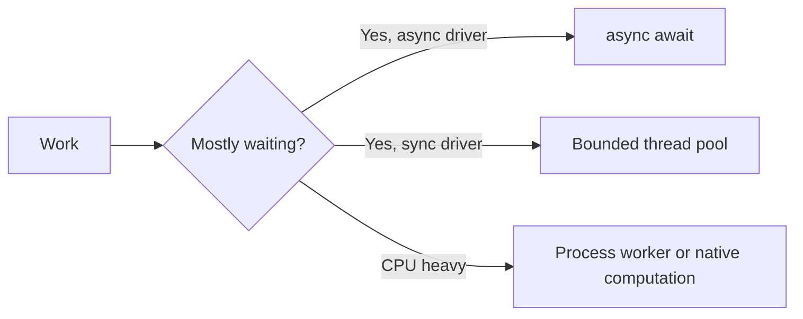
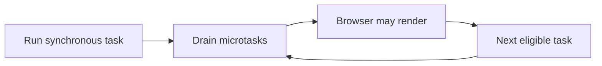
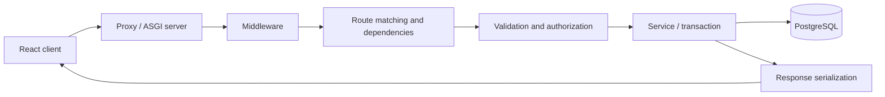
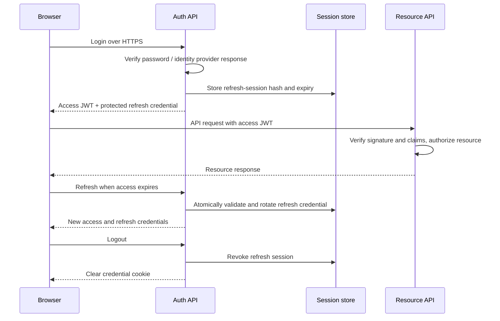
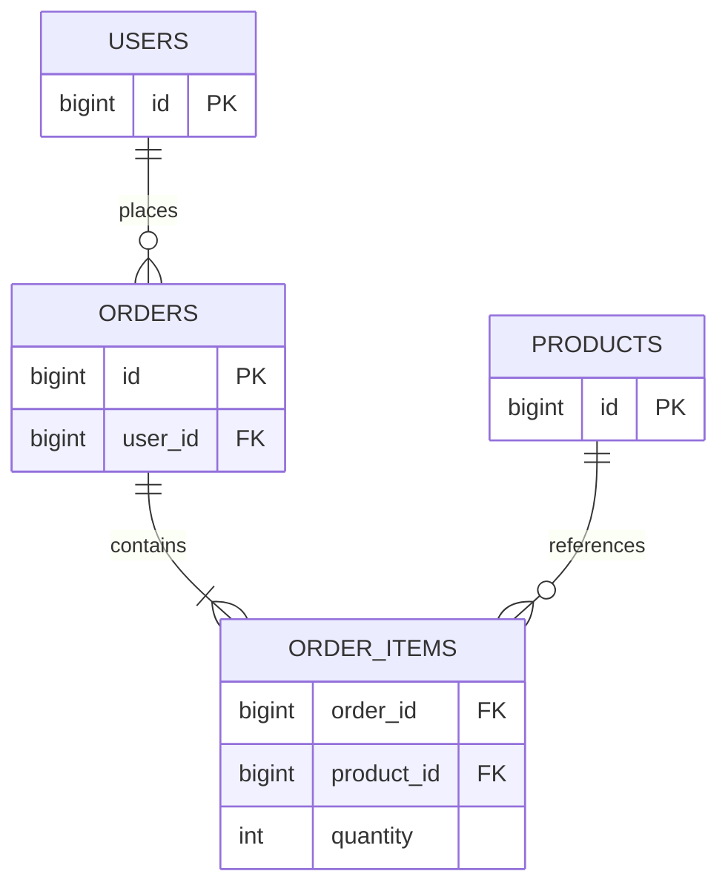
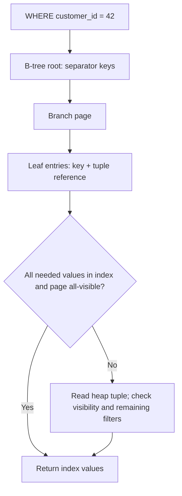
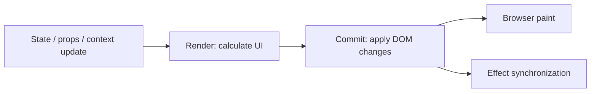
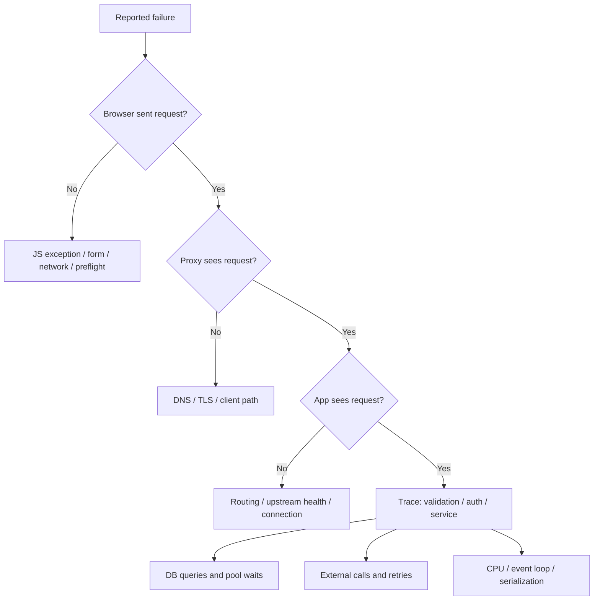
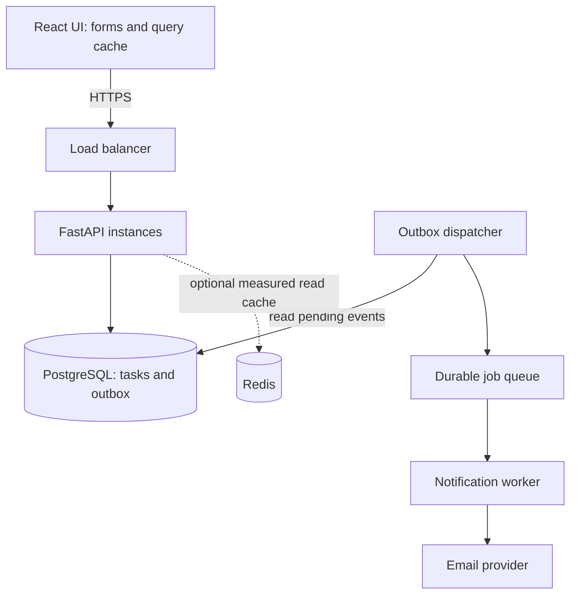
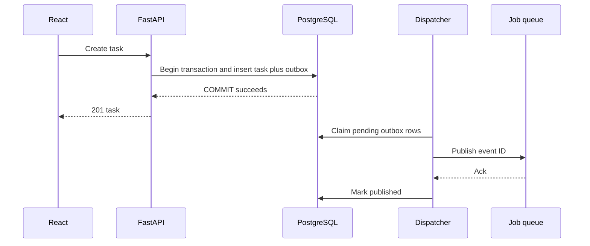

# Full-Stack Master Interview Guide — FastAPI + React + PostgreSQL

**Target:** 2.5 years actual experience, preparation at 3-year full-stack depth. **Language:** Hinglish. **Reviewed:** 23 September 2026.

Core definitions se practical debugging, concurrency, auth, system design aur advanced follow-ups tak. Har topic ko mechanism + example + trade-off + failure/test ke saath prepare karo. Exact employer questions guarantee nahi; priority actual job description ke according adjust karo.

**How to use:** [Roadmap](interview-prep/README.md) → chapters below → [PostgreSQL hands-on folder](postgres-practice/README.md) → mock. P0 fundamentals, P1 practical depth, P2 role-specific internals.

**Single source:** this file is generated from the linked reviewed chapter files using `python3 scripts/build_master_guide.py`. Edit those chapters, then rebuild; `--check` detects drift. Earlier duplicated claims and unverified first-person project metrics have been replaced with qualified explanations and practice templates. Existing PDF, if present, is not this revision.

**Scope and validation:** [Audit and official sources](interview-prep/SOURCES-AND-REVIEW.md). Illustrative snippets are labelled; this is a study guide, not a complete production app.

## Contents

1. [Python fundamentals](#chapter-01)
2. [Python OOP, runtime and async depth](#chapter-02)
3. [JavaScript core](#chapter-03)
4. [JavaScript declarations and language depth](#chapter-04)
5. [TypeScript contracts](#chapter-05)
6. [HTTP and FastAPI fundamentals](#chapter-06)
7. [Backend production patterns and ORM](#chapter-07)
8. [JWT, sessions, authentication and security](#chapter-08)
9. [SQL and database fundamentals](#chapter-09)
10. [PostgreSQL index internals and query tuning](#chapter-10)
11. [React core and hooks](#chapter-11)
12. [React, browser, forms and frontend depth](#chapter-12)
13. [API and production debugging](#chapter-13)
14. [System design with worked diagrams](#chapter-14)
15. [Operations, distributed systems and advanced electives](#chapter-15)
16. [Coding, SQL, mock questions and scorecard](#chapter-16)
17. [Coverage checklist and follow-up question bank](#chapter-17)

---

<a id="chapter-01"></a>

## 1. Python fundamentals

Source chapter: [01-python-quick-guide.md](interview-prep/00-start-here/01-python-quick-guide.md)

[Roadmap](interview-prep/README.md) · Next: [Backend / FastAPI](interview-prep/00-start-here/02-fastapi-quick-guide.md)

**Priority P0:** Har concept ka output predict karo, phir reason bolo. Python 3.11+ syntax use ki gayi hai; GIL discussion standard GIL-enabled CPython ke liye hai.

### 1. Names, mutation aur copying

Variable ek object ka naam hai. Function call mein local parameter bhi same object ko refer karta hai; parameter reassign karne se caller ka naam rebind nahi hota.

```python
def change(items):
    items.append(3)   # shared object mutate hua
    items = [99]      # sirf local name rebind hua

values = [1, 2]
change(values)
print(values)         # [1, 2, 3]

original = [[1], [2]]
copy = original.copy()
copy[0].append(9)
print(original)       # [[1, 9], [2]]: nested objects shared hain
```

**Interview mein:** “Python uses object sharing. In-place mutation visible hoti hai; rebinding local hoti hai. Shallow copy outer container copy karti hai.”

**Follow-up:** Tuple immutable hai, lekin tuple ke andar list mutate ho sakti hai. Har tuple hashable nahi—elements bhi hashable hone chahiye. `==` value equality, `is` identity; `None` check ke liye `is None`.

### 2. Mutable default trap

```python
def add(value, bucket=None):
    if bucket is None:
        bucket = []
    bucket.append(value)
    return bucket
```

`bucket=[]` default function definition par ek baar create hota hai. `bucket or []` mat use karo agar caller ki empty list ko mutate karna intended hai: woh empty list replace kar dega.

### 3. Collections aur complexity

| Type | Kab use karna | Interview detail |
|---|---|---|
| list | ordered sequence | index O(1), membership O(n), append amortized O(1) |
| dict | key → value lookup | average O(1), hashable keys, insertion order preserved |
| set | unique membership | average O(1), order par depend mat karo |
| tuple | fixed record | immutable container, hashability elements par depend |

Dict/set ke O(1) claims average case hain. Large input mein list membership ko repeatedly use karna accidentally O(n²) bana sakta hai.

### 4. Generator vs list

```python
def squares(limit):
    for n in range(limit):
        yield n * n

iterator = squares(3)
print(list(iterator))  # [0, 1, 4]
print(list(iterator))  # []: exhausted
```

Generator lazily values deta hai; poora output ek saath allocate nahi karta. Is example ka auxiliary memory bounded hai, lekin har generator constant-memory nahi hota—retained state aur consumer matter karte hain. `list(generator)` phir full result materialize karega.

### 5. Decorators, context managers, exceptions

Decorator behavior wrap karta hai; `functools.wraps` metadata preserve karta hai. Async function wrap kar rahe ho toh wrapper ko coroutine await karni hogi. Context manager resource lifetime define karta hai: `with open(...)` file close karta hai even on exception.

```python
from functools import wraps

def logged(fn):
    @wraps(fn)
    def wrapper(*args, **kwargs):
        print(f"calling {fn.__name__}")
        return fn(*args, **kwargs)
    return wrapper
```

**Follow-up:** `except Exception` karke silently success mat return karo. Specific exception handle karo, context log karo, unexpected error propagate karo. `finally` cleanup ke liye hai; `finally` mein return exception suppress kar sakta hai.

### 6. OOP jo explain kar paana chahiye

- Instance attribute per object; mutable class attribute sab instances share kar sakte hain.
- `@classmethod` ko `cls` milta hai, alternate constructors mein useful. `@staticmethod` ko implicit object/class nahi milta.
- Inheritance “is-a” relation; composition mein component inject hota hai. Payment service mein gateway inject karna testing easy banata hai.
- Dataclass internal data container; Pydantic external input validation. Type hints alone runtime checks nahi lagate.
- `super()` method-resolution order follow karta hai, sirf “direct parent” shortcut nahi.

### 7. Async, threads, processes



Coroutine cooperative concurrency deti hai. `await` potential suspension point hai; CPU loop ko parallel nahi banata. GIL-enabled CPython mein ek process mein ek thread Python bytecode execute karta hai at a time; I/O aur GIL-releasing native code ke cases alag hain. Optional free-threaded builds exist—interview mein runtime clarify karo.

```python
import asyncio

async def fetch_label(label):
    await asyncio.sleep(0.01)  # simulated non-blocking I/O
    return label

async def main():
    async with asyncio.TaskGroup() as group:
        a = group.create_task(fetch_label("A"))
        b = group.create_task(fetch_label("B"))
    return [a.result(), b.result()]
```

`TaskGroup` ordinary child failure par siblings cancel karke completion wait karta hai; cleanup phir bhi tumhari responsibility hai. Default `gather` first exception propagate karta hai, siblings automatically cancel nahi karta. Unbounded tasks DB pool overwhelm kar sakte hain; concurrency limit aur timeout lagao. [Python task documentation](https://docs.python.org/3/library/asyncio-task.html).

### Self-test (bina notes)

1. Shallow copy example ka output aur fix explain karo.
2. `def f(cache={})` bug reproduce karo.
3. Generator consume hone ke baad kya hota hai?
4. API call aur image resize ke concurrency choices alag kyun?
5. Class-level list kyun surprising ho sakti hai?

Depth: [reviewed OOP/runtime/async chapter](interview-prep/09-deep-dive/08-python-deeper-concepts.md). Supplementary historical references: [fundamentals](interview-prep/01-python-core/01-python-fundamentals.md), [OOP](interview-prep/01-python-core/02-python-oop.md), [async](interview-prep/01-python-core/03-python-async.md).

---

<a id="chapter-02"></a>

## 2. Python OOP, runtime and async depth

Source chapter: [08-python-deeper-concepts.md](interview-prep/09-deep-dive/08-python-deeper-concepts.md)

[Roadmap](interview-prep/README.md) · [Python fundamentals](interview-prep/00-start-here/01-python-quick-guide.md)

### 1. Python vs JavaScript transition

Python indentation blocks define karti hai, dynamic typing with optional static annotations. `None` absent value; truthiness empty containers/zero/False ko include karti hai. `and`/`or` operands return kar sakte hain, strictly bool nahi. `is` identity, `==` overloaded value equality; JS strict equality object behavior Python lists se different hai.

Python names scope LEGB: local, enclosing, global, builtins. Assigning name inside function normally local; `global`/`nonlocal` explicit rebinding choose. Function defaults definition-time; closures later binding read kar sakti hain.

```python
funcs = [lambda: n for n in range(3)]
assert [f() for f in funcs] == [2, 2, 2]
fixed = [lambda n=n: n for n in range(3)]
assert [f() for f in fixed] == [0, 1, 2]
```

### 2. args, kwargs, comprehensions, sorting

`*args` extra positional tuple; `**kwargs` keyword dict. `def f(x, /, *, mode)` positional-only x and keyword-only mode. Generator expressions lazy; list comprehension eagerly allocates list. Large comprehension still memory-heavy.

`sorted(items, key=...)` new list; `list.sort()` in-place and returns None. Python sort stable: equal keys relative order preserve. Hashability stable hash/equality contract hai, merely “immutable” synonym nahi. Dict/set collisions mean average O(1), worst-case assumptions discuss when needed. Tuple integer indexing O(1), membership scan O(n).

### 3. OOP: MRO, properties, protocols

`__init__` existing instance initialize karta hai; `__new__` instance create/return hook. `self` ordinary explicit first parameter by convention, instance bound method automatically supply karta hai. Class mutable attributes shared; instance attribute assignment shadow kar sakti hai.

`super()` method resolution order mein next implementation use karta hai; cooperative multiple inheritance compatible signatures needed. Encapsulation Python conventions/properties se, underscore security boundary nahi. Composition service dependency replace karke testing easy banati hai.

`@property` managed attribute syntax; descriptor `__get__`, `__set__`, `__delete__` attribute protocol. Methods/properties descriptor mechanism use karte hain. `__getattribute__` broad lookup, `__getattr__` missing attribute fallback; recursion trap avoid with base implementation.

ABC explicit abstract contract; Protocol structural type-checking contract. Dataclass methods generation, TypedDict dict shape typing (runtime validation nahi), Pydantic validation boundary. `__slots__` instance attribute layout constrain/save memory in some cases, universal leak fix nahi; inheritance/weakrefs matter.

### 4. Decorator factory, exception-safe timing

```python
import functools
import time

def timed(label):
    def decorate(fn):
        @functools.wraps(fn)
        def wrapped(*args, **kwargs):
            start = time.perf_counter()
            try:
                return fn(*args, **kwargs)
            finally:
                print(label, time.perf_counter() - start)
        return wrapped
    return decorate

@timed('sum')
def add(a, b):
    return a + b
```

Decorator factory arguments leta hai, decorator function leta hai, wrapper calls intercept karta hai. Async function ke liye `async def wrapped` and `await fn(...)` required to time execution not just coroutine creation. `wraps` metadata/`__wrapped__` preserve karta hai, wrapper calling convention magically change nahi karta.

Context manager `__enter__/__exit__`; exception suppress tab ho sakti hai when exit truthy return kare. `contextlib` generator context manager exactly one yield. Cleanup best effort Python execution ke andar; process hard kill par finally guarantee nahi.

### 5. Exceptions and resource safety

Specific exception catch, translate at HTTP boundary, traceback/context preserve (`raise ... from exc`). Bare except includes control exceptions; avoid blanket swallowing. Python cancellation `CancelledError` cleanup ke baad re-raise karo. `finally` return pending exception replace/suppress kar sakta hai.

Dependency setup partially fails toh already-created resources cleanup honi chahiye; async context managers/ExitStack helpful. Retrying whole function can duplicate side effects; transaction/provider idempotency align karo.

### 6. Async: scheduling, race, cancellation

Coroutine object create karna execution schedule nahi; await/create_task/TaskGroup needed. `await` completion-ready awaitable par event-loop handoff necessarily nahi. Multiple tasks same process memory share; await between read/write race create kar sakta hai even single event-loop thread.

```python
import asyncio

async def limited_jobs(items, operation):
    semaphore = asyncio.Semaphore(5)
    async def one(item):
        async with semaphore:
            async with asyncio.timeout(2):
                return await operation(item)
    return await asyncio.gather(*(one(item) for item in items))
```

Example active operations limit karta hai, but million-item iterable ke liye still million tasks create ho sakti hain. Bounded producer/consumer queue for huge streams better. Semaphore timeout starts after permit here; total queue+execution deadline chahiye toh placement/design change karo.

`asyncio.Lock` same loop tasks coordinate karta hai, distributed multi-worker stock invariant nahi. DB constraint/transaction required. Thread cancellation external work stop guarantee nahi; timeouts + cooperative cancellation + request result reconciliation design karo.

### 7. GIL, memory and runtime version

Standard GIL-enabled CPython one thread bytecode at a time per interpreter; native libraries may release GIL. Free-threaded builds exist, extension compatibility/runtime build matter. GIL compound business action atomic guarantee nahi. Processes avoid shared GIL but serialization/memory/process-start overhead add.

CPython uses reference counting plus cycle collection, with version/build-specific details (immortal objects/GC generations etc.). `del x` reference remove karta hai, necessarily object destroy nahi. Cache retains instance through key/value, unbounded tasks and native allocations common memory concerns. `lru_cache` default bounded hai; `maxsize=None` unbounded.

Source parse → code objects/bytecode → interpreter execution conceptual model. Opcode names, JIT/GC implementation details versions ke across change hote hain; interviews mein actual runtime clarify rather than outdated exact opcodes memorize.

### 8. Engineering questions

Virtual environment project Python dependencies isolate karta hai, OS/container isolation nahi. Lock/pin reproducible env, config secrets separate, package/module imports avoid circular design. `if __name__ == '__main__'` import side effects avoid/entrypoint define karta hai. Pytest fixtures lifecycle and dependency replacement cleanup; mutable global test state shared leakage avoid.

**Exit drill:** custom context manager, async cancellation reasoning, dataclass vs Pydantic, closure outputs, method binding, composition example and leak hypothesis explain karo.

---

<a id="chapter-03"></a>

## 3. JavaScript core

Source chapter: [10-javascript-fundamentals-guide.md](interview-prep/00-start-here/10-javascript-fundamentals-guide.md)

[Roadmap](interview-prep/README.md) · Next: [React](interview-prep/00-start-here/03-react-nextjs-quick-guide.md)

### 1. Scope, hoisting, closures

`var` function-scoped; `let`/`const` block-scoped. `let`/`const` declaration se pehle temporal dead zone mein hote hain. `const` binding reassign nahi hoti, object properties phir bhi mutate ho sakti hain.

```js
function counter() {
  let n = 0;
  return () => ++n;
}
const a = counter();
console.log(a(), a()); // 1 2
```

Closure lexical environment access preserve karta hai. React event/timer closure specific render ki values capture karti hai; stale closure ko dependencies/updater strategy se fix karte hain.

### 2. Event loop output (browser example)

```js
console.log('A');
setTimeout(() => console.log('B'), 0);
Promise.resolve().then(() => console.log('C'));
console.log('D');
// A D C B
```

Synchronous stack pehle finish; microtasks then drain; timer task baad mein eligible hota hai. `0` ms immediate execution guarantee nahi. Long synchronous task UI block karta hai; recursive microtasks tasks/render ko starve kar sakti hain. Browser aur Node scheduling details identical assume mat karo. [MDN execution model](https://developer.mozilla.org/en-US/docs/Web/JavaScript/Reference/Execution_model).



### 3. Promises aur async errors

`async` function Promise return karta hai. `await` current async flow pause karta hai, whole browser thread nahi. `Promise.all` independent operations concurrently await karta hai; first rejection par reject, remaining work automatically cancel nahi hota. `allSettled` sab outcomes deta hai.

```js
async function load(url, signal) {
  const response = await fetch(url, { signal });
  if (!response.ok) throw new Error(`HTTP ${response.status}`);
  return response.json();
}
```

`fetch` HTTP 404/500 par automatically reject nahi karta. AbortController cancellation request de sakta hai; remote side effect undo nahi karta. Sequential dependent requests mein `await` correct; independent requests unnecessarily serial mat karo.

### 4. `this`, prototypes aur equality

Regular function ka `this` call-site se aata hai; arrow enclosing lexical `this` use karta hai. Method detach karne par receiver lose ho sakta hai; bind/wrapper required ho sakta hai. Prototype chain property lookup enable karti hai; class syntax us model par built hai.

`===` type coercion avoid karta hai; objects identity se compare. `Object.is(NaN, NaN)` true aur `Object.is(0, -0)` false. Spread shallow copy hai; nested data shared reh sakta hai. `structuredClone` many structured values clone karta hai, functions/DOM nodes jaise cases support nahi karta.

### 5. Debounce vs throttle (write this)

```js
function debounce(fn, delay) {
  let timer;
  function debounced(...args) {
    clearTimeout(timer);
    timer = setTimeout(() => fn.apply(this, args), delay);
  }
  debounced.cancel = () => clearTimeout(timer);
  return debounced;
}
```

Debounce pause ke baad run: search. Throttle bounded frequency: scroll updates. React render mein new debouncer har baar banaya toh timers/state buggy ho sakte hain; stable lifecycle + cleanup chahiye.

### 6. Coding follow-ups

- `map` new result array; `forEach` return values collect nahi karta.
- `forEach(async ...)` promises await nahi karta; `for...of` sequential ya `Promise.all(items.map(...))` concurrent use karo, bounded input ke saath.
- Destructuring default only `undefined` ke liye, `null` ke liye nahi.
- `x ?? fallback` sirf nullish values; `x || fallback` zero/empty string bhi replace karta hai.
- Event delegation parent par listener lagata hai; `target` vs `currentTarget`, bubbling/capture explain karo.

**Self-test:** above loop output, closure counter, cancellable debounce aur failed fetch handling bina notes likho.

Depth: [JS question bank](interview-prep/questions-bank/10-javascript-and-event-loop-questions.md), [optional deep dive](interview-prep/advanced-optional/30-javascript-core-and-event-loop-deep-dive.md).

---

<a id="chapter-04"></a>

## 4. JavaScript declarations and language depth

Source chapter: [01-javascript-language.md](interview-prep/09-deep-dive/01-javascript-language.md)

[Roadmap](interview-prep/README.md) · [Quick JS guide](interview-prep/00-start-here/10-javascript-fundamentals-guide.md)

### let vs const vs var — full answer

| Property | var | let | const |
|---|---|---|---|
| Scope | function, otherwise script global | lexical block | lexical block |
| Same-scope redeclaration | allowed in ordinary var cases | not allowed | not allowed |
| Reassignment | allowed | allowed | not allowed |
| Initialization before declaration executes | `undefined` | uninitialized / TDZ | uninitialized / TDZ |
| Initializer required | no | no | yes in ordinary declaration |
| Per-iteration binding in `for` | shared binding | fresh binding | fresh binding in `for...of/in` |

“Hoisting” conceptual term hai: declarations scope setup mein recognized hoti hain. `let`/`const` ko “not hoisted” bolne se TDZ shadowing explain nahi hoti. Normal `const x;` syntax error hai; `for (const x of values)` valid hai. Top-level classic browser script ka `var` global-object property bana sakta hai; ES modules ka top-level scope alag hai. [MDN declarations and TDZ](https://developer.mozilla.org/en-US/docs/Web/JavaScript/Guide/Grammar_and_types).

```js
console.log(a); // undefined
var a = 10;

// Separate example: uncomment to see ReferenceError.
// console.log(b);
// let b = 20;

const user = { name: 'Asha' };
user.name = 'Neha'; // allowed: object changed, binding same
// user = {};      // TypeError if executed
```

**Follow-up:** `Object.freeze` shallow hai. Nested objects separately freeze na kiye toh mutate ho sakte hain. Immutable application updates aur runtime freezing different concepts hain.

### Closures: loop interview trap

```js
const shared = [];
for (var i = 0; i < 3; i++) shared.push(() => i);
console.log(shared.map(fn => fn())); // [3, 3, 3]

const separate = [];
for (let j = 0; j < 3; j++) separate.push(() => j);
console.log(separate.map(fn => fn())); // [0, 1, 2]
```

Closure value ka automatic frozen copy nahi; lexical binding access preserve karta hai. `var i` ek binding, `let j` per iteration separate. React mein each render ki lexical bindings alag hoti hain, isliye timer older render ka state read kar sakta hai.

### Types, coercion aur equality

Seven primitive categories: undefined, null, boolean, number, bigint, string, symbol. Objects/functions reference identity rakhte hain. `typeof null === 'object'` historical quirk; `Array.isArray` array check ke liye. `NaN !== NaN`; `Number.isNaN` coercion avoid karta hai. `0.1 + 0.2` binary floating-point exactly 0.3 nahi; money ke representation explicitly choose karo.

`==` abstract coercive comparison; `===` strict comparison. `Object.is` signed zero/NaN differences useful for React comparisons. `[] == false` true but `[]` truthy: conversion rules alag questions hain, contradictory nahi.

```js
console.log(0 || 10, 0 ?? 10); // 10 0
console.log('' || 'x', '' ?? 'x'); // x, empty string
console.log(null?.name); // undefined
const { x = 1 } = { x: null };
console.log(x); // null: default only for undefined
```

### this, call/apply/bind, prototypes

```js
'use strict';
function label(prefix) { return `${prefix}${this.name}`; }
const person = { name: 'Asha' };
console.log(label.call(person, 'Hi ')); // Hi Asha
console.log(label.apply(person, ['Hi '])); // Hi Asha
const bound = label.bind(person, 'Hi ');
console.log(bound()); // Hi Asha
```

Regular method ka receiver call expression decide karta hai. Arrow lexical `this` retain karta hai; `call`/`bind` uska `this` replace nahi karte. Arrow constructor nahi. `new` prototype linkage create karke constructor invoke karta hai. Class prototype methods share hote hain; instance arrow fields per instance function banati hain. Class syntax bhi prototype-based model hai; private `#fields` runtime private access semantics dete hain.

Property own object par nahi toh prototype chain lookup hoti hai. `Object.hasOwn` own property check karta hai. User input blindly object keys/prototypes mein merge karna security problem ho sakta hai; schema/allowlisted fields use karo.

### Functions, modules, collections

- Higher-order function function ko accept/return karti hai. Currying multi-argument call ko sequence of functions mein convert karta hai; partial application some arguments fix karti hai.
- Function declaration vs expression ka initialization timing different hai. Rest collects arguments; spread iterable/object contents expand karta hai, deep copy nahi.
- `map/filter/reduce` result intent se choose karo. `sort()` array mutate karta hai, default string ordering; numeric comparator `(a,b) => a-b`. Immutable option available ho toh `toSorted`, otherwise `[...arr].sort(...)`.
- Object keys strings/symbols; Map arbitrary key types. WeakMap object keys ko alive keep nahi karta; iterable/enumerable nahi.
- ES modules explicit import/export aur live bindings use karte hain. Tree-shaking bundler analysis hai, guaranteed zero unused code nahi; module side effects matter.

### Event loop: browser aur Node ko mix mat karo

Browser output drills [quick guide](interview-prep/00-start-here/10-javascript-fundamentals-guide.md) mein hain. Node mein libuv poll/timers/check phases hain. Top-level `setTimeout(0)` vs `setImmediate()` ka one universal order **nahi**. CommonJS top-level `nextTick` often Promise callbacks se pehle; ES-module execution context mein ordering differ kar sakti hai. Environment specify karke predict karo. [Node event loop](https://nodejs.org/en/learn/asynchronous-work/event-loop-timers-and-nexttick).

`Promise.all` rejection sibling I/O cancel nahi karti. `Promise.race` losers bhi run karte rehte hain. `Promise.any` first fulfillment, all rejected toh AggregateError. `finally` result normally preserve karta hai, lekin throw/rejected promise result replace kar sakta hai.

### Memory aur performance follow-ups

GC reachability par depend karta hai. Removed DOM node ko global variable/listener closure retain kare toh memory survive kar sakti hai. Cleanup timers/listeners/observers, bound caches, heap snapshot compare karo. “All primitives stack, all objects heap” language guarantee nahi—engine optimize kar sakta hai.

V8 parse/bytecode/JIT optimization use kar sakta hai; exact tiers version-specific. Stable object shapes helpful ho sakti hain, lekin interview mein premature engine micro-optimization ke bajaye algorithm, render workload aur measured hot path explain karo.

**Exit drill:** declaration table reproduce, loop closure output explain, Promise failure strategy likho, sort mutation bug fix karo, detached method ka `this` explain karo.

---

<a id="chapter-05"></a>

## 5. TypeScript contracts

Source chapter: [11-typescript-guide.md](interview-prep/00-start-here/11-typescript-guide.md)

[Roadmap](interview-prep/README.md) · [React](interview-prep/00-start-here/03-react-nextjs-quick-guide.md)

### Core answer

“TypeScript compile-time checks deta hai; network response runtime par automatically validate nahi hota. API boundary par schema validation/narrowing chahiye.”

`any` checks bypass karta hai; `unknown` use se pehle narrow karna padta hai. `as User` assertion data convert/validate nahi karta. Strict null checks missing values explicit banate hain.

### Type vs interface, generics

Interface object contracts aur declaration merging support karti hai. Type alias unions, tuples, intersections bhi represent karta hai. Dono object shapes express kar sakte hain; “interface always better” rule nahi.

```ts
function first<T>(items: readonly T[]): T | undefined {
  return items[0];
}

type Task = { id: string; title: string; completed: boolean };
type TaskPatch = Partial<Pick<Task, 'title' | 'completed'>>;
```

Generic relationship preserve karta hai; `any` relationship erase karega. `Partial<Task>` se ID bhi editable ho jaata, isliye writable keys deliberately choose kiye. Runtime API empty PATCH reject kar sakti hai even if type allows it.

### Impossible states reduce karo

```ts
type LoadState<T> =
  | { status: 'loading' }
  | { status: 'success'; data: T }
  | { status: 'error'; message: string };

function summary(state: LoadState<Task[]>): string {
  switch (state.status) {
    case 'loading': return 'Loading';
    case 'success': return `${state.data.length} tasks`;
    case 'error': return state.message;
    default: {
      const exhaustive: never = state;
      return exhaustive;
    }
  }
}
```

Discriminated union se `loading=true` aur contradictory data/error flags avoid hote hain. `never` exhaustive handling missing branch expose kar sakta hai.

### React typing checklist

Props explicit rakho; callback `(id: string) => void`; nullable refs/state handle karo. Browser event type aur DOM element generic match karo. Server response ko blindly `as Task[]` mat cast karo.

**Practice:** task form ke props, async load-state union, API error union aur editable patch type likho. `unknown` JSON ko checked domain value banane ka flow explain karo.

---

<a id="chapter-06"></a>

## 6. HTTP and FastAPI fundamentals

Source chapter: [02-fastapi-quick-guide.md](interview-prep/00-start-here/02-fastapi-quick-guide.md)

[Roadmap](interview-prep/README.md) · Prerequisite: [Python](interview-prep/00-start-here/01-python-quick-guide.md) · Next: [Database](interview-prep/00-start-here/04-database-quick-guide.md)

### 1. Request lifecycle explain karo



Yeh conceptual flow hai: dependency resolution aur input validation interleaved ho sakte hain. Uvicorn ASGI server hai, FastAPI web framework, Starlette web primitives deta hai aur Pydantic data validation karta hai.

**Interview answer:** “Route transport details handle karta hai, service business rules, DB constraints final integrity. Main request validation aur authorization ko alag checks maanta hoon.”

### 2. Minimal executable API: validation, path, query, response

Save as `main.py`; install FastAPI/Uvicorn in a virtual environment, then `uvicorn main:app --reload` for development.

```python
from typing import Annotated
from fastapi import FastAPI, Query
from pydantic import BaseModel, Field

app = FastAPI()

class QuoteIn(BaseModel):
    quantity: int = Field(gt=0, le=100)
    unit_price_paise: int = Field(ge=0)

class QuoteOut(BaseModel):
    total_paise: int

@app.post("/quotes", response_model=QuoteOut)
def quote(body: QuoteIn):
    return QuoteOut(total_paise=body.quantity * body.unit_price_paise)

@app.get("/items/{item_id}")
def item(item_id: int, limit: Annotated[int, Query(ge=1, le=100)] = 20):
    return {"id": item_id, "limit": limit}
```

Yeh calculation demo hai, trusted checkout nahi: real purchase mein price server-side catalog se aayegi. Integer paise ya decimal money ke liye useful hai; binary float rounding surprises de sakta hai.

Pydantic v2 mein `model_dump()`, `model_validate()` use karo. Default validation kuch coercion allow karti hai, jaise numeric string → integer; strictness explicitly choose karo. Output schema accidental fields filter karne mein help karti hai, authorization replace nahi karti. [Pydantic models](https://docs.pydantic.dev/latest/concepts/models/).

### 3. `async def` vs `def`

| Situation | Choice | Reason |
|---|---|---|
| async DB / HTTP client | `async def` + `await` | waiting ke dauran loop available |
| blocking sync SDK | sync route, ya bounded thread offload | loop block avoid |
| CPU-heavy report/image processing | process/worker | async CPU parallelism nahi deta |

FastAPI-called sync routes/dependencies thread pool mein run hote hain. Async route ke andar manually called normal helper automatically offload **nahi** hota. Blocking work us worker ka event loop stall karta hai; “poora multi-worker server freeze” universal statement nahi hai. [FastAPI concurrency](https://fastapi.tiangolo.com/async/).

**Follow-up:** More workers = more pools/memory. Example: 4 workers × (pool 10 + overflow 5) = up to 60 DB connections, before other services. Worker count load test se choose karo.

### 4. Dependency injection vs middleware

`Depends` per-route reusable requirements ke liye: current identity, permissions, session. Middleware broad request concerns ke liye: tracing, timings, headers. DI test mein replacement easy banata hai.

Illustrative SQLAlchemy wiring; `SessionFactory` configured `async_sessionmaker` hai:

```python
async def get_session():
    async with SessionFactory() as session:
        yield session

# Service owns transaction, not the cleanup block:
async def create_record(session, record):
    async with session.begin():
        session.add(record)
        await session.flush()
    return record
```

Commit response success se pehle karo taaki DB failure successful response ke baad surprise na ho. `yield` cleanup timing scope/version se related hai; resource background job mein pass mat karo, job apna session banaye. [FastAPI yield dependencies](https://fastapi.tiangolo.com/tutorial/dependencies/dependencies-with-yield/).

Ek `AsyncSession` multiple concurrent tasks mein share mat karo; session transaction state rakhti hai. Each concurrent task ko own session do, aur atomic operation ko ek transaction mein rakho. [SQLAlchemy asyncio](https://docs.sqlalchemy.org/en/20/orm/extensions/asyncio.html).

### 5. HTTP contract

| Code | Typical use |
|---|---|
| 200 / 201 / 202 / 204 | success / created / accepted but pending / no body |
| 400 | application-defined bad request |
| 401 / 403 | missing-invalid authentication / insufficient permission |
| 404 / 409 | missing resource / conflict such as duplicate version |
| 422 | FastAPI request validation default |
| 429 / 503 | rate limited / temporarily unavailable |

FastAPI malformed JSON bhi default request-validation flow mein 422 de sakta hai. “Bad JSON always 400” galat shortcut hai. Response validation bug server-side error hai; client input error ki tarah expose mat karo. [FastAPI error handling](https://fastapi.tiangolo.com/tutorial/handling-errors/).

PUT generally representation replace karta hai; PATCH partial update. Idempotent ka meaning repeated operation ka intended effect same—response code same hona zaroori nahi. POST ke retries ke liye operation-scoped idempotency key design kar sakte ho.

### 6. Auth interview answer

“Authentication se pata chalta hai user kaun hai; authorization se kis resource par kya kar sakta hai. Token valid hone ke baad bhi task ka owner/tenant check karunga.”

JWT encoded/signed ho sakta hai, encrypted by default nahi. Signature, allowed algorithm, expiry aur applicable issuer/audience verify karo. Password hash karo, reversible encrypt nahi. Browser session cookie mein HttpOnly/Secure/SameSite choose karo; cookie auth ke saath CSRF protections, bearer storage ke saath XSS threat consider karo. CORS browser cross-origin reading policy hai, API authorization nahi.

`GET /tasks/{id}` mein sirf ID lookup enough nahi: query ko authenticated user ke allowed tenant/project se scope karo. Tenant ID ko request body se blindly trust mat karo.

### 7. Background work, retries, idempotency

`BackgroundTasks` same app process mein response ke baad work run karta hai. Durable business workflow ke liye persisted jobs + worker + retries useful hain. Async background task mein blocking code event loop phir bhi block karega. [FastAPI background tasks](https://fastapi.tiangolo.com/tutorial/background-tasks/).

Timeout ka matlab remote side-effect definitely nahi hua, aisa nahi. Payment/report job retry par duplicate effect avoid karna padta hai. Retry transient errors only, capped exponential backoff + jitter; permanent validation failure retry mat karo. DB write aur job publication gap ke liye transactional outbox dekho [system design](interview-prep/00-start-here/05-system-design-quick-guide.md).

### 8. Testing aur production debugging

- Service unit tests: business rules, clock/payment client dependencies.
- API tests: invalid input, missing auth, wrong tenant, duplicate action, not-found.
- Real DB integration tests: unique constraint, rollback, concurrent update; ORM mock se yeh prove nahi hota.
- End-to-end: login → create → refresh → data persists.
- Slow API: request trace → DB time/pool wait → external API time → CPU/event-loop lag. Average ke saath p95/p99 dekho.

**Practice gate:** 60 minutes mein authenticated CRUD design karo; list filtering/pagination, transaction boundary aur test cases explain karo. Full task [coding round](interview-prep/00-start-here/12-scenario-coding-round.md) mein hai.

Depth: [reviewed production/ORM chapter](interview-prep/09-deep-dive/05-backend-production-patterns.md), [JWT/session chapter](interview-prep/09-deep-dive/02-auth-jwt-sessions.md). Supplementary historical references: [FastAPI core](interview-prep/02-fastapi-backend/04-fastapi-core.md), [advanced](interview-prep/02-fastapi-backend/05-fastapi-advanced.md), [ORM](interview-prep/02-fastapi-backend/06-databases-orm.md).

---

<a id="chapter-07"></a>

## 7. Backend production patterns and ORM

Source chapter: [05-backend-production-patterns.md](interview-prep/09-deep-dive/05-backend-production-patterns.md)

[Roadmap](interview-prep/README.md) · [Core FastAPI](interview-prep/00-start-here/02-fastapi-quick-guide.md)

### 1. HTTP aur REST fundamentals

Resource-oriented URLs (`/projects/{id}/tasks`), consistent contracts, pagination/filtering, auth and documented errors REST API design mein useful hain. REST sirf JSON transport ka synonym nahi. GET safe/read semantics rakho; mutation GET se mat karo. PUT intended replacement idempotent; PATCH partial change necessarily idempotent nahi (`increment` differs from `set`). DELETE repeated intended effect same ho sakta hai while second response 404 ho.

`Cache-Control: no-store` storage avoid karne ka directive; `no-cache` store allowed but reuse se pehle validation. ETag + If-None-Match conditional GET bandwidth reduce karta hai; If-Match precondition concurrent edit protect kar sakti hai, failed precondition typically 412. API versioning mein old clients, fields/defaults and deprecation window consider karo.

CORS security boundaries [auth chapter](interview-prep/09-deep-dive/02-auth-jwt-sessions.md) mein hain. HTTPS transit protect karta hai, authorization aur input validation replace nahi.

### 2. ASGI, concurrency aur worker resources

ASGI request/response events, WebSocket aur lifespan support karta hai. WSGI sync interface hai; deployment can use different worker models. Django bhi async support rakhta hai—“FastAPI only async framework” wrong.

A worker event loop cooperative tasks schedule karta hai. `await` already-ready result par necessarily yield nahi karta; actual awaitable semantics matter. Async I/O library driver needed; sync function simply `async def` label se nonblocking nahi banti. Thread pools finite hain; library limiter tokens OS thread count ka universal guarantee nahi.

Lifespan per process init/cleanup: shared HTTP client/pool reuse, shutdown close. Multi-worker app mein resources each process create karta hai. Timeout = connect/read/write/pool budgets plus overall deadline; per-read timeout full stream wall-time deadline same nahi.

### 3. ORM session, transaction aur connection

- Engine connections manage karta hai; pool usually lazily create/reuse karta hai, `pool_size` immediate prewarm guarantee nahi.
- Session ORM identity map + unit-of-work transaction state; constructing session immediately DB connection checkout imply nahi.
- Transaction atomic business operation. A request can have read-only/no DB work; request and transaction scopes related but not identical.
- `flush`: pending SQL DB ko send, constraints/generated IDs resolve; not durable commit.
- `commit`: transaction complete; `rollback`: failed transaction clear/undo transactional work.
- `refresh`: DB state explicitly reload; `expire_on_commit=False` expired-attribute refresh avoid, relationship preload nahi.

Session per concurrent task; open session ORM objects background worker ko pass mat karo. Async ORM attribute access implicit I/O trigger kar sakta hai (`MissingGreenlet`); eager load/explicit await/refresh choose. Lazy I/O bug ko “different OS thread error” assume mat karo. [SQLAlchemy async patterns](https://docs.sqlalchemy.org/en/20/orm/extensions/asyncio.html).

### 4. Concrete service transaction: stock reserve

Illustrative SQLAlchemy 2-style function; schema in [practice folder](postgres-practice/01-schema.sql). `session` caller provides fresh AsyncSession with no transaction already begun.

```python
from sqlalchemy import text

class OutOfStock(Exception):
    pass

async def reserve_stock(session, product_id: int, quantity: int):
    if quantity <= 0:
        raise ValueError('quantity must be positive')
    async with session.begin():
        result = await session.execute(text('''
            UPDATE interview_lab.inventory
            SET stock = stock - :quantity, version = version + 1
            WHERE product_id = :product_id AND stock >= :quantity
            RETURNING stock
        '''), {'product_id': product_id, 'quantity': quantity})
        stock = result.scalar_one_or_none()
        if stock is None:
            raise OutOfStock()
        # Related order/reservation insert belongs in THIS transaction.
    return stock  # commit has succeeded before success returned
```

Already-started session transaction ke upar blindly `.begin()` error de sakta hai; ownership boundary clear rakho. Dependency post-yield commit response sent ke baad defer mat karo. No-stock vs not-found business contract decide karo; boolean `if not stock` zero successful stock ko incorrectly reject karega.

### 5. Connection pooling and PgBouncer

Maximum app-side connections ≈ instances × processes × (pool_size + max_overflow), plus workers/admin tools. DB `max_connections` cap crossing refusals cause kar sakta hai, automatic “server crash” inevitable nahi.

PgBouncer transaction mode DB connection transaction lifetime tak multiplex karta hai, every statement ke immediately baad when transaction still open nahi. Session state features/prepared-statement support depend on versions/configuration. Transaction-local `set_config(..., true)` tenant context within explicit transaction use karo; verify RLS under real application role. Pooling throughput ceiling remove nahi karta; waiting/backpressure ab bhi needed.

### 6. Pagination, filters, validation

List cap, deterministic ordering, consistent cursor key and filters, authorization before results. Input sorting column names parameterized value placeholders se bind nahi hote; allowlist mapping use karo. SQLAlchemy expression building safe patterns use kar sakta hai; raw SQL f-string still vulnerable. Pydantic validation SQL injection defense by itself nahi.

PATCH `model_dump(exclude_unset=True)` omitted field vs explicit null distinguish karta hai. `str | None` without default Pydantic v2 mein required-but-nullable ho sakta hai. Empty patch, whitespace title, enum transitions validate karo. Input/output models separate; password hash output mein nahi.

### 7. Job queues, delivery and idempotency

Producer → broker → worker → optional result store. Reliability configuration se aati hai: broker persistence, publisher acknowledgment, consumer acknowledgment timing, visibility lease, retry/dead-letter policy. Queue use karna alone delivery guarantee nahi.

```text
Operation key scoped by (tenant, endpoint/action, client key)
  + request fingerprint
  + in-progress/completed status
  + saved result / outcome
  + expiry policy
```

Unique DB constraint concurrent same key serialize/dedup kare. Same key different payload reject. External call DB transaction ke andar long wait na rakho; persist intent + provider idempotency + reconciliation. Crash after provider success before local commit possible, so local unique row alone end-to-end exactly-once proof nahi.

Task retry transient exceptions only. Poison payload quarantine/DLQ, capped retries, jitter. Worker task apna DB session banaye. Cancellation thread/external service operation ko automatically stop nahi karti.

### 8. Webhook / payment / workflow integrations

Server calculates expected amount/currency/order, provider-hosted flow collects payment details, signed webhook/reconciliation confirms final status. Client success redirect ko fulfillment proof mat banao. Provider signature algorithm exact docs se use karo; raw request bytes verify; replay/timestamp policy provider-specific. Stripe/Razorpay header formats identical assume mat karo.

Durably record verified event before acknowledgment; unique provider event ID + payment state machine handle duplicates/out-of-order events. Amount/currency/merchant identity/order mapping verify against stored intent. Later failure event se succeeded order blindly downgrade mat karo; valid transitions define karo. Workflow tools such as n8n integration simplify kar sakte hain, but credentials, retries, audit and ownership still required.

### 9. Uploads / downloads / SSRF

Large uploads scoped short-lived presigned URL se object storage ja sakte hain; finalize ownership, actual size/type/hash and scanning policy verify karo. Declared MIME/client filename trustworthy nahi. Download authorization enforce, guessed path se access mat do. Stream/batch processing memory cap preserve karta hai.

User-supplied URL fetch can cause SSRF: restrict scheme/destination, resolve/validate network targets, redirects revalidate, egress policy, time/size limits. Private metadata endpoints expose mat karo. File paths normalize and confine allowed directory; arbitrary extraction path avoid.

### 10. Testing that finds real bugs

Unit: rules and pure transforms. API: validation, status, identity. Integration: real DB constraints, locks/transactions/migrations. E2E: user journey. Test distribution project risk pe choose, fixed 70/20/10 rule nahi.

HTTPX ASGITransport lifecycle startup automatically run assume mat karo; lifespan fixture/tool or context-managed TestClient configure karo. Test transaction isolation tab work karti hai jab app correct test-bound connection/session use kare; independently committed jobs/other connections automatically rollback nahi honge. Parallel tests separate DB/schema or controlled fixtures use karein.

Mock external service deterministic timeouts, malformed response, retry, partial stream. Mock ORM alone PostgreSQL correctness validate nahi karta. Contract code generation drift reduce karti hai; deployment mismatch/runtime malformed data impossible nahi banati.

### 11. Architecture for 3 years experience

```text
app/
  api/          routes, HTTP errors, input/output contracts
  services/     business operations, transaction ownership
  models/       ORM tables
  schemas/      Pydantic models
  core/         config, auth, DB, logging
  workers/      durable background operations
migrations/     reviewed schema changes
tests/          unit, API, DB integration
```

Small application mein unnecessary repository/interfaces layers mat force karo. Domain boundary useful ho toh modular monolith. Design judgment = constraint + alternative + cost + evidence, directory naming contest nahi.

---

<a id="chapter-08"></a>

## 8. JWT, sessions, authentication and security

Source chapter: [02-auth-jwt-sessions.md](interview-prep/09-deep-dive/02-auth-jwt-sessions.md)

[Roadmap](interview-prep/README.md) · [Backend basics](interview-prep/00-start-here/02-fastapi-quick-guide.md)

### 1. Pehle four terms separate karo

**HTTP stateless:** protocol requests ke beech login conversation automatically remember nahi karta. **Stateless API instance:** request kisi bhi replica par jaa sakti hai; required shared state local RAM mein locked nahi. **JWT:** claims carry karne ka token format. **Session:** login ki continuing relationship/lifecycle, usually expiry, device aur revocation policy ke saath.

JWT ki signature verify karne ke liye per-token session DB lookup **mandatory nahi**. Iska matlab complete auth system ko state ki zaroorat hi nahi, aisa nahi. User, roles, password, refresh credentials aur account disable status persistent facts hain.

**30-second interview answer:** “JWT access token ko server signature aur claims se validate kar sakta hai without a session lookup. Lekin immediate logout, device revoke, refresh rotation, password-change logout ya live permission changes chahiye toh server-side state useful ya necessary hoti hai. Short-lived stateless access tokens plus stateful refresh sessions ek common trade-off hai.”

### 2. Three valid designs compare karo

| Design | Every API request | Revocation | Trade-off |
|---|---|---|---|
| Opaque session ID cookie | shared session store lookup | session delete/revoke se next check reject | store availability/latency |
| Self-contained JWT access only | signature + claim validation | issued token usually expiry tak valid | immediate revoke difficult |
| Short access JWT + refresh session | access local validation; refresh store check | refresh revoked; access expiry tak valid unless extra checks | limited access revocation delay + refresh lifecycle |

Pure JWT design automatically wrong nahi. Agar short validity aur limited revoke delay acceptable hai toh valid choice. Simple browser app mein opaque session implementation easier ho sakti hai. JWT vs cookie false comparison hai: JWT **format**, cookie **transport/storage**; opaque ID bhi cookie mein jaa sakti hai.

### 3. Example login → access → refresh → logout

Times below design examples hain, universal recommendations nahi: access 10 min, refresh absolute 7 days.



Client storage choice next section mein hai. Browser access token memory mein ho toh reload par refresh/BFF flow chahiye. API replica stateless reh sakti hai, shared session store stateful ho sakta hai—contradiction nahi.

### 4. Refresh session mein kya store karein?

Illustrative schema, migrations/application code nahi:

```sql
CREATE TABLE refresh_sessions (
  id uuid PRIMARY KEY,
  user_id bigint NOT NULL,
  token_hash text NOT NULL UNIQUE,
  family_id uuid NOT NULL,
  created_at timestamptz NOT NULL,
  expires_at timestamptz NOT NULL,
  last_used_at timestamptz,
  revoked_at timestamptz
);
```

Raw high-entropy refresh credential ke bajaye hash store karo; password hashing aur random-token hashing ka threat model different hai. Token rotate karte waqt previous token consumed/revoked state aur family lineage retain karo taaki replay detect ho. Ek row overwrite karke old credential forget kar doge toh replay ko known-used token se distinguish nahi kar paoge.

Atomic transaction/compare-and-swap se only one rotation accept karo. Do tabs simultaneously refresh kar sakte hain; single-flight client coordination aur explicit server retry/grace policy choose karo. Har duplicate ko bina policy account compromise bolna legitimate sessions break kar sakta hai.

### 5. Logout ke baad JWT ka kya hoga?

Suppose token 10:00 issue, 10:10 expiry; user 10:02 logout. Browser token clear kar diya aur refresh revoke kiya, lekin stolen access token offline verifier ke liye 10:10 tak valid reh sakta hai.

Options:

1. **Accept bounded delay:** short access lifetime, sensitive operations additional check.
2. **Denylist `jti`:** revoked token ID expiry tak store; APIs lookup karti hain → verification path now state-dependent.
3. **Session/version check:** token carries `sid`/version, server compares active session/user version; global logout simple but every request lookup/cache has cost/staleness.
4. **Opaque token + introspection:** central status check; latency/availability trade-off.

Signing key rotate karna per-user logout mechanism nahi: all tokens signed by that key affect ho sakte hain. Refresh token revoke **already issued access tokens** ko automatically cryptographically invalidate nahi karta. [OWASP JWT guidance](https://cheatsheetseries.owasp.org/cheatsheets/JSON_Web_Token_Cheat_Sheet.html).

### 6. JWT validation checklist ka reasoning

Decoded payload trusted tab hota hai jab signature aur policy valid ho. Server-approved algorithms, trusted key source, `exp`, relevant `nbf`, expected `iss`/`aud`, required claims aur limited clock skew validate karo. Access token intended API ke liye hona chahiye; ID token ko arbitrary API access token mat samjho.

JWT header ka `kid` cached trusted issuer keys select karne ke kaam aa sakta hai. Token-provided arbitrary URL se signing key fetch mat karo. JWKS cache expiry + bounded unknown-key refresh + rotation overlap define karo; endless cache old keys par fail kar sakti hai, every request fetch auth provider overload kar sakta hai.

Signed JWT payload readable ho sakta hai: passwords/secrets/extra PII mat rakho. Signature data integrity/authenticity hai, confidentiality nahi.

### 7. Cookie, localStorage, CSRF aur XSS

| Mechanism | Helps with | Does not solve |
|---|---|---|
| HttpOnly | JS token read/exfiltration block | XSS can still perform authenticated actions |
| Secure | cookie HTTPS transmission | XSS/CSRF by itself |
| SameSite | some cross-site cookie sending | all CSRF cases, same-site malicious subdomain |
| CSRF token / Origin checks | unwanted browser-authenticated mutations | arbitrary trusted-origin XSS |
| CSP + output safety | script execution risk reduction | all injection or business auth flaws |

localStorage token JS-readable hai; malicious script read kar sakti hai. Header-only bearer request mein browser automatic credential attachment nahi karta, lekin app ki cookie-based refresh/login endpoints ko independently protect karna hota hai. Cookies ke Domain/Path scope, expiry aur credentials behavior intentional choose karo. [OWASP session lifecycle](https://cheatsheetseries.owasp.org/cheatsheets/Session_Management_Cheat_Sheet.html).

**Cross-origin ≠ cross-site:** `https://app.example.com` aur `https://api.example.com` different origins, generally same site. Isliye “subdomain hai toh SameSite=None compulsory” wrong. Fetch credentials/CORS config phir bhi matter karti hai. Credentialed CORS mein specific allowed origin, credentials allowance aur browser policy verify karo; wildcard origin workaround nahi.

### 8. OAuth2, OIDC, SSO, PKCE

OAuth2 delegated authorization framework; OIDC authentication identity layer. SPA Authorization Code + PKCE mein browser secret safely store nahi kar sakta; code verifier/challenge code interception risk reduce karte hain. Redirect URI exact registration, state/correlation, OIDC nonce where applicable aur validated issuer/client context use karo. Established library/provider flow follow karo.

BFF alternative: backend code exchange/token storage own karta hai; browser opaque HttpOnly session cookie rakhta hai. PKCE, client authentication aur browser CSRF protections different threats address karte hain. SSO means identity-provider login reuse; your app session, IdP session aur other apps ke sessions independent expiry/logout behavior rakh sakte hain.

Keycloak vocabulary: realm identity boundary, client registered app, roles/scopes claims/permissions model. Provider role claim ko business record ownership ka substitute mat banao. User role change ke baad JWT stale claims until expiry/check strategy apply hogi.

### 9. Authorization aur tenant isolation

Authentication “kaun?”; authorization “kis resource par kya?”. RBAC roles → permissions; ABAC resource/user attributes and conditions. Frontend hidden button UX hai, enforcement backend par.

Tenant context user ke verified memberships se derive/validate karo. Resource query tenant/project scope kare. Cache, exports, object-store download, WebSocket room aur background job mein same boundary enforce karo. PostgreSQL RLS defense in depth: owner/superuser/BYPASSRLS exceptions samjho, correct app role use karo, pooled connection par transaction-local context set karo.

### Interview follow-ups

- Redis down toh login/access? → selected design mein fail-open/closed behavior and cached-state staleness explicit.
- Account disabled now? → local JWT verification alone immediate status nahi jaanta.
- JWT stolen? → expiry/revocation scope, refresh family, incident response.
- 10 concurrent 401? → one refresh in-flight, bounded replay, no infinite interceptor loop.
- Logout all devices? → revoke user's refresh sessions; issued access token policy separately.
- Session fixation? → authenticate/privilege change par session identifier regenerate, old invalidate.

---

<a id="chapter-09"></a>

## 9. SQL and database fundamentals

Source chapter: [04-database-quick-guide.md](interview-prep/00-start-here/04-database-quick-guide.md)

[Roadmap](interview-prep/README.md) · Next: [System design](interview-prep/00-start-here/05-system-design-quick-guide.md)

**P0:** SQL likhna, data model defend karna, concurrent writes samajhna. Examples PostgreSQL ke hain.

### 1. Relational model aur constraints



Diagram business rule dikhata hai: submitted order mein at least one item. Sirf foreign keys se “at least one child” enforce nahi hota; transaction/service validation bhi chahiye.

- Primary key row identity; UNIQUE alternate uniqueness; FK referential integrity.
- `NOT NULL` required value; `CHECK (quantity > 0)` valid domain. PostgreSQL CHECK mein NULL pass ho sakta hai, isliye required columns par NOT NULL bhi.
- Many-to-many ke liye join table, e.g. `project_members(project_id, user_id)` with composite unique key.
- App-level “exists?” then insert race-safe nahi. Unique constraint final authority; conflict handle karo.

**Interview answer:** “Normalization repeated facts ko separate tables mein rakhti hai taaki update anomalies avoid hon. Order item ka purchase price historical snapshot hai, current product price se overwrite nahi karunga.”

1NF: repeating groups avoid; 2NF: non-key attributes poore candidate key par depend; 3NF: problematic transitive dependencies remove. Denormalize measured query need ke liye, with update/reconciliation strategy.

### 2. SQL runnable practice schema

Sandbox PostgreSQL database mein run karo:

```sql
CREATE TABLE users (
  id bigint PRIMARY KEY,
  name text NOT NULL
);
CREATE TABLE orders (
  id bigint PRIMARY KEY,
  user_id bigint NOT NULL REFERENCES users(id),
  total_paise bigint NOT NULL CHECK (total_paise >= 0),
  status text NOT NULL,
  created_at timestamptz NOT NULL
);
INSERT INTO users VALUES (1, 'Asha'), (2, 'Ravi'), (3, 'Neha');
INSERT INTO orders VALUES
 (101, 1, 5000, 'paid', '2026-09-01T10:00:00Z'),
 (102, 1, 7000, 'paid', '2026-09-02T10:00:00Z'),
 (103, 2, 2000, 'pending', '2026-09-03T10:00:00Z');
```

#### Q1. Har user ka paid order count, including zero?

```sql
SELECT u.id, u.name, COUNT(o.id) AS paid_count
FROM users u
LEFT JOIN orders o ON o.user_id = u.id AND o.status = 'paid'
GROUP BY u.id, u.name
ORDER BY u.id;
-- Asha 2, Ravi 0, Neha 0
```

`COUNT(*)` unmatched left row bhi count karega. `WHERE o.status='paid'` left join ke unmatched rows remove kar dega. `WHERE` rows filter karta hai; `HAVING` grouped results.

#### Q2. Har user ka latest order?

```sql
WITH ranked AS (
  SELECT o.*, ROW_NUMBER() OVER (
    PARTITION BY user_id ORDER BY created_at DESC, id DESC
  ) AS rn
  FROM orders o
)
SELECT id, user_id, total_paise FROM ranked WHERE rn = 1;
-- 102 for Asha, 103 for Ravi
```

Window function rows collapse nahi karta; GROUP BY aggregation karta hai. Ties ke liye `ROW_NUMBER`, `RANK`, `DENSE_RANK` ka expected behavior clarify karo. Second distinct salary ke liye DENSE_RANK useful; second row alag question hai.

#### Q3. Users with no orders?

```sql
SELECT u.id FROM users u
WHERE NOT EXISTS (SELECT 1 FROM orders o WHERE o.user_id = u.id);
-- 3
```

`NULL = NULL` true nahi; `IS NULL` use karo. `NOT IN` subquery mein NULL ho toh result surprising ho sakta hai; NOT EXISTS intent clear karta hai.

### 3. Index design query se start hota hai

```sql
CREATE INDEX orders_user_created_id_idx
ON orders (user_id, created_at DESC, id DESC);

EXPLAIN (ANALYZE, BUFFERS)
SELECT id, total_paise FROM orders
WHERE user_id = 1
ORDER BY created_at DESC, id DESC LIMIT 20;
```

Index storage/write cost add karta hai. Small table par sequential scan sensible ho sakta hai. ANALYZE query execute karta hai; writes par casually mat run karo. Plan mein estimated vs actual rows, scan type, sort, buffers aur loop counts dekho.

B-tree leading equality predicates aur next range column generally scan narrow karte hain. Leading column missing hone par index **kabhi use hi nahi hoga** bolna wrong: planner scan ya eligible skip scan choose kar sakta hai. Actual distribution + plan decide karte hain. [PostgreSQL multicolumn indexes](https://www.postgresql.org/docs/current/indexes-multicolumn.html).

**Follow-ups:** `LOWER(email)` lookup ke liye matching expression index consider karo. Partial index selected rows ke liye; covering index extra columns include karta hai, index-only scan visibility conditions par depend karta hai. Foreign key referencing column par PostgreSQL automatically index create nahi karta.

### 4. ACID aur isolation

Atomicity: all-or-nothing. Consistency: declared constraints/invariants preserved. Isolation: concurrent operations ki allowed visibility. Durability: acknowledged commit ki persistence, configured durability assumptions ke andar.

| PostgreSQL level | Kya yaad rakho |
|---|---|
| Read Committed (default) | each statement fresh committed snapshot |
| Repeatable Read | stable transaction snapshot; write skew possible |
| Serializable | committed result serial order jaisa; abort/retry possible |

PostgreSQL Read Uncommitted actually Read Committed jaisa behave karta hai; Repeatable Read phantom reads bhi prevent karta hai. Serializable ka matlab transactions literally ek-ek karke execute nahi hoti. Serialization failure par **poori transaction** retry karte hain. [PostgreSQL isolation](https://www.postgresql.org/docs/current/transaction-iso.html).

### 5. Last item: two buyers, one stock

“Pehle SELECT stock, phir Python mein minus, phir UPDATE” race create karta hai.

```sql
-- Illustrative: inventory has product_id PK, stock NOT NULL CHECK(stock >= 0).
UPDATE inventory
SET stock = stock - 1
WHERE product_id = 42 AND stock > 0
RETURNING stock;
```

One row returned → reserved; zero rows → unavailable/missing. Reservation aur order insert same transaction mein rakho. Alternative: `SELECT ... FOR UPDATE`, validate, update, commit. Transaction short rakho; payment network call ke dauran lock mat pakdo. Multiple locks consistent order mein lo; deadlocks possible hain aur retry policy chahiye.

Optimistic approach: `UPDATE ... WHERE id=:id AND version=:old_version`, increment version, zero affected rows par conflict. Collaborative task editor ke liye useful.

### 6. Pagination, ORM aur migrations

Offset simple hai; large offset work badhata hai aur concurrent changes rows shift kar sakte hain. Cursor deterministic sort key use karta hai:

```sql
SELECT * FROM orders
WHERE user_id = 1
  AND (created_at, id) < ('2026-09-02T10:00:00Z'::timestamptz, 102)
ORDER BY created_at DESC, id DESC LIMIT 20;
-- 101
```

Cursor fields same filters/sort ke saath bind karo; page size cap aur cursor validation rakho. Cursor automatic snapshot consistency nahi deta.

N+1: parent list + each parent ka separate relation query. Query count measure karo; `selectinload` collection fetch batch kar sakta hai; `joinedload` joins se row duplication ho sakti hai. ORM SQL cost hide nahi karta.

Migration: expand (new nullable column) → compatible code → batched backfill → constraints → old field remove later. Long locks, failed partial rollout aur rollback compatibility discuss karo. Autogenerated migration review karo.

### Self-test

Bina notes three queries likho, index justify karo, aur simultaneous stock purchase ka timeline draw karo. No-orders, ties, NULL aur empty result test karo.

Depth: [reviewed indexing chapter](interview-prep/09-deep-dive/03-postgres-indexing-internals.md), [SQL practice](postgres-practice/README.md). Supplementary historical references: [database design](interview-prep/07-database-design/16-database-design-principles.md), [SQLAlchemy](interview-prep/02-fastapi-backend/06-databases-orm.md).

---

<a id="chapter-10"></a>

## 10. PostgreSQL index internals and query tuning

Source chapter: [03-postgres-indexing-internals.md](interview-prep/09-deep-dive/03-postgres-indexing-internals.md)

[Roadmap](interview-prep/README.md) · [SQL basics](interview-prep/00-start-here/04-database-quick-guide.md) · [Executable labs](postgres-practice/README.md)

### 1. Table aur index separate structures hain

Table heap pages mein row versions stored hain. Default B-tree index sorted keys aur tuple-location references maintain karta hai. “Index lagaya toh table permanently sort ho gayi” wrong. Database query planner estimates cheapest access path; index existence use guarantee nahi karti.

Imagine 100k orders mein user 42 ke latest 20 chahiye. Without suitable index, many rows inspect/filter/sort karne pad sakte hain. `(customer_id, created_at DESC, id DESC)` index matching range locate karke order mein stop early kar sakta hai.



Ordinary index scan heap visit karti hai. Index-only scan ke liye index mein required values aur MVCC visibility support chahiye. Visibility map page all-visible na bole toh “Index Only Scan” plan bhi heap fetches kar sakta hai. `INCLUDE` zero heap reads guarantee nahi. [PostgreSQL index-only scans](https://www.postgresql.org/docs/current/indexes-index-only-scans.html).

### 2. B-tree vs binary tree

B-tree balanced **multiway** tree hai: page mein many keys/child pointers. Typical PostgreSQL build page size 8 KiB, configurable at build; arbitrary “one node = one key” picture wrong. Root → branch → leaf descent few page reads mein seek locate kar sakta hai; nearby keys scan for ranges.

Simplified seek cost O(log n), matching k rows retrieve karne ka work bhi add hota hai. Heap locality/cache/I/O, row visibility, sorting, returned payload matter. Index write mein new entry, page split aur WAL overhead ho sakta hai; sequential keys bhi splits se immune nahi. `ctid` physical tuple location hai, stable business ID nahi.

### 3. Composite index lexicographic order

```text
(customer_id, created_at, id)
(1, Sep-01, 101)
(1, Sep-02, 102)
(2, Sep-01, 103)
(2, Sep-03, 104)
```

Pehle first column order, ties mein second, phir third. Equality + range + sort ko workload ke saath reason karo:

```sql
-- Illustrative orders schema: customer_id, status, created_at, id, total_amount.
CREATE INDEX orders_customer_feed_idx
ON orders (customer_id, created_at DESC, id DESC);

SELECT id, created_at FROM orders
WHERE customer_id = 42
ORDER BY created_at DESC, id DESC LIMIT 20;
```

`WHERE status='paid'` ke frequent filtered feed ko `(customer_id,status,created_at DESC,id DESC)` suit kar sakta hai. Lekin status predicate absent ho toh `created_at` ordering across all statuses directly match na kare. “Equality first then range then sort” helpful starting heuristic hai, universal optimal proof nahi.

Leading column absent hone par B-tree still scanned ho sakta hai; supported planner/version/data distribution mein skip scan possible. “Leftmost missing → cannot ever use index” avoid karo. [Multicolumn index rules](https://www.postgresql.org/docs/current/indexes-multicolumn.html).

### 4. Index types aur use cases

| Type / feature | Example need | Trade-off / trap |
|---|---|---|
| B-tree | equality, range, compatible ordering | write/storage cost |
| Hash | supported equality operators | ranges/order not supported |
| GIN | JSONB containment, array membership, text search | many entries; write/build cost |
| GiST / SP-GiST | supported geometric/range/operator-class searches | semantics depend on operator class |
| BRIN | huge physically correlated timestamp table | lossy summaries; heap recheck |
| Partial | only pending/active rows | query must imply predicate |
| Expression | `lower(email)` matching predicate | expression computation/write cost |
| INCLUDE | return columns without making search keys wider | payload still enlarges index; visibility caveat |
| UNIQUE | invariant, e.g. tenant + external ID | conflicts expected under races |

Partial/expression/covering are index design features, not all separate underlying tree types. GIN JSONB operator coverage depends on operator class. Native PostgreSQL text ranking is not automatically BM25.

```sql
CREATE INDEX pending_orders_idx ON orders (created_at, id)
WHERE status = 'pending';

CREATE INDEX users_lower_email_idx ON users (lower(email));
-- Matches lower(email) = 'asha@example.test'; ordinary email index differs.

CREATE INDEX orders_paid_cover_idx
ON orders (customer_id, created_at DESC, id DESC)
INCLUDE (total_amount) WHERE status = 'paid';
```

Prepared/generic query plan might not prove a parameter equals partial-index predicate; don't assume parameterized query always selects it. Inspect actual plan under real driver usage.

### 5. Why PostgreSQL ignores my index?

1. Table tiny or query returns large portion: sequential scan cheaper.
2. Leading filters/order not aligned with index; low selectivity.
3. Expression/cast/collation/operator doesn't match access path.
4. Stale statistics or correlated columns make estimated row count inaccurate.
5. Random heap fetch cost high; bitmap/seq scan wins.
6. Query returns many wide columns or uses deep offset; index doesn't remove all work.

`enable_seqscan=off` permanently set karna performance fix nahi. Different predicate, statistics, index design aur plan compare karo.

### 6. EXPLAIN read karne ka practical method

```sql
EXPLAIN (ANALYZE, BUFFERS)
SELECT id FROM orders WHERE customer_id = 42;
```

**EXPLAIN** estimates; **ANALYZE** query really executes. DML ke triggers/side effects ho sakte hain; rollback sequence advances ya external effects necessarily undo nahi karta. Training/representative safe environment mein run karo.

Read leaf scans → joins → aggregates/sorts → limit. `cost` abstract planner units, milliseconds nahi. `actual time` timings per loop; `rows` per-loop averages with loops > 1. Node times inclusive hain, all times simply sum mat karo. Estimated vs actual rows big mismatch investigate.

`shared hit` PostgreSQL buffer hit; `shared read` block PostgreSQL buffer mein load hua, OS cache se bhi aa sakta hai—not necessarily physical disk. More hits automatically better nahi: fewer touched buffers for same work often better. Sort spill/temp I/O aur repeated loops costly ho sakte hain. [Using EXPLAIN](https://www.postgresql.org/docs/current/using-explain.html).

### 7. Join strategies

Nested loop: few outer rows + indexed inner lookup good; huge loops bad ho sakte hain. Hash join: equality joins, hash build/probe, memory/spill matters. Merge join: sorted inputs, useful large compatible joins. Koi absolute fastest order nahi.

N+1 application-level many SQL round trips hai; DB nested-loop plan itself N+1 API bug nahi. ORM eager loading solve kar sakta hai, lekin huge joined collections row multiplication create kar sakti hain.

### 8. MVCC, VACUUM, WAL

UPDATE new row version create karta hai; readers snapshot rules se visible version dekhte hain. Old versions jab kisi active snapshot ko needed nahi, VACUUM reusable space reclaim kar sakta hai aur visibility map maintain karta hai. Long-running/idle transactions cleanup block karke bloat badha sakti hain.

Normal VACUUM generally OS ko poori file shrink karke return nahi karta. VACUUM FULL rewrite/strong locks require karta hai; default production fix nahi. ANALYZE planner statistics collect karta hai, row cleanup nahi. Autovacuum maintain karo.

WAL modified data pages durable flush se pehle log persistence support karta hai. Commit acknowledgment durability settings pe depend karta hai; standard durable settings mein necessary WAL flush, har table page immediately flush hona needed nahi. Rollback failed row versions invisible karta hai; background cleanup baad mein. Sequences transaction rollback se old number par necessarily nahi lautti.

### 9. Transactions, locks, deadlocks — deeper caveats

`SELECT FOR UPDATE` competing writers/locking readers ko block kar sakta hai, normal MVCC SELECT ko generally block nahi karta. Optimistic version update bhi DB write locks leti hai; difference long application read-think-write lock avoid karke version conflict detect karna hai.

Transaction error PostgreSQL transaction ko failed state mein chhod sakta hai; rollback or rollback-to-savepoint required. Savepoint partial recovery hai, independent committed nested transaction nahi. SERIALIZABLE logically serial outcome allow karta hai, full transaction abort/retry possible. [PostgreSQL concurrency](https://www.postgresql.org/docs/current/transaction-iso.html).

### 10. Production index/migration changes

Foreign key referencing column automatically indexed nahi. PK/UNIQUE generally supporting indexes banate hain. Duplicate indexes detect karo; unused stats recent reset/workload window ke context mein read karo.

`CREATE INDEX CONCURRENTLY` writes broadly allow karta hai, lekin more work, waits, invalid index on failure aur restrictions hain; no explicit transaction block. Strong “zero locks/zero impact” guarantee nahi. Replica plan/data/stats hardware production primary se differ kar sakte hain.

Partitioning one logical table ko partitions mein divide karta hai; sharding separate database nodes mein distribution. Pruning aligned predicate par help; bad queries/keys automatically fix nahi. Read replicas stale ho sakti hain, backup nahi. Restore/PITR drill availability design ka part hai.

**Practice:** [index lab](postgres-practice/05-indexing-lab.sql) mein 100k rows ke before/after plans compare karo; [two-session labs](postgres-practice/06-concurrency-labs.md) mein blocking aur versions dekho.

---

<a id="chapter-11"></a>

## 11. React core and hooks

Source chapter: [03-react-nextjs-quick-guide.md](interview-prep/00-start-here/03-react-nextjs-quick-guide.md)

[Roadmap](interview-prep/README.md) · Prerequisite: [JavaScript](interview-prep/00-start-here/10-javascript-fundamentals-guide.md) · [TypeScript](interview-prep/00-start-here/11-typescript-guide.md)

### 1. Render, commit, paint



Effect timing ko paint ke strictly baad assume mat karo; interaction ke cases mein timing differ kar sakti hai. Render pure hona chahiye, kyunki work repeat/discard ho sakta hai. Re-render ka matlab DOM change compulsory nahi. Virtual DOM automatically har implementation se faster hone ki guarantee nahi.

**Interview answer:** “React render mein next UI calculate karta hai, commit mein required DOM changes apply karta hai. Main render ke andar network requests ya mutations nahi karta.”

### 2. State snapshot aur batching

```jsx
// Assume count is 0 for this render:
setCount(count + 1);
setCount(count + 1);   // next count = 1

// Alternative, starting from 0:
setCount(c => c + 1);
setCount(c => c + 1); // next count = 2
```

Handler apne render ka snapshot dekhta hai. Updater functions pending updates ko compose karti hain. Setter call current closure variable change nahi karta. [React state snapshot](https://react.dev/learn/state-as-a-snapshot).

Nested update mein changed path copy karo: `setUser(u => ({...u, address: {...u.address, city: 'Delhi'}}))`. State duplicate mat rakho agar current props/state se calculate ho sakta hai.

### 3. Effects: external systems se synchronization

`useEffect` subscriptions, browser APIs ya external synchronization ke liye hai. Filtered list/total render mein derive karo; button-specific work event handler mein rakho. Dependencies effect ke reactive reads se follow hoti hain, preference se nahi. [You might not need an Effect](https://react.dev/learn/you-might-not-need-an-effect).

```jsx
import { useEffect, useState } from 'react';

export function useSearch(query) {
  const [state, setState] = useState({
    items: [], loading: false, error: null
  });
  useEffect(() => {
    const q = query.trim();
    if (!q) {
      setState({ items: [], loading: false, error: null });
      return;
    }
    const controller = new AbortController();
    let ignore = false;
    setState({ items: [], loading: true, error: null });
    const timer = setTimeout(async () => {
      try {
        const response = await fetch(`/api/search?q=${encodeURIComponent(q)}`, {
          signal: controller.signal
        });
        if (!response.ok) throw new Error(`HTTP ${response.status}`);
        const items = await response.json(); // demo assumes API returns an array
        if (!ignore) setState({ items, loading: false, error: null });
      } catch (error) {
        if (!ignore) setState({ items: [], loading: false, error: String(error) });
      }
    }, 300);
    return () => {
      ignore = true;
      clearTimeout(timer);
      controller.abort();
    };
  }, [query]);
  return state;
}
```

Yeh hook debounce + cancellation + obsolete response guard sikhata hai. Real app mein response validation aur reusable server-state cache evaluate karo. Abort request server-side operation rollback nahi karta.

Cleanup next changed-dependency setup se pehle aur unmount par run hoti hai. Development Strict Mode extra setup/cleanup cycle se bugs expose kar sakta hai; disable karna fix nahi. [React useEffect](https://react.dev/reference/react/useEffect).

### 4. Keys, refs, controlled input

Keys sibling identity define karti hain. Sorted editable list mein index key se input state wrong item ke saath attach ho sakti hai. Stable ID use karo; changing key intentionally subtree state reset kar sakti hai.

Ref renders ke across mutable value preserve karta hai, ref write re-render request nahi karta. Timer/DOM reference ke liye good; displayed counter ke liye state.

Controlled input: `value` + `onChange`, React source of truth. Uncontrolled: `defaultValue`/DOM state, ref ya form APIs se read. Input ko uncontrolled se controlled switch mat karo accidentally (`undefined` → string).

### 5. State kahan rakhein?

| Data | Default location |
|---|---|
| input/modal toggle | closest component state |
| shareable filters/page | URL search params |
| theme/current auth context | context if appropriate |
| complex shared client workflow | reducer/store |
| remote records | query cache / framework data layer |

Context changed value consume karne wale components ko re-render kar sakta hai; split providers/state ownership useful hai. Redux/Zustand mandatory nahi. Server cache key mein filters aur user/tenant scope include karo, logout par sensitive cache clear karo.

Optimistic update: snapshot → optimistic change → server mutation → rollback/refetch on failure. Multiple simultaneous mutations mein old rollback newer success overwrite na kare; versioning/invalidation strategy explain karo.

### 6. Performance aur UX

Measure React Profiler + browser performance/network se. Localize state, avoid expensive synchronous render, paginate/virtualize big lists, code split heavy routes. `memo`, `useMemo`, `useCallback` measured need ke liye; correctness inke cache par depend nahi honi chahiye.

`useCallback` stable function reference return kar sakta hai; function expression creation magically stop nahi hoti. `useTransition` non-urgent state update mark karta hai; network debounce nahi. Suspense arbitrary Effect fetch ko automatically track nahi karta; compatible framework/resource needed.

Forms mein loading, empty, error, retry, disabled submit, accessible labels aur keyboard handling include karo. Error boundaries descendant render failures ke liye; event handler/ordinary async errors explicitly handle karo.

### 7. Next.js ko React se separate explain karo (P1)

CSR: browser rendering; SSR: server HTML; SSG: build/prerender; RSC: server component execution model. RSC aur SSR same concept nahi. Client Component initial HTML server par prerender ho sakta hai, browser interaction hydrate hoti hai. `'use client'` module boundary define karta hai; browser globals ko render mein blindly read mat karo.

Hydration mismatch = initial client/server output inconsistent. Time/random/locale/browser-only values inspect karo. Framework caching/rendering defaults version-specific hain; project version verify karke answer do.

### Follow-up ladder

1. Search results old query ke kyun aa rahe? → race → cleanup/guard → request cancellation.
2. Counter stale kyun? → closure snapshot → functional updater → dependencies.
3. List delete ke baad wrong input? → key identity → stable IDs.
4. Typing slow? → profile → state scope → expensive render → virtualization/memo where useful.
5. Optimistic save fail? → rollback → concurrency/version conflict → accessible error feedback.

Depth: [reviewed React/browser chapter](interview-prep/09-deep-dive/06-react-browser-engineering.md). Supplementary historical references: [React architecture](interview-prep/06-frontend-react/14-react-core-architecture.md), [state management](interview-prep/00-start-here/09-state-management-guide.md), [ecosystem](interview-prep/06-frontend-react/18-react-ecosystem-libraries.md).

---

<a id="chapter-12"></a>

## 12. React, browser, forms and frontend depth

Source chapter: [06-react-browser-engineering.md](interview-prep/09-deep-dive/06-react-browser-engineering.md)

[Roadmap](interview-prep/README.md) · [React core](interview-prep/00-start-here/03-react-nextjs-quick-guide.md)

### 1. Hooks and rendering follow-ups

Props read-only inputs; state component position/identity ke saath persist. Parent render ordinarily child render trigger kar sakta hai; memo can skip with stable props, but own state/context still update. `Object.is` state equality bailout does not mean all React rendering is “reference compare only”.

Ordinary hooks top level of components/custom hooks. React `use` is exception: condition/loop mein resource read allowed, but still React component/hook context chahiye and `try/catch` around it prohibited. Promise pending par Suspense, rejection error boundary; unstable newly-created promise every render avoid. [React use](https://react.dev/reference/react/use).

Fiber implementation tree of linked nodes hai, plain doubly-linked-list model incomplete. Concurrent rendering interruptible work support karta hai, not multiple JS threads executing component simultaneously. Commit/layout work can still block paint.

### 2. Reducer vs state vs custom hook

Reducer related transitions centralize karta hai, e.g. draft→saving→saved/error. Reducer pure hona chahiye; network side effect reducer mein nahi. Custom hook stateful logic reuse karta hai, automatically shared state create nahi—two calls ordinarily independent instances.

`useRef` persist without render; `useImperativeHandle` controlled imperative API expose kar sakta hai. `useId` accessibility association ke liye, data list keys ka generator nahi. Context provider values change par consumers render; `memo` context update block nahi karta.

### 3. Form engineering: library vs simple state

Small form controlled state often fine. Large form mein field subscriptions, validation timing, dynamic arrays, async submission, reset/defaults, dirty/touched state complexity grows. React Hook Form uncontrolled registration and subscriptions reduce work, but watch/formState/controlled components rerender kar sakte hain—“zero renders always” false.

Number HTML input value often string; parser/schema coercion explicit. Missing/empty/null semantics agree with API. Client validation instant UX, server validation authoritative. Server field errors input se associate, submit-level failures visible, failed submit typed values preserve kare.

Schema evolution: backend adds required field → old frontend must remain compatible or rollout coordinate. OpenAPI-generated TypeScript helps compilation; runtime validation, contract tests and deployment versioning still matter.

### 4. Fetching, query caching and mutations

Remote state includes freshness, retry, pagination and invalidation. Cache key all query inputs + identity scope represent kare. “stale” means eligible for refetch according to policy, immediate delete nahi. Cache retention and staleness timers separate concepts. Retry non-idempotent mutation blindly nahi.

Optimistic update only safe UX assumptions ke saath. Server final value/version may differ; rollback older request se newer mutation overwrite na kare. Invalidation coarse but safe ho sakti hai; fine-grained cache patch faster but complexity. Offline queues must reconcile conflicts after reconnect.

### 5. Suspense, transition, memo and compiler

Suspense supported resource/lazy component loading boundary hai; ordinary Effect fetch automatically suspend nahi hoti. Transition non-urgent update schedule karta hai; controlled input current value urgent rakho. Deferred value expensive result display lag allow karta hai, debounce API calls nahi.

React Compiler configured build optimization hai; React 19 install karne se every project auto-compiled nahi hota. Compiler manual memoization ki need reduce kar sakta hai, but configuration/support/performance verify karo. Logic correct first, measure second. [React Compiler introduction](https://react.dev/learn/react-compiler/introduction).

### 6. SSR, SSG, ISR, RSC, hydration

SSR request server HTML; SSG prerender; ISR regeneration/revalidation strategy; RSC server execution and serialization model. These orthogonal axes overlap kar sakti hain. Client Components initial server HTML ka part ho sakti hain, then hydrate. RSC code client bundle mein nahi, lekin serialized props/output secrets leak kar sakte hain—data projection needed.

Server Actions bhi input-facing server entrypoints hain: authenticate, authorize, validate, rate-limit as appropriate. Server-only placement alone business permission enforce nahi karta. Framework caching defaults evolving hain; project version-specific docs follow karo. [Next.js server/client boundaries](https://nextjs.org/docs/app/getting-started/server-and-client-components).

Hydration troubleshooting: same initial inputs/timezone/locale, invalid HTML nesting, browser-only data, random values, extensions. Escape-hatch suppression actual mismatch fix nahi. CSS skeleton/reserved image dimensions prevent layout shift, but one Image component zero page CLS guarantee nahi.

### 7. Browser rendering + HTML/CSS basics

URL navigation may reuse DNS/connection/cache. HTTP/1.1 and HTTP/2 commonly TLS over TCP; HTTP/3 QUIC over UDP. Browser HTML parse → DOM, CSS style → layout → paint/composite conceptual pipeline. JavaScript long tasks can delay interaction; layout reads interleaved writes force repeated layout.

| Topic | Explain in interview |
|---|---|
| Box model | content/padding/border/margin; border-box includes padding/border in declared width |
| Flex vs Grid | one-dimensional distribution vs two-dimensional layout; use based on structure |
| Specificity/cascade | origin/layer/importance/specificity/source order, not simply last selector |
| Positioning | static/relative/absolute/fixed/sticky; containing block and scroll container matter |
| Stacking context | z-index scoped; huge z-index cannot escape parent context |
| Responsive UI | content-driven breakpoints, flexible sizes, media/container queries where supported |
| Semantic HTML | correct buttons, links, inputs, headings, table structure |

CSS utility framework doesn't guarantee tiny bundle/accessible UI. Tailwind build/config differs by version; dynamic constructed class names may not be discovered. Component library copied code still needs maintenance, dependency updates and keyboard testing.

### 8. Accessibility practical round

Labels linked via htmlFor/id, real button for action, anchor for navigation. Modal: meaningful label, focus placement/trap appropriate, Escape handling, restore trigger focus. Keyboard behaviors element-specific; not every element responds to Space/Enter/Escape identically. Error text via aria-describedby, important async status announce thoughtfully. Contrast, zoom/reflow, reduced motion, alt text context matter.

Automated checks catch subset; keyboard and screen-reader journeys test karo. ARIA labels semantic element misuse cure nahi karte.

### 9. Performance debugging

Network waterfall vs React Profiler vs browser Performance panel different evidence dete hain. Profiler slow component, Performance JS/layout/paint, network payload/latency. Real user metrics vs lab runs separate. LCP loading, INP responsiveness, CLS stability; goal thresholds official Web Vitals docs/project SLO se verify.

Optimize measured bottleneck: avoid waterfall, smaller response, pagination, lazy heavy code, correct image sizes, virtualize long lists with keyboard/accessibility plan. `React.memo` expensive child help kar sakta hai if props stable; unnecessary memo adds maintenance. CPU-heavy computation worker mein, not endless useMemo hopes.

### 10. Security and frontend testing

JSX text escaping helpful; raw HTML/unsafe URLs/script injection surfaces still need validation/sanitization. Private API keys frontend build mein expose mat karo. Auth state UI hint, server authorization source of truth.

React Testing Library user-visible behavior: labelled input, submit, loading, error, resulting view. Test stale response with deferred promises, debounce with fake timers, unmount cleanup. E2E real API contract/login/cookies test kare, every component permutation E2E mein inefficient ho sakta hai.

### Machine-coding expectations

Search/table CRUD with loading/error/empty states, modal form, pagination/sort, debounce cleanup, request race protection, accessible UI. Explain time complexity and state ownership while implementing. Advanced stretch: virtualized list, optimistic edit with conflict, multi-tab session refresh.

---

<a id="chapter-13"></a>

## 13. API and production debugging

Source chapter: [04-api-production-debugging.md](interview-prep/09-deep-dive/04-api-production-debugging.md)

[Roadmap](interview-prep/README.md) · [FastAPI](interview-prep/00-start-here/02-fastapi-quick-guide.md)

### 1. Debugging ka repeatable answer

“Main impact aur timeline establish karunga, recent changes check karunga, request/trace ID se browser → proxy → API → DB/external service correlate karunga. Pehle safe mitigation, phir evidence-based root cause aur regression test.”

**Collect:** UTC timestamp, environment/build version, endpoint/method, status, redacted input shape, affected scope, request ID, expected vs actual. Password/token/private data logs/tickets mein paste mat karo. Single user's report ko browser issue assume mat karo; data/permissions/feature-flag specific backend bug ho sakta hai.



### 2. Browser Network tab ko kaise read karna hai?

- URL/method/query/payload/headers expected? Wrong base URL, undefined ID, stale feature flag?
- OPTIONS fail toh CORS preflight inspect; actual API request ho bhi nahi sakti.
- Cookie sent? Domain/path/expiry/Secure/SameSite, fetch credentials aur browser blocked-cookie reason.
- Queue/stall, DNS/connect/TLS, waiting, download alag timings. High TTFB mein network/proxy/server sab contribute kar sakte hain; DB guilty automatically nahi.
- Response correct but UI wrong? response adapter, cache key, race, stale closure, rendering error.
- Disable cache experiment se compare; fix cache policy mein karo, permanent user cache-clearing ritual nahi.

cURL/Postman success browser CORS prove nahi karta. Same endpoint ko browser and server-to-server paths se compare karo. HAR files cookies/tokens carry kar sakti hain; redact before sharing.

### 3. HTTP failure matrix

| Symptom | Evidence | Common next step |
|---|---|---|
| 401 | missing/expired/wrong issuer-audience credential | token policy, clock, refresh flow |
| 403 | authenticated but denied | role, ownership, tenant, CSRF/Origin policy |
| 404 | wrong route or missing/hidden resource | version/base path + scoped lookup |
| 409 | conflict / version / uniqueness | expected state, idempotency scope |
| 422 | FastAPI input location/message | query vs body, shape/coercion, JSON decode |
| 429 | gateway/app limits and key | Retry-After, burst policy, shared limiter |
| 500 | application exception | trace + sanitized stack + DB failure |
| 502 | proxy invalid upstream response | process crash, reset, wrong port/protocol |
| 503 | unavailable/overloaded/not ready | capacity, readiness, rollout |
| 504 | gateway deadline exceeded | upstream span + timeout budget |

Status creator identify karo; response body alone application emitted status prove nahi karti. Server response-schema bug usually 500-class issue hai, request 422 se different.

### 4. Latency breakdown: pool wait ≠ query duration

Practice example, measured production claim nahi:

```text
API 1800 ms
  auth                  20 ms
  DB pool checkout     900 ms
  SQL                  100 ms
  external call        650 ms
  serialize/other      130 ms
```

SQL ko 100→50 ms improve karna 900 ms pool wait solve nahi karega. Pool checked-out connections kahan retained hain? Long transaction, leaked session, DB lock, external await while transaction open, burst concurrency?

p95 means 95% observations at/below that latency, not 5% distinct users necessarily. Same interval, route, status, load compare karo. Throughput/errors/saturation saath dekho—failed-fast requests average improve kar sakti hain while service worse ho.

### 5. Scenario: slow FastAPI under load

1. Baseline load arrival rate + latency percentiles + failures.
2. Event-loop lag/CPU high? `requests`, `time.sleep`, CPU loop, giant JSON serialization in async route inspect.
3. DB pool wait high? connection capacity formula, session lifetime, transaction duration.
4. SQL high? query count, EXPLAIN, rows, locks, stale stats, missing index.
5. External span high? connect/read/pool timeout, upstream saturation, uncontrolled retries.
6. Fix one bottleneck; same representative load retest, correct result/error rate preserve.

“More workers” memory aur DB pools multiply karta hai. “Make everything async” sync driver convert nahi karta. “Timeout increase” symptomatic relief ho sakta hai, capacity fix nahi.

### 6. Read-only PostgreSQL triage queries

Appropriate monitoring permissions needed; query texts sensitive ho sakte hain. These inspect, they do not cancel/kill sessions.

```sql
SELECT pid, state, wait_event_type, wait_event,
       now() - xact_start AS transaction_age,
       now() - query_start AS query_age,
       pg_blocking_pids(pid) AS blocked_by
FROM pg_stat_activity
WHERE datname = current_database()
  AND pid <> pg_backend_pid()
ORDER BY xact_start NULLS LAST;
```

`idle in transaction` open transaction without current query ho sakta hai; its query text last statement hota hai. `wait_event_type='Lock'` blocker inspect karne ka signal. Query text and permission visibility role-dependent. [PostgreSQL monitoring](https://www.postgresql.org/docs/current/monitoring-stats.html).

```sql
-- Requires installed/configured pg_stat_statements; columns vary by PG version.
SELECT query, calls, total_exec_time, mean_exec_time, rows
FROM pg_stat_statements
ORDER BY total_exec_time DESC LIMIT 10;
```

High total time hot aggregate workload; high mean rare expensive query. `pg_stat_statements` aggregate stats deta hai, automatically “all >250 ms queries log” nahi; slow-query logging separate server config.

### 7. Scenario: memory grows / process OOM

RSS aur Python traced allocation same metric nahi. Containers limits, process count, memory timeline, request size, workload correlate karo. Heap snapshots compare; unbounded caches, retained lists, unclosed clients, tasks/stream buffers inspect. `tracemalloc` tracked Python allocations dikhata hai; native allocations all captured nahi hote. RSS high rehna alone leak proof nahi—allocator retains arenas/cache bhi ho sakta hai.

Mitigation: size limits, bounded concurrency/cache, stream batches, rollback bad release if supported. Restart may restore service temporarily; capture evidence and fix source. Realistic load + repeated cycles se verify memory plateaus.

### 8. Scenario: save twice / payment duplicate

Button disable useful UX, correctness server par. Trace duplicate request IDs/idempotency keys/provider event IDs. App “if not processed” check race ho sakta hai: DB unique constraint + atomic side-effect transaction. External provider operation ko idempotency key; local DB/provider mismatch reconciliation. Network timeout ke baad unknown outcome ko definitely-failed assume mat karo.

### 9. Scenario: works locally, fails only for one user

Compare affected vs unaffected: data shape/volume, timezone/locale, permissions, tenant, old account migrations, feature flags, app build, browser, extensions, service worker/cache. Synthetic sanitized equivalent fixture create karo; production user impersonation/change casually mat karo. Session replay enabled ho toh privacy masking/access policy follow karo.

Other prod differences: Python/package versions, env config, resource limits, filesystem case sensitivity, proxy buffering, HTTPS/cookies, concurrency and real data cardinality. Subdomains often same-site; don't prescribe SameSite=None blindly.

### 10. Scenario: streaming hangs or partial output disappears

Backend sends valid SSE records ending blank line? Proxy buffering/compression? Client accumulates partial chunks/UTF-8 boundaries correctly? A TCP chunk is not one SSE event. Track time-to-first-byte/token vs total duration, disconnect cancellation and heartbeat. Response headers sent ho gaye toh status cannot simply change to 500; application error event/connection close semantics define karo.

### 11. Incident response aur postmortem

Declare scope/severity, owner, rollback/feature-flag/rate-limit mitigation, update timeline. Rollback schema-compatible hai? Validate recovery with user journey + latency/errors, not “pod green”. Root cause, contributing factors, detection gap, action owner and deadline document karo. Logs/metrics/traces ideally same identifiers and release tags carry karein; trace sampling missing trace ka possible reason hai.

**Example answer template:** “Observed [symptom]. Trace showed [evidence], so hypothesis [cause]. Mitigated using [reversible change]. Verified [metric + correctness]. Added [regression guard].” Brackets actual experience se fill karo; fabricated outage story memorize mat karo.

### Self-test: interviewer push

- DB query 20 ms but API 2 sec: pool/network/serialization/external time kahan?
- 401 after key rotation: stale JWKS vs bad aud/iss, how distinguish?
- p50 stable, p99 bad: locks, queueing, GC, upstream tails?
- Health checks pass, users fail: shallow probe, tenant-specific path, dependencies?
- CPU low but requests timeout: waiting/blocking/backpressure rather than compute?

---

<a id="chapter-14"></a>

## 14. System design with worked diagrams

Source chapter: [05-system-design-quick-guide.md](interview-prep/00-start-here/05-system-design-quick-guide.md)

[Roadmap](interview-prep/README.md) · Prerequisites: [Backend](interview-prep/00-start-here/02-fastapi-quick-guide.md), [DB](interview-prep/00-start-here/04-database-quick-guide.md)

### 1. Interview mein pehle kya bolna hai?

“Pehle users, core flows, expected load, consistency aur failure expectations clarify karunga. Uske baad API/data model, simplest working architecture, bottlenecks aur trade-offs discuss karunga.”

35-minute round: requirements 5 min → scale/data 5 → architecture 10 → one deep dive 10 → failure/trade-offs 5. Yeh practice allocation hai, company-specific pattern ka claim nahi.

### 2. Worked case: team task manager

**Scope:** users projects join karein, tasks create/list/update karein, comments add karein; notification eventually deliver ho. Out of scope initially: full-text search, offline sync, attachments.

**Assumptions for practice:** 10k daily users, each 100 requests/day = 1M/day ≈ 11.6 average requests/sec. Assume 10× peak ≈ 116/sec. Yeh invented sizing assumptions hain; measured capacity nahi. Starting point modular monolith + Postgres; Kafka/sharding automatically required nahi.

**Goals:** tenant isolation, no silent lost updates, p95 API latency target 300 ms for ordinary CRUD (proposed target, benchmark nahi), notification delay acceptable up to a minute.



Flow: React authenticated API call karega, FastAPI permission validate karega, transaction task + event persist karegi. Worker notification asynchronously bhejega. Redis sirf measured need par add karna.

### 3. Data model + API contracts

| Table | Key fields / constraints |
|---|---|
| users | id, unique login identifier |
| projects | id, tenant_id, name |
| project_members | project_id + user_id unique, role |
| tasks | id, project_id FK, title, status, version, created_at |
| comments | id, task_id FK, author_id FK, body |
| outbox | id, event_type, payload, created_at, published_at |

Index: `tasks(project_id, created_at DESC, id DESC)` for project feed. Status filter common ho toh alternative `(project_id, status, created_at DESC, id DESC)` compare with actual plans. Membership lookup ke liye composite key.

| Endpoint | Important contract |
|---|---|
| POST /projects/{id}/tasks | membership check, validation, 201 |
| GET /projects/{id}/tasks?cursor=... | membership, stable ordering, page-size cap |
| PATCH /tasks/{id} | permitted fields + expected version; 409 on conflict |
| POST /tasks/{id}/comments | membership, size limit, 201 |

Frontend version send karega; server `WHERE id=:id AND version=:expected` update karega. Zero affected rows par missing/unauthorized/conflict appropriately resolve karo. React 409 par latest version fetch karke user ko reconcile option de; silently overwrite mat karo.

### 4. Write + event ka failure-safe flow



DB commit ke baad directly queue publish karne mein crash gap hai. Outbox event same DB transaction mein persist karta hai. Publish ke baad mark se pehle crash hua toh duplicate event possible. Consumer event ID deduplicate kare; external email provider supports idempotency toh use karo. Otherwise external delivery exactly-once guarantee mat bolo. Multiple dispatchers row claims/leases use karein, abandoned claims recover hon.

### 5. Failures jo interviewer push kar sakta hai

| Failure | Handling + cost |
|---|---|
| API commit hua, response lost | operation-scoped idempotency key and saved response; payload mismatch reject |
| Two edits together | optimistic version check; user resolves conflict |
| Worker down | pending durable backlog; oldest-job-age alert |
| Retry storm | retry cap, backoff+jitter, dead-letter/manual recovery |
| Redis unavailable | bounded DB fallback; DB overload protection |
| Replica lag | critical read-after-write primary se; eventual reads selectively |
| Wrong tenant task ID | server-side membership/resource scope, negative tests |
| DB connection exhaustion | bounded pool, timeouts, admission control, capacity planning |

### 6. Caching aur consistency

Cache-aside: read cache → miss → DB → cache with TTL. Write DB commit ke baad invalidate, lekin racing readers stale data re-cache kar sakte hain. Staleness tolerance define karo; versions/short TTL/stronger coordination where needed. Authorization-sensitive data ko public cache key mein mat rakho.

Replica reads eventually consistent ho sakti hain. “Save ke turant baad old title” bug ko UI cache aur replication lag dono angle se debug karo. Serializable DB transaction external services ko automatically atomic nahi banati.

CAP mein network partition ke time availability vs consistency tension explain karo; “always choose any two” oversimplified hai. Monolith vs microservices ownership/deployment boundaries par choose karo, buzzwords par nahi.

### 7. Browser experience bhi design ka part hai

- Form validation + server field errors; submit pending state.
- Query cache invalidate/update; auth/tenant-aware cache keys.
- Cursor pagination, loading skeleton, empty/error/retry states.
- Accessible labels, keyboard support, focus after dialogs/errors.
- Notification updates initially polling; low-latency server push needed ho toh SSE, bidirectional chat ho toh WebSocket evaluate karo.

### 8. Observability, deployment, scaling

Request ID logs + traces: API latency, DB queries/pool wait, external calls. Metrics: p95/p99, error rate, saturation, queue age, business success. Tokens/passwords logs mein nahi.

Deploy: compatible schema first, readiness probe, graceful drain, bounded timeouts, rollback path. Scale measured bottleneck: query/index → pool/CPU → replicas/instances → partitioning only when justified. Stateless API replicas ke local memory mein shared sessions/jobs mat rakho.

### 9. Two mini-design drills

**URL shortener (15 min):** POST creates random code with UNIQUE constraint and collision retry; GET resolves and redirects. Discuss expiration, malicious-link abuse, hot-code cache, cache invalidation, 301 vs 302 caching behavior. Analytics queue mein; redirect critical path simple.

**Document upload (20 min):** authorize → scoped short-lived upload URL → object store → finalize verification → durable processing job → status polling/SSE. Validate size/type server-side, store job ownership, retry idempotently, download authorization enforce karo. LLM/RAG extension sirf relevant JD ho toh.

**Readiness:** whiteboard par one write, one read, duplicate retry, unauthorized user aur DB failure walk through kar pao.

Depth: [system design reference](interview-prep/04-system-design-dsa/11-system-design-basics.md), [scale scenarios](interview-prep/questions-bank/06-scale-fintech-scenarios-questions.md).

---

<a id="chapter-15"></a>

## 15. Operations, distributed systems and advanced electives

Source chapter: [07-system-operations-advanced.md](interview-prep/09-deep-dive/07-system-operations-advanced.md)

[Roadmap](interview-prep/README.md) · [Worked system design](interview-prep/00-start-here/05-system-design-quick-guide.md)

### 1. Sizing: users, requests, concurrency alag hain

1M requests/day ≈ 11.6 average requests/sec; 1M requests/sec radically different system. Peak multiplier, request mix, payload and latency assumptions bolo. Little's Law steady-state approximation: in-flight work ≈ arrival rate × average time. 100 req/sec × 0.2 sec ≈ 20 in-flight; 50k idle sockets ka same CPU load assume mat karo.

Capacity benchmark actual mix/connection limits/DB work se aata hai, framework name se nahi. Rate limit inbound demand, concurrency limit in-flight operations, backpressure upstream producer ko slow/reject karna. Queue unbounded backlog solve nahi karti; arrival sustained service capacity se high ho toh delay grows.

### 2. Caches and Redis

Cache-aside, read-through, write-through, write-behind different consistency/write-failure trade-offs. Cache key tenant/user/version/filter include where needed. TTL staleness bound ki policy hai; updates invalidate/version, TTL jitter avoids synchronized expiry. Cache stampede single-flight/lease + stale-while-revalidate where acceptable. Hot-key capacity and sensitive-data leakage test karo.

Redis strings/counters, hashes, sets, sorted sets and streams useful hain. Atomic increment + expiry must be coordinated for limiter; two separate commands crash gap create kar sakti hain. Sliding window precise but memory cost; token bucket bursts allow karta hai. Multi-instance limiter shared state use kare; local dict per instance global rate limit nahi.

Redis Pub/Sub missed messages replay nahi karta. Streams/log durability config and consumer acknowledgment matter. Redis “in-memory” ka matlab persistence impossible nahi; RDB/AOF/failover settings data-loss window decide karti hain.

### 3. Queue vs Kafka, ordering and exactly-once

Task queue work distribution ke liye; log stream independent consumers/replay ke liye. Kafka topic partitions parallelism + per-partition order dete hain. Stable key/partitioning policy needed; partition count change mappings affect kar sakta hai. Processing concurrency can reorder completion even when log records ordered. Consumer lag offset distance hai, business delay measure bhi useful.

Producer idempotence/transactions bounded Kafka guarantees de sakte hain; external email/payment/DB side effects automatically exactly-once nahi. Event ID dedup + transaction/outbox + reconciliation explain karo. Saga multi-service steps + compensating actions; compensation business recovery hai, DB rollback jaisa perfect inverse necessary nahi.

### 4. Real-time: polling, SSE, WebSocket

| Method | Use | Nuance |
|---|---|---|
| Polling | low-frequency updates | persistent HTTP connections may reuse; not every poll fresh TLS |
| SSE | server → client text events | EventSource reconnect; fetch-stream clients own reconnect/parser |
| WebSocket | bidirectional low-latency messages | auth, origin, heartbeat, bounded buffers |
| WebRTC | real-time media/peer communications | signaling, NAT traversal, relay may be needed |

Native browser EventSource/WebSocket APIs don't offer arbitrary header configuration like fetch. Choose suitable cookie/session or short-lived ticket; avoid long-lived tokens in logged URLs. Verify Origin + room/resource permission. One connection belongs to one process; pub/sub fanout can notify remote instance, but delivery durability needs storage and replay cursor.

Slow client send must not indefinitely block entire room broadcast: bounded per-client queue/drop/disconnect policy. Track listener tasks, close subscriptions when room empty, cancel on shutdown. Heartbeat interval under configured proxy idle limits, bounded reconnection backoff+jitter. Browser JS doesn't expose protocol ping-frame API; server/library heartbeat or application-level messages choose karo.

### 5. Docker, Kubernetes, cloud

Container process isolation uses kernel facilities; VM has guest kernel. Docker Desktop Linux containers macOS par Linux VM ke through run karte hain. Image immutable template; container running instance, writable layer ephemeral; durable data volumes/external store mein.

Dockerfile: dependency files before source for cache, multi-stage build final image minimal, non-root where practical, secrets runtime/BuildKit secret mounts. Secret mount ka content manually file/log mein copy kiya toh leak still possible. Healthcheck command image mein installed hona chahiye; old examples mein `curl` missing ho sakta tha. Pin/review dependencies and base image, don't blindly choose Alpine if binary compatibility hurts.

K8s: Pod execution unit; Deployment rollout/replicas; Service stable service discovery; Ingress controller HTTP routing; ConfigMap configuration; Secret secret material (base64 alone encryption nahi). Liveness restart decision, readiness traffic eligibility, startup initialization gate. Thresholds configurable, “3 failures always” nahi.

Dependency outage par every liveness fail karna restart storm bana sakta hai. Readiness critical paths reflect kare, noncritical optional Redis fail par all pods remove karna sensible nahi always. Graceful shutdown: stop new traffic, drain in-flight, bound shutdown deadline, close resources. Existing WebSockets and long jobs need explicit behavior.

Cloud selection: region, team expertise, service constraints, recovery goals, cost incl egress, observability and lock-in. AWS/GCP/PaaS mein universal winner nahi; vendor choice automatic compliance/zero-downtime guarantee nahi. Managed DB backup + failover + replicas different capabilities. RPO allowed data loss; RTO restore time; restore drill verify karo.

### 6. CI/CD and safe migrations

Pipeline: reproducible dependencies → lint/types → relevant tests → build → staging smoke → controlled rollout → monitor. Schema-compatible old/new deployments, versioned contracts, feature flags and rollback plan. Blue/green/canary extra capacity/operational complexity trade-off.

Expand/contract: add compatible field, dual-write strategy, ensure old writers migrated, batched resumable backfill, validate consistency, switch reads, retire old writers/readers, later drop. Fixed 48 hours wait correctness proof nahi. Backfill existing non-null new field overwrite na kare; old writers racing backfill handled explicitly. DDL metadata-only ho toh bhi locks needed ho sakte hain. Concurrent index creation less blocking, not zero impact. [PostgreSQL CREATE INDEX](https://www.postgresql.org/docs/current/sql-createindex.html).

Monorepo shared changes/codegen easy kar sakti hai; separate deployed versions still drift kar sakti hain. Remote cache inputs/environment/secrets correctly scope; cache artifact trusted boundary. OpenAPI codegen runtime validation and compatibility checks replace nahi karta.

### 7. Git and team judgment

Merge can fast-forward or create merge commit; rebase replay commits and change IDs. Shared history rewrite team coordination without mat karo. Revert inverse commit shared history mein useful; reset moves local ref and mode affects index/worktree. Reflog local ref movements recover karne mein useful until expiry/pruning, remote permanent backup nahi.

Conflict solve intended behavior understand karke; tests run. Review explain why, small coherent PR, rollback risk. ADR: context/options/decision/consequences. Package choice need, compatibility, maintenance, security, actual bundle/runtime cost and organization license process se evaluate—download-count threshold security proof nahi.

### 8. MongoDB vs PostgreSQL (role-specific)

Document store embedded bounded aggregate access simplify kar sakta hai; unbounded collections references. PostgreSQL relationships/constraints/transactions strong; JSONB flexible attributes support. NoSQL “no schema/no transactions” false; MongoDB validation/transactions exist. Join/query plans and index selectivity there too; collection scan not automatically wrong for tiny/full-scan workload.

Driver/version verify: Motor is deprecated in favor of PyMongo Async; old Motor setup ko new-project default mat memorize karo. [MongoDB driver notice](https://www.mongodb.com/docs/drivers/motor/). Arbitrary writes/sec/vector-count thresholds architecture laws nahi; measured workload and operations decide.

### 9. RAG / LLM systems (only relevant role)

Ingest file → validate/parse → chunks + metadata/ACL → embeddings → search index. Query → permission-filtered retrieval → optional keyword/vector fusion → rerank → bounded context → answer with source links. Retrieval quality and generation faithfulness separate evaluate: representative labeled queries, recall@k, relevance, groundedness, latency/cost.

Chunk size/overlap and top-k dataset-dependent. Hybrid retrieval exact terms and semantics combine kar sakti hai; native PostgreSQL `ts_rank` is not BM25. HNSW approximate retrieval memory/build/recall trade-off; no fixed O(log n), 99% recall or 5ms guarantee for every workload.

History storage external shared DB/Redis when needed; token budget/summary preserve user intent without elevating untrusted data to instructions. Long-context positional effects model/task dependent. Streaming perceived responsiveness improves, total latency not necessarily. Retry only safe calls, cost budgets, disconnect cancellation and provider limits.

Prompt injection ko delimiters alone stop nahi karte. Tool allowlists, least privilege, tenant filtering, sandboxed execution, validated output, scoped credentials and confirmations for dangerous side effects are real enforcement boundaries. “SQL starts with SELECT” arbitrary query sandbox nahi: functions, stacked statements, expensive reads, tenant spoofing. Prefer fixed parameterized tool operations plus DB roles/RLS/timeouts.

MCP tools/resources/prompts interoperable interface deta hai, authorization magic nahi. Modern transport includes stdio and Streamable HTTP; old HTTP+SSE transport legacy hai. [MCP transports](https://modelcontextprotocol.io/specification/2025-06-18/basic/transports). This guide deliberately excludes old untested “secure SQL runner” code.

### 10. DSA and behavioral depth for 3-year prep

DSA: array/string, hash map, stack/queue, two pointers, sliding window, binary search, intervals, linked list basics, BFS/DFS/tree traversal, heap/top-k, simple DP. For each: input constraints, brute force, invariant, complexity, empty/duplicate/extreme case. [Timed DSA solution](interview-prep/00-start-here/12-scenario-coding-round.md).

Behavioral: one end-to-end feature, one difficult bug, one performance/quality improvement, one disagreement. Project names in older notes are prompts, not proof of your role or metrics. Actual contribution, constraints, measurement and learning explain karo. “I have 2.5 years, preparing at 3-year depth” honest positioning hai; title inflate karna necessary nahi.

Project worksheet: business goal → users → your scope → diagram → API/data model → auth → failure → tests/deployment → real outcome → what you'd improve. Three-year expectation independent delivery/debugging and defensible choices ho sakti hai; Staff-level internals every role ke liye required nahi.

---

<a id="chapter-16"></a>

## 16. Coding, SQL, mock questions and scorecard

Source chapter: [12-scenario-coding-round.md](interview-prep/00-start-here/12-scenario-coding-round.md)

[Roadmap](interview-prep/README.md) · [DB solutions](interview-prep/00-start-here/04-database-quick-guide.md) · [React race solution](interview-prep/00-start-here/03-react-nextjs-quick-guide.md)

Yeh practice prompts hain, kisi employer ke confirmed/recent question list ka claim nahi. Pehle timer lagao, answer baad mein dekho.

### Round A — FastAPI task API (60 min)

**Prompt:** authenticated user project tasks create/list/update kar sake. PostgreSQL persistence, Pydantic input, ownership check aur tests explain/implement karo.

**Acceptance criteria:**

- Title whitespace-only reject; reasonable length cap; status allowlist.
- Create 201, absent resource 404, invalid input 422, unauthorized access policy consistent.
- Membership authenticated identity se verify, body user_id trust nahi.
- List stable sort + limit cap; parameterized query/ORM expressions.
- PATCH only allowed fields; version conflict 409; failed write rollback.
- Duplicate/concurrent requests ka behavior define.

**Solution approach:** route → validation/dependencies → permission check → service transaction → ORM → output schema. Schema/session code [backend guide](interview-prep/00-start-here/02-fastapi-quick-guide.md) aur race strategy [DB guide](interview-prep/00-start-here/04-database-quick-guide.md) mein hai.

**Tests interviewer ko bolo:** happy path, whitespace title, wrong tenant ID, no membership, missing record, stale version, DB commit failure. In-memory dict prototype ko multi-worker persistent solution mat present karo.

### Round B — React task search (45 min)

**Prompt:** search/filter, loading/error/empty states, debounced API, select task, edit title.

**Acceptance criteria:**

- Old response latest search ko overwrite na kare.
- Unmount/query change par timer/request cleanup.
- Fetch non-2xx handled; user ko retry available.
- Stable keys, labelled input, keyboard usable controls.
- Save pending/failed/conflict states; rapid duplicate submission handled.

**Solution:** [useSearch example](interview-prep/00-start-here/03-react-nextjs-quick-guide.md) likho; API adapter ko separate rakho; query cache available ho toh equivalent key/cancellation explain karo.

**Manual scenarios:** “rea” slow, “react” fast → latest results only; query clear → empty state; 500 → error; screen leave → no obsolete state update. Network tab aur test delayed promises se race verify karo.

### Round C — SQL (30 min)

[Practice schema](interview-prep/00-start-here/04-database-quick-guide.md) use karo. Bina solution dekhe:

1. Har user ka paid count including zero (8 min).
2. Latest order per user with deterministic tie-breaker (8 min).
3. Users without orders (5 min).
4. Feed index and cursor query explain karo (9 min).

**Expected results:** paid counts Asha=2/Ravi=0/Neha=0; latest IDs 102/103; no-order user 3; before cursor `(Sep 2, 102)` for user 1 gives 101. Missing row, tied timestamps aur NULL follow-ups discuss karo.

### Round D — DSA (30 min)

**Prompt:** longest substring without repeated characters ka length. Start brute force, then optimize.

```python
def longest_unique(text: str) -> int:
    last_seen = {}
    left = best = 0
    for right, char in enumerate(text):
        if char in last_seen:
            left = max(left, last_seen[char] + 1)
        last_seen[char] = right
        best = max(best, right - left + 1)
    return best

assert longest_unique('') == 0
assert longest_unique('abba') == 2
assert longest_unique('abcabcbb') == 3
assert longest_unique('bbbb') == 1
```

**Explanation:** window unique rakho; old duplicate agar current window ke bahar hai toh left backward nahi move hona chahiye, isliye `max`. Average O(n) time, O(min(n, alphabet)) space. Python string code points count karta hai, grapheme clusters nahi.

Next patterns: hashmap/two sum, stack/balanced brackets, intervals/merge, binary search, BFS/DFS basics. [DSA reference](interview-prep/04-system-design-dsa/12-dsa-essentials.md).

### Round E — full-stack debugging (20 min)

**“Save successful, refresh par old data.”** API response vs persisted row → transaction commit → replica lag → cache invalidation → stale response → environment mismatch. Har hypothesis ke liye evidence name karo.

**“Load badhne par latency shoots up.”** Trace DB duration/pool wait, query counts, external API time, CPU/event loop, queue depth. More workers blindly add karne se DB worse ho sakta hai.

**“Do users ek dusre ke tasks dekh rahe.”** Resource authorization, tenant context, shared cache keys, stale login cache. Reproduce with two identities; API negative integration test add karo.

### 45-minute oral mock + answer checkpoints

| Minutes | Prompt | Strong answer includes |
|---|---|---|
| 0–5 | Intro + one real feature | ownership, constraints, outcome |
| 5–10 | async vs threads? | blocking calls, I/O vs CPU, bounded concurrency |
| 10–15 | DB transaction vs session? | atomic unit vs ORM lifecycle, commit/rollback |
| 15–20 | Last stock race? | conditional update/lock, affected rows |
| 20–25 | React stale result? | closures, response ordering, cleanup |
| 25–30 | JWT enough for access? | token verification + resource permissions |
| 30–40 | Task manager design | contracts, DB, failures, measured scale |
| 40–45 | Incident/story | real evidence, trade-off, learning |

### 20 rapid questions: pehle answer bolo, phir checkpoint dekho

| Question | Minimum checkpoint |
|---|---|
| Python mutable default? | definition-time object shared |
| Shallow copy? | nested references shared |
| Generator benefit? | lazy production; consumer may materialize |
| `await` CPU parallelism? | no; cooperative suspension |
| FastAPI sync helper offload? | only framework-called sync route/dependency automatic |
| Pydantic vs TS? | runtime validation vs compile-time typing |
| DI vs middleware? | route resource/requirements vs cross-cutting request concern |
| 401 vs 403? | authentication vs permission |
| Idempotent retry? | repeated intended effect; durable dedup scope |
| N+1? | parent query plus per-parent relation fetch |
| LEFT JOIN WHERE trap? | null-rejecting predicate removes unmatched rows |
| Index always faster? | no, selectivity/cost/write overhead |
| Serializable retries? | abort then entire transaction retry |
| State setter immediate? | current render snapshot unchanged |
| Why stable key? | preserve intended component identity |
| Effect cleanup? | before re-setup and unmount |
| `useMemo` guarantee? | performance optimization, not semantic storage |
| Server state? | remote data/cache lifecycle distinct from UI state |
| RSC vs SSR? | component execution model vs HTML rendering |
| Outbox solves duplicates? | closes DB/publication gap; duplicates still possible |

### Scorecard + repair loop

Har dimension 0–4: correctness, reasoning/trade-offs, implementation, edge cases/tests, communication. 0=no answer; 1=memorized; 2=happy path; 3=correct with follow-ups; 4=independent implementation + limits.

Practice target: 15/20 with no zero in correctness or implementation. Yeh self-assessment threshold hai, hiring prediction nahi. Mistake log: date | question | wrong assumption | corrected answer | exercise | retry date. Missed topic next day, 3 days later, 7 days later repeat karo.

Behavioral answers mein real project, actual role aur measured outcome hi use karo. [STAR templates](interview-prep/05-behavioral/13-project-talking-points.md).

---

<a id="chapter-17"></a>

## 17. Coverage checklist and follow-up question bank

Source chapter: [09-interview-coverage.md](interview-prep/09-deep-dive/09-interview-coverage.md)

[Roadmap](interview-prep/README.md) · [Mock workbook](interview-prep/00-start-here/12-scenario-coding-round.md) · [PostgreSQL practice](postgres-practice/README.md)

### Readiness ka meaning

Topic done tab: 60-second definition, working example, one failure case, one alternative/trade-off. Basic questions ko skip karke only internals padhna balanced preparation nahi. Yeh broad preparation map hai, every possible interview question ki guarantee nahi.

### Python — P0/P1

| Question | Answer checkpoint |
|---|---|
| List vs tuple? | mutability, hashability elements, indexing vs membership complexity |
| Dict key list kyun nahi? | hash/equality stability; list unhashable |
| Mutable default? | definition-time shared object; None sentinel |
| Shallow/deep copy? | nested references vs recursive copy; copy cost |
| is vs ==? | identity vs value; custom __eq__ |
| Closure late binding? | variable lookup timing; default capture |
| args/kwargs? | positional tuple/keyword dict; forwarding |
| Decorator with arguments? | factory → decorator → wrapper; wraps; async-aware |
| Generator vs iterator? | yield state machine; lazy, exhaustion, retained state |
| Context manager? | setup/cleanup; exception handling and suppression |
| Class vs instance attribute? | shared class state vs per instance |
| classmethod vs staticmethod? | cls supplied vs no implicit receiver |
| Inheritance vs composition? | substitutability vs injected collaborators |
| MRO and super? | next method in resolution order |
| Protocol vs ABC? | structural typing vs explicit abstraction |
| GIL means race-free? | no; build/native code/compound operations caveat |
| async vs thread vs process? | I/O vs CPU, overhead, bounded resources |
| gather vs TaskGroup? | sibling cancellation/error lifecycle differ |
| Memory leak? | retained references/caches/tasks/native memory; measure |
| venv vs Docker? | dependencies vs process/runtime environment isolation |

### Backend / HTTP / security — P0/P1

| Question | Answer checkpoint |
|---|---|
| Framework vs ASGI server? | FastAPI vs Uvicorn, app interface vs serving |
| async route calls sync helper? | blocks worker loop unless explicitly offloaded |
| Why Pydantic when type hints? | runtime boundary validation, coercion/strictness |
| Optional field vs nullable field? | omission default separate from None allowed |
| Depends vs middleware? | route requirements vs broad request concern |
| Resource cleanup timing? | yield scope/version; own background task resources |
| Session vs transaction? | ORM lifecycle vs atomic unit; connection acquired as needed |
| flush vs commit? | SQL synchronization vs transaction completion |
| 400/401/403/409/422? | error meaning + FastAPI defaults + producing layer |
| GET/PUT/PATCH/POST? | safe/idempotent semantics, partial update contract |
| Idempotency key? | operation/user scope, payload fingerprint, atomic persistence |
| REST pagination? | limit/order/cursor, offset cost, concurrent changes |
| JWT stateless but sessions? | access verification vs lifecycle/revocation state |
| Logout stolen JWT? | expiry window or denylist/status lookup |
| JWT decode enough? | signature + algorithms + claims + authorization |
| Access token vs refresh vs ID token? | API credential vs renewal vs identity assertion |
| Cookie vs token? | transport/storage vs credential format |
| HttpOnly stops XSS? | token reading reduced; authenticated actions still possible |
| CORS vs CSRF? | browser cross-origin reading vs unwanted authenticated actions |
| Cross-origin vs cross-site? | scheme/host/port origin vs site boundary |
| RBAC vs ABAC? | role permissions vs contextual attributes |
| SQL injection with ORM? | raw interpolated SQL remains dangerous |
| SSRF? | server fetches attacker destination; network/redirect controls |
| Rate limit multiple instances? | shared atomic state, key policy, backpressure |
| Durable job? | persist intent, delivery/ack/retry/dedup semantics |
| Webhook duplicated/out of order? | verified event, unique ID, state machine, reconciliation |
| Upload validation? | actual file size/type, ownership, scoped URL and scan policy |
| Retry every failure? | only transient + capped backoff, avoid duplicate effects |

### PostgreSQL — P0/P1

| Question | Answer checkpoint |
|---|---|
| PK/UNIQUE/FK/CHECK? | identity, uniqueness, relationship, domain; null semantics |
| Normalization 1NF→BCNF? | repeating groups, partial/transitive FD, determinants |
| Denormalize when? | measured read need/historical snapshot + consistency cost |
| WHERE vs HAVING? | row filter vs group filter |
| LEFT JOIN right predicate? | ON preserves unmatched, WHERE may reject NULL |
| COUNT(*) vs COUNT(col)? | rows vs non-null values |
| NOT IN with NULL? | UNKNOWN; NOT EXISTS alternative |
| Window vs GROUP BY? | per-row context vs collapsed groups |
| row_number/rank/dense_rank? | unique numbering / ties gaps / ties no gaps |
| Index internally? | balanced multiway pages → tuple reference → visibility |
| Why index unused? | selectivity/stats/expression/order/heap cost |
| Composite index order? | lexicographic, equality/range/order workload |
| INCLUDE vs key column? | payload vs searchable ordering, visibility caveat |
| GIN vs BRIN? | inverted entries vs block-range summaries |
| EXPLAIN cost milliseconds? | no; actual timing separate; loops/statistics |
| ACID consistency vs CAP consistency? | integrity vs distributed observed behavior; context differs |
| Isolation levels? | PG snapshots/anomalies, serializable retries |
| SELECT FOR UPDATE blocks SELECT? | ordinary MVCC read generally not blocked by row lock |
| Optimistic locking no locks? | update still locks; version detects stale decision |
| Deadlock fix? | consistent lock order, shorter TX, retry whole operation |
| Savepoint? | partial rollback, not independently committed nested TX |
| VACUUM vs ANALYZE? | reclaim reusable dead-space vs planner stats |
| Connection pool exhaustion? | waiting/leak/long TX + multiplicative worker capacity |
| Replication vs backup? | lag/failover vs restore history; accidental delete replicates |
| Partition vs shard? | partitions vs independent database distribution |
| RLS sufficient alone? | roles/bypass/context/app auth and operational tests |

### JS / TS / React — P0/P1

| Question | Answer checkpoint |
|---|---|
| let/const/var? | block/function scope, TDZ, reassign/redeclare, const object mutation |
| var loop callbacks? | shared binding vs per-iteration let |
| Closure vs copy? | lexical environment, not frozen value by default |
| this and arrow? | call-site receiver vs lexical capture |
| call/apply/bind? | immediate invocation args/list vs bound function |
| prototype vs class? | lookup chain, shared methods, class syntax |
| ==/===/Object.is? | coercion vs strict equality vs NaN/signed zero |
| ?? vs ||? | nullish vs all falsy |
| Promise combinators? | all/any/race/allSettled; losing work cancellation separate |
| Event loop output? | specify browser/Node + module context; microtask/task order |
| debounce vs throttle? | pause-based vs rate-limited; cleanup |
| sort/map/filter/reduce? | mutation/return/complexity and intent |
| any vs unknown vs never? | checks off vs narrowing required vs no possible value |
| Type assertion validate? | no; runtime schema required for external data |
| Generics? | preserve relationships among types |
| Discriminated union? | narrow state, exhaustive handling |
| React render vs commit? | calculate vs DOM mutations; render purity |
| setState two calls? | render snapshot vs functional updater queue |
| State mutation? | identity/snapshot violation; changed path copies |
| Key index bug? | reorder/delete changes identity/state association |
| Effect vs event? | external synchronization vs user action |
| Dependency stale closure? | reads must match dependencies/updater design |
| useRef vs state? | mutable persistent storage vs UI updates |
| useMemo/useCallback/memo? | cached value/function/component optimization |
| Context vs reducer/store/query? | ownership, transition logic, shared client vs remote state |
| Custom hook shares state? | no, each invocation separate unless external shared store |
| Strict Mode double setup? | development checks; cleanup symmetry |
| use vs ordinary hook rules? | use conditional exception, allowed context constraints |
| React Compiler automatic with version? | configured build tooling, not version-only magic |
| Controlled/uncontrolled? | source of input state and form behavior |
| Search race? | abort/ignore old result; cleanup and cache key |
| Optimistic rollback race? | version/order-aware reconcile, not stale snapshot overwrite |
| Suspense arbitrary fetch? | requires supported resource, Effect fetch not automatic |
| transition vs debounce? | render priority vs delay/rate control |
| RSC vs SSR? | execution model vs HTML generation |
| Hydration mismatch? | deterministic initial tree + inspect data/time/browser |
| Error boundary async? | normal async/event handlers need explicit handling |
| Accessibility? | semantics, labels, keyboard/focus, feedback |
| Slow typing? | measure JS/layout/render, state locality, expensive computations |
| WebSocket reconnect? | auth/origin, jitter, bounded buffer, resume/dedup |

### Production/system design — P1, deeper parts P2

| Question | Answer checkpoint |
|---|---|
| Slow API with fast SQL? | pool checkout, network, external spans, serialization |
| Single user issue? | permissions/data/flags/build/browser compare |
| 502 vs 504? | upstream response/reset vs gateway timeout evidence |
| Memory growing? | RSS vs traced allocations, references/native/pool limits |
| Debug after deployment? | release correlation, rollback compatibility, mitigation then RCA |
| Logs vs metrics vs traces? | event details vs aggregate trends vs request path |
| p95 vs average? | tail latency, sampling interval, route/error mix |
| Cache invalidation race? | stale reader refill after write; TTL/version/coordination |
| CAP? | partition-time consistency/availability trade-off, not unconditional choose-two |
| Outbox? | same DB transaction persists business change + event, duplicates remain |
| Saga? | compensating multi-service workflow, not ACID magic |
| Kafka ordering? | partition order, key mapping, completion ordering caveat |
| Liveness vs readiness? | restart vs traffic; dependency failure design |
| Expand/contract? | mixed-version compatibility + backfill race + retire old clients |
| RTO/RPO? | recovery time and data-loss objectives, restore drill |
| API codegen guarantees? | catches type drift, not all runtime/deploy mismatches |
| Monolith vs microservices? | team ownership/scale boundaries vs operational cost |

### Practice gates

1. **Backend:** 60-minute CRUD with permission failure and transaction rollback explained.
2. **DB:** Q1–10 in 30 minutes; window/ranking problems in another session; actual EXPLAIN explain aloud.
3. **Frontend:** 45-minute search/form with obsolete response, loading/error/empty and accessibility.
4. **Design:** 35-minute task manager, including auth, conflict, queue failure and sizing.
5. **Behavioral:** two real 3-minute stories with specific ownership and one trade-off.

Do not memorize all tables as one-line scripts. Har weak checkpoint ka linked full chapter read + reproduce code. [Workbook](interview-prep/00-start-here/12-scenario-coding-round.md) has scoring and repair loop.
