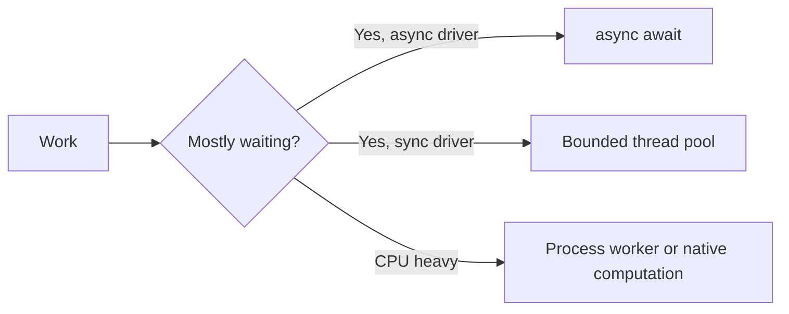

# Python concepts — Hinglish interview guide

[Roadmap](../README.md) · Next: [Backend / FastAPI](02-fastapi-quick-guide.md)

**Priority P0:** Har concept ka output predict karo, phir reason bolo. Python 3.11+ syntax use ki gayi hai; GIL discussion standard GIL-enabled CPython ke liye hai.

## 1. Names, mutation aur copying

Variable ek object ka naam hai. Function call mein local parameter bhi same object ko refer karta hai; parameter reassign karne se caller ka naam rebind nahi hota.

```python
def change(items):
    items.append(3)   # shared object mutate hua
    items = [99]      # sirf local name rebind hua

values = [1, 2]
change(values)
print(values)         # [1, 2, 3]

original = [[1], [2]]
copy = original.copy()
copy[0].append(9)
print(original)       # [[1, 9], [2]]: nested objects shared hain
```

**Interview mein:** “Python uses object sharing. In-place mutation visible hoti hai; rebinding local hoti hai. Shallow copy outer container copy karti hai.”

**Follow-up:** Tuple immutable hai, lekin tuple ke andar list mutate ho sakti hai. Har tuple hashable nahi—elements bhi hashable hone chahiye. `==` value equality, `is` identity; `None` check ke liye `is None`.

## 2. Mutable default trap

```python
def add(value, bucket=None):
    if bucket is None:
        bucket = []
    bucket.append(value)
    return bucket
```

`bucket=[]` default function definition par ek baar create hota hai. `bucket or []` mat use karo agar caller ki empty list ko mutate karna intended hai: woh empty list replace kar dega.

## 3. Collections aur complexity

| Type | Kab use karna | Interview detail |
|---|---|---|
| list | ordered sequence | index O(1), membership O(n), append amortized O(1) |
| dict | key → value lookup | average O(1), hashable keys, insertion order preserved |
| set | unique membership | average O(1), order par depend mat karo |
| tuple | fixed record | immutable container, hashability elements par depend |

Dict/set ke O(1) claims average case hain. Large input mein list membership ko repeatedly use karna accidentally O(n²) bana sakta hai.

## 4. Generator vs list

```python
def squares(limit):
    for n in range(limit):
        yield n * n

iterator = squares(3)
print(list(iterator))  # [0, 1, 4]
print(list(iterator))  # []: exhausted
```

Generator lazily values deta hai; poora output ek saath allocate nahi karta. Is example ka auxiliary memory bounded hai, lekin har generator constant-memory nahi hota—retained state aur consumer matter karte hain. `list(generator)` phir full result materialize karega.

## 5. Decorators, context managers, exceptions

Decorator behavior wrap karta hai; `functools.wraps` metadata preserve karta hai. Async function wrap kar rahe ho toh wrapper ko coroutine await karni hogi. Context manager resource lifetime define karta hai: `with open(...)` file close karta hai even on exception.

```python
from functools import wraps

def logged(fn):
    @wraps(fn)
    def wrapper(*args, **kwargs):
        print(f"calling {fn.__name__}")
        return fn(*args, **kwargs)
    return wrapper
```

**Follow-up:** `except Exception` karke silently success mat return karo. Specific exception handle karo, context log karo, unexpected error propagate karo. `finally` cleanup ke liye hai; `finally` mein return exception suppress kar sakta hai.

## 6. OOP jo explain kar paana chahiye

- Instance attribute per object; mutable class attribute sab instances share kar sakte hain.
- `@classmethod` ko `cls` milta hai, alternate constructors mein useful. `@staticmethod` ko implicit object/class nahi milta.
- Inheritance “is-a” relation; composition mein component inject hota hai. Payment service mein gateway inject karna testing easy banata hai.
- Dataclass internal data container; Pydantic external input validation. Type hints alone runtime checks nahi lagate.
- `super()` method-resolution order follow karta hai, sirf “direct parent” shortcut nahi.

## 7. Async, threads, processes



Coroutine cooperative concurrency deti hai. `await` potential suspension point hai; CPU loop ko parallel nahi banata. GIL-enabled CPython mein ek process mein ek thread Python bytecode execute karta hai at a time; I/O aur GIL-releasing native code ke cases alag hain. Optional free-threaded builds exist—interview mein runtime clarify karo.

```python
import asyncio

async def fetch_label(label):
    await asyncio.sleep(0.01)  # simulated non-blocking I/O
    return label

async def main():
    async with asyncio.TaskGroup() as group:
        a = group.create_task(fetch_label("A"))
        b = group.create_task(fetch_label("B"))
    return [a.result(), b.result()]
```

`TaskGroup` ordinary child failure par siblings cancel karke completion wait karta hai; cleanup phir bhi tumhari responsibility hai. Default `gather` first exception propagate karta hai, siblings automatically cancel nahi karta. Unbounded tasks DB pool overwhelm kar sakte hain; concurrency limit aur timeout lagao. [Python task documentation](https://docs.python.org/3/library/asyncio-task.html).

## Self-test (bina notes)

1. Shallow copy example ka output aur fix explain karo.
2. `def f(cache={})` bug reproduce karo.
3. Generator consume hone ke baad kya hota hai?
4. API call aur image resize ke concurrency choices alag kyun?
5. Class-level list kyun surprising ho sakti hai?

Depth: [reviewed OOP/runtime/async chapter](../09-deep-dive/08-python-deeper-concepts.md). Supplementary historical references: [fundamentals](../01-python-core/01-python-fundamentals.md), [OOP](../01-python-core/02-python-oop.md), [async](../01-python-core/03-python-async.md).
