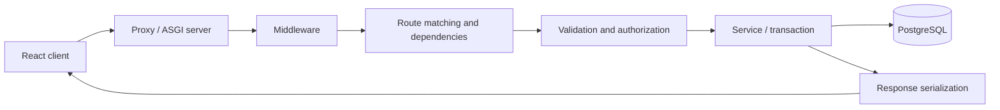

# Backend + FastAPI concepts — request se database tak

[Roadmap](../README.md) · Prerequisite: [Python](01-python-quick-guide.md) · Next: [Database](04-database-quick-guide.md)

## 1. Request lifecycle explain karo



Yeh conceptual flow hai: dependency resolution aur input validation interleaved ho sakte hain. Uvicorn ASGI server hai, FastAPI web framework, Starlette web primitives deta hai aur Pydantic data validation karta hai.

**Interview answer:** “Route transport details handle karta hai, service business rules, DB constraints final integrity. Main request validation aur authorization ko alag checks maanta hoon.”

## 2. Minimal executable API: validation, path, query, response

Save as `main.py`; install FastAPI/Uvicorn in a virtual environment, then `uvicorn main:app --reload` for development.

```python
from typing import Annotated
from fastapi import FastAPI, Query
from pydantic import BaseModel, Field

app = FastAPI()

class QuoteIn(BaseModel):
    quantity: int = Field(gt=0, le=100)
    unit_price_paise: int = Field(ge=0)

class QuoteOut(BaseModel):
    total_paise: int

@app.post("/quotes", response_model=QuoteOut)
def quote(body: QuoteIn):
    return QuoteOut(total_paise=body.quantity * body.unit_price_paise)

@app.get("/items/{item_id}")
def item(item_id: int, limit: Annotated[int, Query(ge=1, le=100)] = 20):
    return {"id": item_id, "limit": limit}
```

Yeh calculation demo hai, trusted checkout nahi: real purchase mein price server-side catalog se aayegi. Integer paise ya decimal money ke liye useful hai; binary float rounding surprises de sakta hai.

Pydantic v2 mein `model_dump()`, `model_validate()` use karo. Default validation kuch coercion allow karti hai, jaise numeric string → integer; strictness explicitly choose karo. Output schema accidental fields filter karne mein help karti hai, authorization replace nahi karti. [Pydantic models](https://docs.pydantic.dev/latest/concepts/models/).

## 3. `async def` vs `def`

| Situation | Choice | Reason |
|---|---|---|
| async DB / HTTP client | `async def` + `await` | waiting ke dauran loop available |
| blocking sync SDK | sync route, ya bounded thread offload | loop block avoid |
| CPU-heavy report/image processing | process/worker | async CPU parallelism nahi deta |

FastAPI-called sync routes/dependencies thread pool mein run hote hain. Async route ke andar manually called normal helper automatically offload **nahi** hota. Blocking work us worker ka event loop stall karta hai; “poora multi-worker server freeze” universal statement nahi hai. [FastAPI concurrency](https://fastapi.tiangolo.com/async/).

**Follow-up:** More workers = more pools/memory. Example: 4 workers × (pool 10 + overflow 5) = up to 60 DB connections, before other services. Worker count load test se choose karo.

## 4. Dependency injection vs middleware

`Depends` per-route reusable requirements ke liye: current identity, permissions, session. Middleware broad request concerns ke liye: tracing, timings, headers. DI test mein replacement easy banata hai.

Illustrative SQLAlchemy wiring; `SessionFactory` configured `async_sessionmaker` hai:

```python
async def get_session():
    async with SessionFactory() as session:
        yield session

# Service owns transaction, not the cleanup block:
async def create_record(session, record):
    async with session.begin():
        session.add(record)
        await session.flush()
    return record
```

Commit response success se pehle karo taaki DB failure successful response ke baad surprise na ho. `yield` cleanup timing scope/version se related hai; resource background job mein pass mat karo, job apna session banaye. [FastAPI yield dependencies](https://fastapi.tiangolo.com/tutorial/dependencies/dependencies-with-yield/).

Ek `AsyncSession` multiple concurrent tasks mein share mat karo; session transaction state rakhti hai. Each concurrent task ko own session do, aur atomic operation ko ek transaction mein rakho. [SQLAlchemy asyncio](https://docs.sqlalchemy.org/en/20/orm/extensions/asyncio.html).

## 5. HTTP contract

| Code | Typical use |
|---|---|
| 200 / 201 / 202 / 204 | success / created / accepted but pending / no body |
| 400 | application-defined bad request |
| 401 / 403 | missing-invalid authentication / insufficient permission |
| 404 / 409 | missing resource / conflict such as duplicate version |
| 422 | FastAPI request validation default |
| 429 / 503 | rate limited / temporarily unavailable |

FastAPI malformed JSON bhi default request-validation flow mein 422 de sakta hai. “Bad JSON always 400” galat shortcut hai. Response validation bug server-side error hai; client input error ki tarah expose mat karo. [FastAPI error handling](https://fastapi.tiangolo.com/tutorial/handling-errors/).

PUT generally representation replace karta hai; PATCH partial update. Idempotent ka meaning repeated operation ka intended effect same—response code same hona zaroori nahi. POST ke retries ke liye operation-scoped idempotency key design kar sakte ho.

## 6. Auth interview answer

“Authentication se pata chalta hai user kaun hai; authorization se kis resource par kya kar sakta hai. Token valid hone ke baad bhi task ka owner/tenant check karunga.”

JWT encoded/signed ho sakta hai, encrypted by default nahi. Signature, allowed algorithm, expiry aur applicable issuer/audience verify karo. Password hash karo, reversible encrypt nahi. Browser session cookie mein HttpOnly/Secure/SameSite choose karo; cookie auth ke saath CSRF protections, bearer storage ke saath XSS threat consider karo. CORS browser cross-origin reading policy hai, API authorization nahi.

`GET /tasks/{id}` mein sirf ID lookup enough nahi: query ko authenticated user ke allowed tenant/project se scope karo. Tenant ID ko request body se blindly trust mat karo.

## 7. Background work, retries, idempotency

`BackgroundTasks` same app process mein response ke baad work run karta hai. Durable business workflow ke liye persisted jobs + worker + retries useful hain. Async background task mein blocking code event loop phir bhi block karega. [FastAPI background tasks](https://fastapi.tiangolo.com/tutorial/background-tasks/).

Timeout ka matlab remote side-effect definitely nahi hua, aisa nahi. Payment/report job retry par duplicate effect avoid karna padta hai. Retry transient errors only, capped exponential backoff + jitter; permanent validation failure retry mat karo. DB write aur job publication gap ke liye transactional outbox dekho [system design](05-system-design-quick-guide.md).

## 8. Testing aur production debugging

- Service unit tests: business rules, clock/payment client dependencies.
- API tests: invalid input, missing auth, wrong tenant, duplicate action, not-found.
- Real DB integration tests: unique constraint, rollback, concurrent update; ORM mock se yeh prove nahi hota.
- End-to-end: login → create → refresh → data persists.
- Slow API: request trace → DB time/pool wait → external API time → CPU/event-loop lag. Average ke saath p95/p99 dekho.

**Practice gate:** 60 minutes mein authenticated CRUD design karo; list filtering/pagination, transaction boundary aur test cases explain karo. Full task [coding round](12-scenario-coding-round.md) mein hai.

Depth: [reviewed production/ORM chapter](../09-deep-dive/05-backend-production-patterns.md), [JWT/session chapter](../09-deep-dive/02-auth-jwt-sessions.md). Supplementary historical references: [FastAPI core](../02-fastapi-backend/04-fastapi-core.md), [advanced](../02-fastapi-backend/05-fastapi-advanced.md), [ORM](../02-fastapi-backend/06-databases-orm.md).
