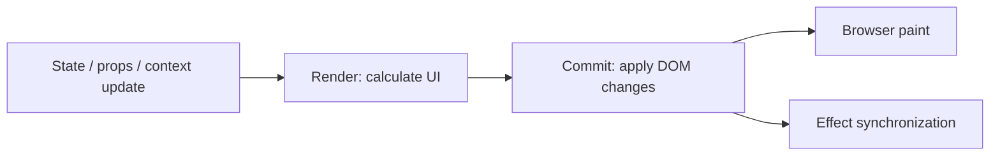

# React concepts — Hinglish interview guide

[Roadmap](../README.md) · Prerequisite: [JavaScript](10-javascript-fundamentals-guide.md) · [TypeScript](11-typescript-guide.md)

## 1. Render, commit, paint



Effect timing ko paint ke strictly baad assume mat karo; interaction ke cases mein timing differ kar sakti hai. Render pure hona chahiye, kyunki work repeat/discard ho sakta hai. Re-render ka matlab DOM change compulsory nahi. Virtual DOM automatically har implementation se faster hone ki guarantee nahi.

**Interview answer:** “React render mein next UI calculate karta hai, commit mein required DOM changes apply karta hai. Main render ke andar network requests ya mutations nahi karta.”

## 2. State snapshot aur batching

```jsx
// Assume count is 0 for this render:
setCount(count + 1);
setCount(count + 1);   // next count = 1

// Alternative, starting from 0:
setCount(c => c + 1);
setCount(c => c + 1); // next count = 2
```

Handler apne render ka snapshot dekhta hai. Updater functions pending updates ko compose karti hain. Setter call current closure variable change nahi karta. [React state snapshot](https://react.dev/learn/state-as-a-snapshot).

Nested update mein changed path copy karo: `setUser(u => ({...u, address: {...u.address, city: 'Delhi'}}))`. State duplicate mat rakho agar current props/state se calculate ho sakta hai.

## 3. Effects: external systems se synchronization

`useEffect` subscriptions, browser APIs ya external synchronization ke liye hai. Filtered list/total render mein derive karo; button-specific work event handler mein rakho. Dependencies effect ke reactive reads se follow hoti hain, preference se nahi. [You might not need an Effect](https://react.dev/learn/you-might-not-need-an-effect).

```jsx
import { useEffect, useState } from 'react';

export function useSearch(query) {
  const [state, setState] = useState({
    items: [], loading: false, error: null
  });
  useEffect(() => {
    const q = query.trim();
    if (!q) {
      setState({ items: [], loading: false, error: null });
      return;
    }
    const controller = new AbortController();
    let ignore = false;
    setState({ items: [], loading: true, error: null });
    const timer = setTimeout(async () => {
      try {
        const response = await fetch(`/api/search?q=${encodeURIComponent(q)}`, {
          signal: controller.signal
        });
        if (!response.ok) throw new Error(`HTTP ${response.status}`);
        const items = await response.json(); // demo assumes API returns an array
        if (!ignore) setState({ items, loading: false, error: null });
      } catch (error) {
        if (!ignore) setState({ items: [], loading: false, error: String(error) });
      }
    }, 300);
    return () => {
      ignore = true;
      clearTimeout(timer);
      controller.abort();
    };
  }, [query]);
  return state;
}
```

Yeh hook debounce + cancellation + obsolete response guard sikhata hai. Real app mein response validation aur reusable server-state cache evaluate karo. Abort request server-side operation rollback nahi karta.

Cleanup next changed-dependency setup se pehle aur unmount par run hoti hai. Development Strict Mode extra setup/cleanup cycle se bugs expose kar sakta hai; disable karna fix nahi. [React useEffect](https://react.dev/reference/react/useEffect).

## 4. Keys, refs, controlled input

Keys sibling identity define karti hain. Sorted editable list mein index key se input state wrong item ke saath attach ho sakti hai. Stable ID use karo; changing key intentionally subtree state reset kar sakti hai.

Ref renders ke across mutable value preserve karta hai, ref write re-render request nahi karta. Timer/DOM reference ke liye good; displayed counter ke liye state.

Controlled input: `value` + `onChange`, React source of truth. Uncontrolled: `defaultValue`/DOM state, ref ya form APIs se read. Input ko uncontrolled se controlled switch mat karo accidentally (`undefined` → string).

## 5. State kahan rakhein?

| Data | Default location |
|---|---|
| input/modal toggle | closest component state |
| shareable filters/page | URL search params |
| theme/current auth context | context if appropriate |
| complex shared client workflow | reducer/store |
| remote records | query cache / framework data layer |

Context changed value consume karne wale components ko re-render kar sakta hai; split providers/state ownership useful hai. Redux/Zustand mandatory nahi. Server cache key mein filters aur user/tenant scope include karo, logout par sensitive cache clear karo.

Optimistic update: snapshot → optimistic change → server mutation → rollback/refetch on failure. Multiple simultaneous mutations mein old rollback newer success overwrite na kare; versioning/invalidation strategy explain karo.

## 6. Performance aur UX

Measure React Profiler + browser performance/network se. Localize state, avoid expensive synchronous render, paginate/virtualize big lists, code split heavy routes. `memo`, `useMemo`, `useCallback` measured need ke liye; correctness inke cache par depend nahi honi chahiye.

`useCallback` stable function reference return kar sakta hai; function expression creation magically stop nahi hoti. `useTransition` non-urgent state update mark karta hai; network debounce nahi. Suspense arbitrary Effect fetch ko automatically track nahi karta; compatible framework/resource needed.

Forms mein loading, empty, error, retry, disabled submit, accessible labels aur keyboard handling include karo. Error boundaries descendant render failures ke liye; event handler/ordinary async errors explicitly handle karo.

## 7. Next.js ko React se separate explain karo (P1)

CSR: browser rendering; SSR: server HTML; SSG: build/prerender; RSC: server component execution model. RSC aur SSR same concept nahi. Client Component initial HTML server par prerender ho sakta hai, browser interaction hydrate hoti hai. `'use client'` module boundary define karta hai; browser globals ko render mein blindly read mat karo.

Hydration mismatch = initial client/server output inconsistent. Time/random/locale/browser-only values inspect karo. Framework caching/rendering defaults version-specific hain; project version verify karke answer do.

## Follow-up ladder

1. Search results old query ke kyun aa rahe? → race → cleanup/guard → request cancellation.
2. Counter stale kyun? → closure snapshot → functional updater → dependencies.
3. List delete ke baad wrong input? → key identity → stable IDs.
4. Typing slow? → profile → state scope → expensive render → virtualization/memo where useful.
5. Optimistic save fail? → rollback → concurrency/version conflict → accessible error feedback.

Depth: [reviewed React/browser chapter](../09-deep-dive/06-react-browser-engineering.md). Supplementary historical references: [React architecture](../06-frontend-react/14-react-core-architecture.md), [state management](09-state-management-guide.md), [ecosystem](../06-frontend-react/18-react-ecosystem-libraries.md).
