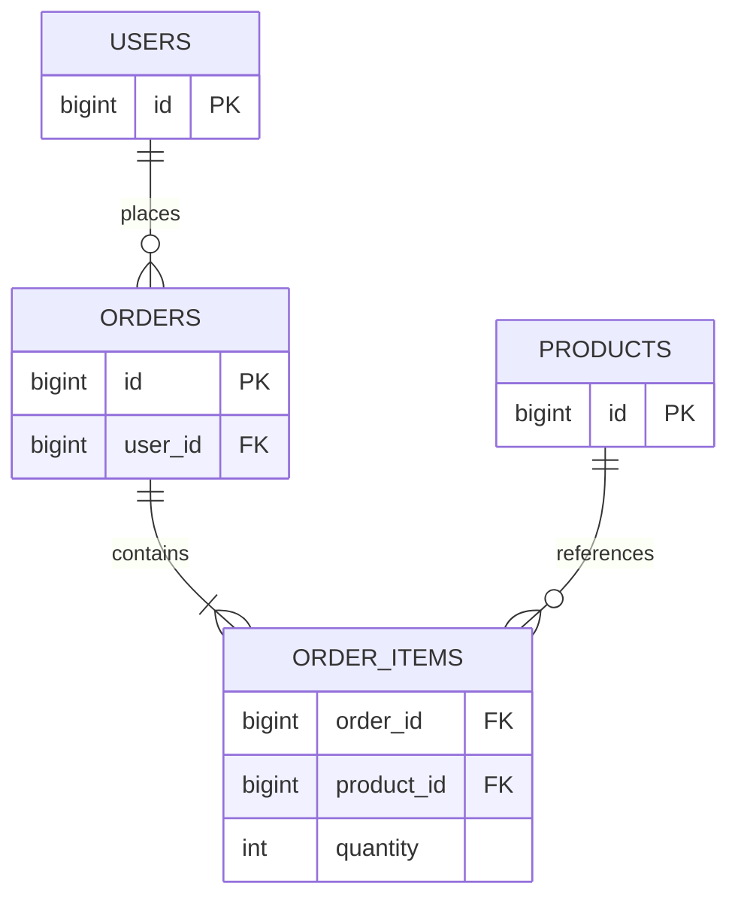

# Database concepts — SQL, indexes, transactions (Hinglish)

[Roadmap](../README.md) · Next: [System design](05-system-design-quick-guide.md)

**P0:** SQL likhna, data model defend karna, concurrent writes samajhna. Examples PostgreSQL ke hain.

## 1. Relational model aur constraints



Diagram business rule dikhata hai: submitted order mein at least one item. Sirf foreign keys se “at least one child” enforce nahi hota; transaction/service validation bhi chahiye.

- Primary key row identity; UNIQUE alternate uniqueness; FK referential integrity.
- `NOT NULL` required value; `CHECK (quantity > 0)` valid domain. PostgreSQL CHECK mein NULL pass ho sakta hai, isliye required columns par NOT NULL bhi.
- Many-to-many ke liye join table, e.g. `project_members(project_id, user_id)` with composite unique key.
- App-level “exists?” then insert race-safe nahi. Unique constraint final authority; conflict handle karo.

**Interview answer:** “Normalization repeated facts ko separate tables mein rakhti hai taaki update anomalies avoid hon. Order item ka purchase price historical snapshot hai, current product price se overwrite nahi karunga.”

1NF: repeating groups avoid; 2NF: non-key attributes poore candidate key par depend; 3NF: problematic transitive dependencies remove. Denormalize measured query need ke liye, with update/reconciliation strategy.

## 2. SQL runnable practice schema

Sandbox PostgreSQL database mein run karo:

```sql
CREATE TABLE users (
  id bigint PRIMARY KEY,
  name text NOT NULL
);
CREATE TABLE orders (
  id bigint PRIMARY KEY,
  user_id bigint NOT NULL REFERENCES users(id),
  total_paise bigint NOT NULL CHECK (total_paise >= 0),
  status text NOT NULL,
  created_at timestamptz NOT NULL
);
INSERT INTO users VALUES (1, 'Asha'), (2, 'Ravi'), (3, 'Neha');
INSERT INTO orders VALUES
 (101, 1, 5000, 'paid', '2026-09-01T10:00:00Z'),
 (102, 1, 7000, 'paid', '2026-09-02T10:00:00Z'),
 (103, 2, 2000, 'pending', '2026-09-03T10:00:00Z');
```

### Q1. Har user ka paid order count, including zero?

```sql
SELECT u.id, u.name, COUNT(o.id) AS paid_count
FROM users u
LEFT JOIN orders o ON o.user_id = u.id AND o.status = 'paid'
GROUP BY u.id, u.name
ORDER BY u.id;
-- Asha 2, Ravi 0, Neha 0
```

`COUNT(*)` unmatched left row bhi count karega. `WHERE o.status='paid'` left join ke unmatched rows remove kar dega. `WHERE` rows filter karta hai; `HAVING` grouped results.

### Q2. Har user ka latest order?

```sql
WITH ranked AS (
  SELECT o.*, ROW_NUMBER() OVER (
    PARTITION BY user_id ORDER BY created_at DESC, id DESC
  ) AS rn
  FROM orders o
)
SELECT id, user_id, total_paise FROM ranked WHERE rn = 1;
-- 102 for Asha, 103 for Ravi
```

Window function rows collapse nahi karta; GROUP BY aggregation karta hai. Ties ke liye `ROW_NUMBER`, `RANK`, `DENSE_RANK` ka expected behavior clarify karo. Second distinct salary ke liye DENSE_RANK useful; second row alag question hai.

### Q3. Users with no orders?

```sql
SELECT u.id FROM users u
WHERE NOT EXISTS (SELECT 1 FROM orders o WHERE o.user_id = u.id);
-- 3
```

`NULL = NULL` true nahi; `IS NULL` use karo. `NOT IN` subquery mein NULL ho toh result surprising ho sakta hai; NOT EXISTS intent clear karta hai.

## 3. Index design query se start hota hai

```sql
CREATE INDEX orders_user_created_id_idx
ON orders (user_id, created_at DESC, id DESC);

EXPLAIN (ANALYZE, BUFFERS)
SELECT id, total_paise FROM orders
WHERE user_id = 1
ORDER BY created_at DESC, id DESC LIMIT 20;
```

Index storage/write cost add karta hai. Small table par sequential scan sensible ho sakta hai. ANALYZE query execute karta hai; writes par casually mat run karo. Plan mein estimated vs actual rows, scan type, sort, buffers aur loop counts dekho.

B-tree leading equality predicates aur next range column generally scan narrow karte hain. Leading column missing hone par index **kabhi use hi nahi hoga** bolna wrong: planner scan ya eligible skip scan choose kar sakta hai. Actual distribution + plan decide karte hain. [PostgreSQL multicolumn indexes](https://www.postgresql.org/docs/current/indexes-multicolumn.html).

**Follow-ups:** `LOWER(email)` lookup ke liye matching expression index consider karo. Partial index selected rows ke liye; covering index extra columns include karta hai, index-only scan visibility conditions par depend karta hai. Foreign key referencing column par PostgreSQL automatically index create nahi karta.

## 4. ACID aur isolation

Atomicity: all-or-nothing. Consistency: declared constraints/invariants preserved. Isolation: concurrent operations ki allowed visibility. Durability: acknowledged commit ki persistence, configured durability assumptions ke andar.

| PostgreSQL level | Kya yaad rakho |
|---|---|
| Read Committed (default) | each statement fresh committed snapshot |
| Repeatable Read | stable transaction snapshot; write skew possible |
| Serializable | committed result serial order jaisa; abort/retry possible |

PostgreSQL Read Uncommitted actually Read Committed jaisa behave karta hai; Repeatable Read phantom reads bhi prevent karta hai. Serializable ka matlab transactions literally ek-ek karke execute nahi hoti. Serialization failure par **poori transaction** retry karte hain. [PostgreSQL isolation](https://www.postgresql.org/docs/current/transaction-iso.html).

## 5. Last item: two buyers, one stock

“Pehle SELECT stock, phir Python mein minus, phir UPDATE” race create karta hai.

```sql
-- Illustrative: inventory has product_id PK, stock NOT NULL CHECK(stock >= 0).
UPDATE inventory
SET stock = stock - 1
WHERE product_id = 42 AND stock > 0
RETURNING stock;
```

One row returned → reserved; zero rows → unavailable/missing. Reservation aur order insert same transaction mein rakho. Alternative: `SELECT ... FOR UPDATE`, validate, update, commit. Transaction short rakho; payment network call ke dauran lock mat pakdo. Multiple locks consistent order mein lo; deadlocks possible hain aur retry policy chahiye.

Optimistic approach: `UPDATE ... WHERE id=:id AND version=:old_version`, increment version, zero affected rows par conflict. Collaborative task editor ke liye useful.

## 6. Pagination, ORM aur migrations

Offset simple hai; large offset work badhata hai aur concurrent changes rows shift kar sakte hain. Cursor deterministic sort key use karta hai:

```sql
SELECT * FROM orders
WHERE user_id = 1
  AND (created_at, id) < ('2026-09-02T10:00:00Z'::timestamptz, 102)
ORDER BY created_at DESC, id DESC LIMIT 20;
-- 101
```

Cursor fields same filters/sort ke saath bind karo; page size cap aur cursor validation rakho. Cursor automatic snapshot consistency nahi deta.

N+1: parent list + each parent ka separate relation query. Query count measure karo; `selectinload` collection fetch batch kar sakta hai; `joinedload` joins se row duplication ho sakti hai. ORM SQL cost hide nahi karta.

Migration: expand (new nullable column) → compatible code → batched backfill → constraints → old field remove later. Long locks, failed partial rollout aur rollback compatibility discuss karo. Autogenerated migration review karo.

## Self-test

Bina notes three queries likho, index justify karo, aur simultaneous stock purchase ka timeline draw karo. No-orders, ties, NULL aur empty result test karo.

Depth: [reviewed indexing chapter](../09-deep-dive/03-postgres-indexing-internals.md), [SQL practice](../../postgres-practice/README.md). Supplementary historical references: [database design](../07-database-design/16-database-design-principles.md), [SQLAlchemy](../02-fastapi-backend/06-databases-orm.md).
