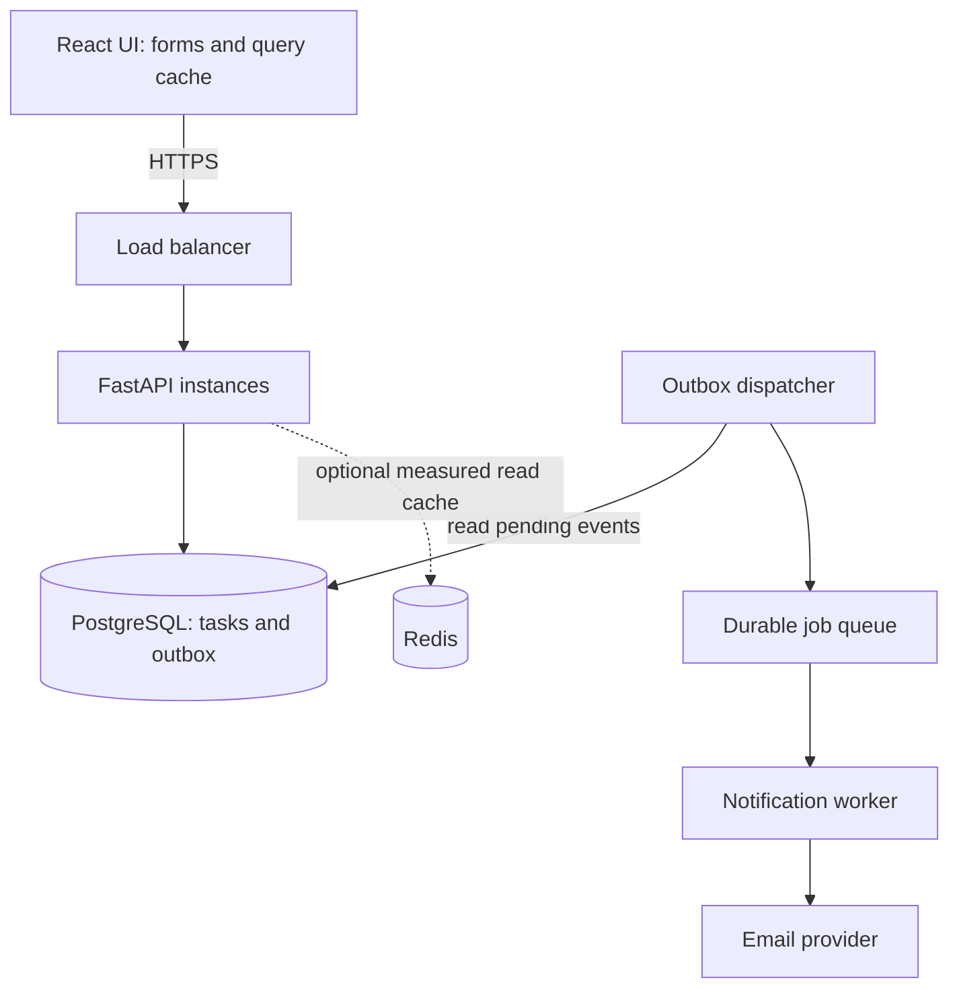
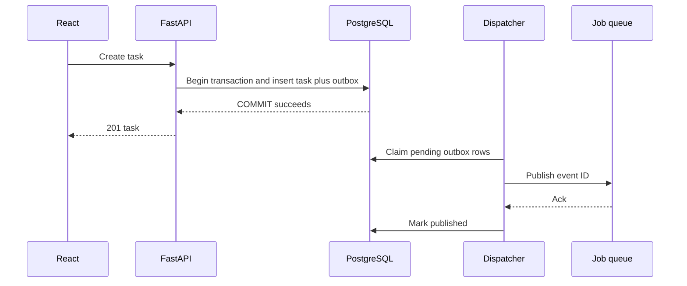

# System design — React + FastAPI + PostgreSQL (Hinglish)

[Roadmap](../README.md) · Prerequisites: [Backend](02-fastapi-quick-guide.md), [DB](04-database-quick-guide.md)

## 1. Interview mein pehle kya bolna hai?

“Pehle users, core flows, expected load, consistency aur failure expectations clarify karunga. Uske baad API/data model, simplest working architecture, bottlenecks aur trade-offs discuss karunga.”

35-minute round: requirements 5 min → scale/data 5 → architecture 10 → one deep dive 10 → failure/trade-offs 5. Yeh practice allocation hai, company-specific pattern ka claim nahi.

## 2. Worked case: team task manager

**Scope:** users projects join karein, tasks create/list/update karein, comments add karein; notification eventually deliver ho. Out of scope initially: full-text search, offline sync, attachments.

**Assumptions for practice:** 10k daily users, each 100 requests/day = 1M/day ≈ 11.6 average requests/sec. Assume 10× peak ≈ 116/sec. Yeh invented sizing assumptions hain; measured capacity nahi. Starting point modular monolith + Postgres; Kafka/sharding automatically required nahi.

**Goals:** tenant isolation, no silent lost updates, p95 API latency target 300 ms for ordinary CRUD (proposed target, benchmark nahi), notification delay acceptable up to a minute.

Flow: React authenticated API call karega, FastAPI permission validate karega, transaction task + event persist karegi. Worker notification asynchronously bhejega. Redis sirf measured need par add karna.

## 3. Data model + API contracts

| Table | Key fields / constraints |
|---|---|
| users | id, unique login identifier |
| projects | id, tenant_id, name |
| project_members | project_id + user_id unique, role |
| tasks | id, project_id FK, title, status, version, created_at |
| comments | id, task_id FK, author_id FK, body |
| outbox | id, event_type, payload, created_at, published_at |

Index: `tasks(project_id, created_at DESC, id DESC)` for project feed. Status filter common ho toh alternative `(project_id, status, created_at DESC, id DESC)` compare with actual plans. Membership lookup ke liye composite key.

| Endpoint | Important contract |
|---|---|
| POST /projects/{id}/tasks | membership check, validation, 201 |
| GET /projects/{id}/tasks?cursor=... | membership, stable ordering, page-size cap |
| PATCH /tasks/{id} | permitted fields + expected version; 409 on conflict |
| POST /tasks/{id}/comments | membership, size limit, 201 |

Frontend version send karega; server `WHERE id=:id AND version=:expected` update karega. Zero affected rows par missing/unauthorized/conflict appropriately resolve karo. React 409 par latest version fetch karke user ko reconcile option de; silently overwrite mat karo.

## 4. Write + event ka failure-safe flow

DB commit ke baad directly queue publish karne mein crash gap hai. Outbox event same DB transaction mein persist karta hai. Publish ke baad mark se pehle crash hua toh duplicate event possible. Consumer event ID deduplicate kare; external email provider supports idempotency toh use karo. Otherwise external delivery exactly-once guarantee mat bolo. Multiple dispatchers row claims/leases use karein, abandoned claims recover hon.

## 5. Failures jo interviewer push kar sakta hai

| Failure | Handling + cost |
|---|---|
| API commit hua, response lost | operation-scoped idempotency key and saved response; payload mismatch reject |
| Two edits together | optimistic version check; user resolves conflict |
| Worker down | pending durable backlog; oldest-job-age alert |
| Retry storm | retry cap, backoff+jitter, dead-letter/manual recovery |
| Redis unavailable | bounded DB fallback; DB overload protection |
| Replica lag | critical read-after-write primary se; eventual reads selectively |
| Wrong tenant task ID | server-side membership/resource scope, negative tests |
| DB connection exhaustion | bounded pool, timeouts, admission control, capacity planning |

## 6. Caching aur consistency

Cache-aside: read cache → miss → DB → cache with TTL. Write DB commit ke baad invalidate, lekin racing readers stale data re-cache kar sakte hain. Staleness tolerance define karo; versions/short TTL/stronger coordination where needed. Authorization-sensitive data ko public cache key mein mat rakho.

Replica reads eventually consistent ho sakti hain. “Save ke turant baad old title” bug ko UI cache aur replication lag dono angle se debug karo. Serializable DB transaction external services ko automatically atomic nahi banati.

CAP mein network partition ke time availability vs consistency tension explain karo; “always choose any two” oversimplified hai. Monolith vs microservices ownership/deployment boundaries par choose karo, buzzwords par nahi.

## 7. Browser experience bhi design ka part hai

- Form validation + server field errors; submit pending state.
- Query cache invalidate/update; auth/tenant-aware cache keys.
- Cursor pagination, loading skeleton, empty/error/retry states.
- Accessible labels, keyboard support, focus after dialogs/errors.
- Notification updates initially polling; low-latency server push needed ho toh SSE, bidirectional chat ho toh WebSocket evaluate karo.

## 8. Observability, deployment, scaling

Request ID logs + traces: API latency, DB queries/pool wait, external calls. Metrics: p95/p99, error rate, saturation, queue age, business success. Tokens/passwords logs mein nahi.

Deploy: compatible schema first, readiness probe, graceful drain, bounded timeouts, rollback path. Scale measured bottleneck: query/index → pool/CPU → replicas/instances → partitioning only when justified. Stateless API replicas ke local memory mein shared sessions/jobs mat rakho.

## 9. Two mini-design drills

**URL shortener (15 min):** POST creates random code with UNIQUE constraint and collision retry; GET resolves and redirects. Discuss expiration, malicious-link abuse, hot-code cache, cache invalidation, 301 vs 302 caching behavior. Analytics queue mein; redirect critical path simple.

**Document upload (20 min):** authorize → scoped short-lived upload URL → object store → finalize verification → durable processing job → status polling/SSE. Validate size/type server-side, store job ownership, retry idempotently, download authorization enforce karo. LLM/RAG extension sirf relevant JD ho toh.

**Readiness:** whiteboard par one write, one read, duplicate retry, unauthorized user aur DB failure walk through kar pao.

Depth: [system design reference](../04-system-design-dsa/11-system-design-basics.md), [scale scenarios](../questions-bank/06-scale-fintech-scenarios-questions.md).
