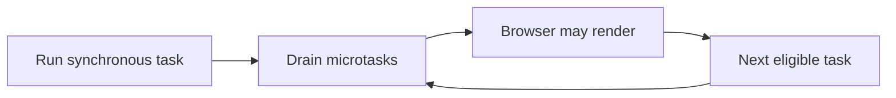

# JavaScript concepts — output, reason, follow-up

[Roadmap](../README.md) · Next: [React](03-react-nextjs-quick-guide.md)

## 1. Scope, hoisting, closures

`var` function-scoped; `let`/`const` block-scoped. `let`/`const` declaration se pehle temporal dead zone mein hote hain. `const` binding reassign nahi hoti, object properties phir bhi mutate ho sakti hain.

```js
function counter() {
  let n = 0;
  return () => ++n;
}
const a = counter();
console.log(a(), a()); // 1 2
```

Closure lexical environment access preserve karta hai. React event/timer closure specific render ki values capture karti hai; stale closure ko dependencies/updater strategy se fix karte hain.

## 2. Event loop output (browser example)

```js
console.log('A');
setTimeout(() => console.log('B'), 0);
Promise.resolve().then(() => console.log('C'));
console.log('D');
// A D C B
```

Synchronous stack pehle finish; microtasks then drain; timer task baad mein eligible hota hai. `0` ms immediate execution guarantee nahi. Long synchronous task UI block karta hai; recursive microtasks tasks/render ko starve kar sakti hain. Browser aur Node scheduling details identical assume mat karo. [MDN execution model](https://developer.mozilla.org/en-US/docs/Web/JavaScript/Reference/Execution_model).



## 3. Promises aur async errors

`async` function Promise return karta hai. `await` current async flow pause karta hai, whole browser thread nahi. `Promise.all` independent operations concurrently await karta hai; first rejection par reject, remaining work automatically cancel nahi hota. `allSettled` sab outcomes deta hai.

```js
async function load(url, signal) {
  const response = await fetch(url, { signal });
  if (!response.ok) throw new Error(`HTTP ${response.status}`);
  return response.json();
}
```

`fetch` HTTP 404/500 par automatically reject nahi karta. AbortController cancellation request de sakta hai; remote side effect undo nahi karta. Sequential dependent requests mein `await` correct; independent requests unnecessarily serial mat karo.

## 4. `this`, prototypes aur equality

Regular function ka `this` call-site se aata hai; arrow enclosing lexical `this` use karta hai. Method detach karne par receiver lose ho sakta hai; bind/wrapper required ho sakta hai. Prototype chain property lookup enable karti hai; class syntax us model par built hai.

`===` type coercion avoid karta hai; objects identity se compare. `Object.is(NaN, NaN)` true aur `Object.is(0, -0)` false. Spread shallow copy hai; nested data shared reh sakta hai. `structuredClone` many structured values clone karta hai, functions/DOM nodes jaise cases support nahi karta.

## 5. Debounce vs throttle (write this)

```js
function debounce(fn, delay) {
  let timer;
  function debounced(...args) {
    clearTimeout(timer);
    timer = setTimeout(() => fn.apply(this, args), delay);
  }
  debounced.cancel = () => clearTimeout(timer);
  return debounced;
}
```

Debounce pause ke baad run: search. Throttle bounded frequency: scroll updates. React render mein new debouncer har baar banaya toh timers/state buggy ho sakte hain; stable lifecycle + cleanup chahiye.

## 6. Coding follow-ups

- `map` new result array; `forEach` return values collect nahi karta.
- `forEach(async ...)` promises await nahi karta; `for...of` sequential ya `Promise.all(items.map(...))` concurrent use karo, bounded input ke saath.
- Destructuring default only `undefined` ke liye, `null` ke liye nahi.
- `x ?? fallback` sirf nullish values; `x || fallback` zero/empty string bhi replace karta hai.
- Event delegation parent par listener lagata hai; `target` vs `currentTarget`, bubbling/capture explain karo.

**Self-test:** above loop output, closure counter, cancellable debounce aur failed fetch handling bina notes likho.

Depth: [JS question bank](../questions-bank/10-javascript-and-event-loop-questions.md), [optional deep dive](../advanced-optional/30-javascript-core-and-event-loop-deep-dive.md).
