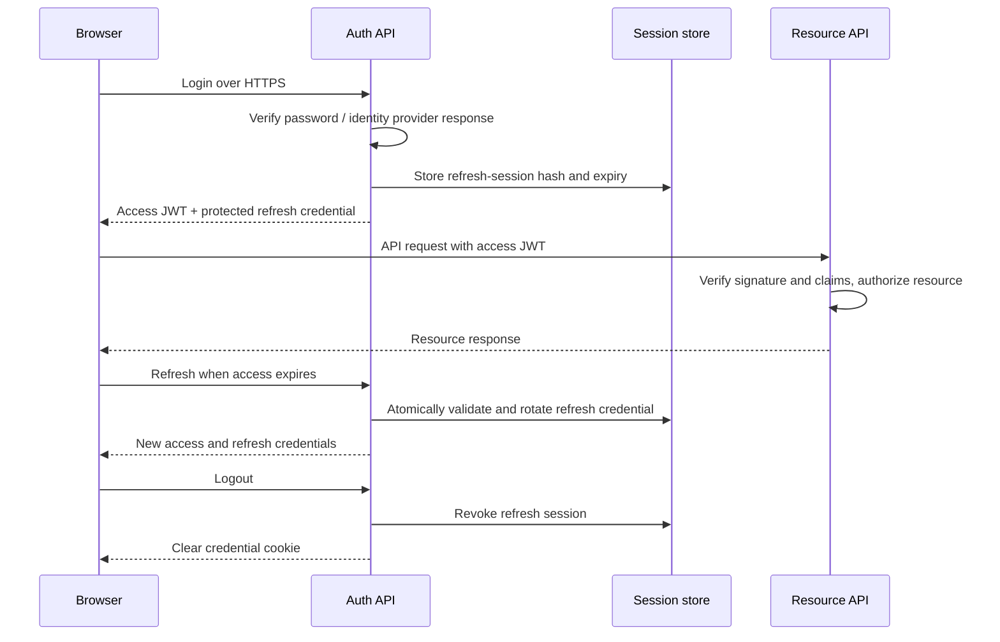

# JWT stateless hai toh server-side session kyun? Auth ka complete flow

[Roadmap](../README.md) · [Backend basics](../00-start-here/02-fastapi-quick-guide.md)

## 1. Pehle four terms separate karo

**HTTP stateless:** protocol requests ke beech login conversation automatically remember nahi karta. **Stateless API instance:** request kisi bhi replica par jaa sakti hai; required shared state local RAM mein locked nahi. **JWT:** claims carry karne ka token format. **Session:** login ki continuing relationship/lifecycle, usually expiry, device aur revocation policy ke saath.

JWT ki signature verify karne ke liye per-token session DB lookup **mandatory nahi**. Iska matlab complete auth system ko state ki zaroorat hi nahi, aisa nahi. User, roles, password, refresh credentials aur account disable status persistent facts hain.

**30-second interview answer:** “JWT access token ko server signature aur claims se validate kar sakta hai without a session lookup. Lekin immediate logout, device revoke, refresh rotation, password-change logout ya live permission changes chahiye toh server-side state useful ya necessary hoti hai. Short-lived stateless access tokens plus stateful refresh sessions ek common trade-off hai.”

## 2. Three valid designs compare karo

| Design | Every API request | Revocation | Trade-off |
|---|---|---|---|
| Opaque session ID cookie | shared session store lookup | session delete/revoke se next check reject | store availability/latency |
| Self-contained JWT access only | signature + claim validation | issued token usually expiry tak valid | immediate revoke difficult |
| Short access JWT + refresh session | access local validation; refresh store check | refresh revoked; access expiry tak valid unless extra checks | limited access revocation delay + refresh lifecycle |

Pure JWT design automatically wrong nahi. Agar short validity aur limited revoke delay acceptable hai toh valid choice. Simple browser app mein opaque session implementation easier ho sakti hai. JWT vs cookie false comparison hai: JWT **format**, cookie **transport/storage**; opaque ID bhi cookie mein jaa sakti hai.

## 3. Example login → access → refresh → logout

Times below design examples hain, universal recommendations nahi: access 10 min, refresh absolute 7 days.



Client storage choice next section mein hai. Browser access token memory mein ho toh reload par refresh/BFF flow chahiye. API replica stateless reh sakti hai, shared session store stateful ho sakta hai—contradiction nahi.

## 4. Refresh session mein kya store karein?

Illustrative schema, migrations/application code nahi:

```sql
CREATE TABLE refresh_sessions (
  id uuid PRIMARY KEY,
  user_id bigint NOT NULL,
  token_hash text NOT NULL UNIQUE,
  family_id uuid NOT NULL,
  created_at timestamptz NOT NULL,
  expires_at timestamptz NOT NULL,
  last_used_at timestamptz,
  revoked_at timestamptz
);
```

Raw high-entropy refresh credential ke bajaye hash store karo; password hashing aur random-token hashing ka threat model different hai. Token rotate karte waqt previous token consumed/revoked state aur family lineage retain karo taaki replay detect ho. Ek row overwrite karke old credential forget kar doge toh replay ko known-used token se distinguish nahi kar paoge.

Atomic transaction/compare-and-swap se only one rotation accept karo. Do tabs simultaneously refresh kar sakte hain; single-flight client coordination aur explicit server retry/grace policy choose karo. Har duplicate ko bina policy account compromise bolna legitimate sessions break kar sakta hai.

## 5. Logout ke baad JWT ka kya hoga?

Suppose token 10:00 issue, 10:10 expiry; user 10:02 logout. Browser token clear kar diya aur refresh revoke kiya, lekin stolen access token offline verifier ke liye 10:10 tak valid reh sakta hai.

Options:

1. **Accept bounded delay:** short access lifetime, sensitive operations additional check.
2. **Denylist `jti`:** revoked token ID expiry tak store; APIs lookup karti hain → verification path now state-dependent.
3. **Session/version check:** token carries `sid`/version, server compares active session/user version; global logout simple but every request lookup/cache has cost/staleness.
4. **Opaque token + introspection:** central status check; latency/availability trade-off.

Signing key rotate karna per-user logout mechanism nahi: all tokens signed by that key affect ho sakte hain. Refresh token revoke **already issued access tokens** ko automatically cryptographically invalidate nahi karta. [OWASP JWT guidance](https://cheatsheetseries.owasp.org/cheatsheets/JSON_Web_Token_Cheat_Sheet.html).

## 6. JWT validation checklist ka reasoning

Decoded payload trusted tab hota hai jab signature aur policy valid ho. Server-approved algorithms, trusted key source, `exp`, relevant `nbf`, expected `iss`/`aud`, required claims aur limited clock skew validate karo. Access token intended API ke liye hona chahiye; ID token ko arbitrary API access token mat samjho.

JWT header ka `kid` cached trusted issuer keys select karne ke kaam aa sakta hai. Token-provided arbitrary URL se signing key fetch mat karo. JWKS cache expiry + bounded unknown-key refresh + rotation overlap define karo; endless cache old keys par fail kar sakti hai, every request fetch auth provider overload kar sakta hai.

Signed JWT payload readable ho sakta hai: passwords/secrets/extra PII mat rakho. Signature data integrity/authenticity hai, confidentiality nahi.

## 7. Cookie, localStorage, CSRF aur XSS

| Mechanism | Helps with | Does not solve |
|---|---|---|
| HttpOnly | JS token read/exfiltration block | XSS can still perform authenticated actions |
| Secure | cookie HTTPS transmission | XSS/CSRF by itself |
| SameSite | some cross-site cookie sending | all CSRF cases, same-site malicious subdomain |
| CSRF token / Origin checks | unwanted browser-authenticated mutations | arbitrary trusted-origin XSS |
| CSP + output safety | script execution risk reduction | all injection or business auth flaws |

localStorage token JS-readable hai; malicious script read kar sakti hai. Header-only bearer request mein browser automatic credential attachment nahi karta, lekin app ki cookie-based refresh/login endpoints ko independently protect karna hota hai. Cookies ke Domain/Path scope, expiry aur credentials behavior intentional choose karo. [OWASP session lifecycle](https://cheatsheetseries.owasp.org/cheatsheets/Session_Management_Cheat_Sheet.html).

**Cross-origin ≠ cross-site:** `https://app.example.com` aur `https://api.example.com` different origins, generally same site. Isliye “subdomain hai toh SameSite=None compulsory” wrong. Fetch credentials/CORS config phir bhi matter karti hai. Credentialed CORS mein specific allowed origin, credentials allowance aur browser policy verify karo; wildcard origin workaround nahi.

## 8. OAuth2, OIDC, SSO, PKCE

OAuth2 delegated authorization framework; OIDC authentication identity layer. SPA Authorization Code + PKCE mein browser secret safely store nahi kar sakta; code verifier/challenge code interception risk reduce karte hain. Redirect URI exact registration, state/correlation, OIDC nonce where applicable aur validated issuer/client context use karo. Established library/provider flow follow karo.

BFF alternative: backend code exchange/token storage own karta hai; browser opaque HttpOnly session cookie rakhta hai. PKCE, client authentication aur browser CSRF protections different threats address karte hain. SSO means identity-provider login reuse; your app session, IdP session aur other apps ke sessions independent expiry/logout behavior rakh sakte hain.

Keycloak vocabulary: realm identity boundary, client registered app, roles/scopes claims/permissions model. Provider role claim ko business record ownership ka substitute mat banao. User role change ke baad JWT stale claims until expiry/check strategy apply hogi.

## 9. Authorization aur tenant isolation

Authentication “kaun?”; authorization “kis resource par kya?”. RBAC roles → permissions; ABAC resource/user attributes and conditions. Frontend hidden button UX hai, enforcement backend par.

Tenant context user ke verified memberships se derive/validate karo. Resource query tenant/project scope kare. Cache, exports, object-store download, WebSocket room aur background job mein same boundary enforce karo. PostgreSQL RLS defense in depth: owner/superuser/BYPASSRLS exceptions samjho, correct app role use karo, pooled connection par transaction-local context set karo.

## Interview follow-ups

- Redis down toh login/access? → selected design mein fail-open/closed behavior and cached-state staleness explicit.
- Account disabled now? → local JWT verification alone immediate status nahi jaanta.
- JWT stolen? → expiry/revocation scope, refresh family, incident response.
- 10 concurrent 401? → one refresh in-flight, bounded replay, no infinite interceptor loop.
- Logout all devices? → revoke user's refresh sessions; issued access token policy separately.
- Session fixation? → authenticate/privilege change par session identifier regenerate, old invalidate.
