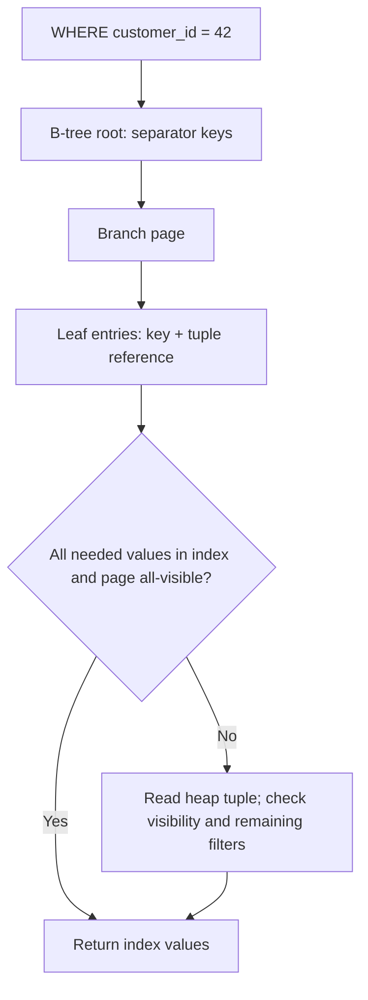

# PostgreSQL indexing — kya hota hai, andar kaise, kab useful?

[Roadmap](../README.md) · [SQL basics](../00-start-here/04-database-quick-guide.md) · [Executable labs](../../postgres-practice/README.md)

## 1. Table aur index separate structures hain

Table heap pages mein row versions stored hain. Default B-tree index sorted keys aur tuple-location references maintain karta hai. “Index lagaya toh table permanently sort ho gayi” wrong. Database query planner estimates cheapest access path; index existence use guarantee nahi karti.

Imagine 100k orders mein user 42 ke latest 20 chahiye. Without suitable index, many rows inspect/filter/sort karne pad sakte hain. `(customer_id, created_at DESC, id DESC)` index matching range locate karke order mein stop early kar sakta hai.



Ordinary index scan heap visit karti hai. Index-only scan ke liye index mein required values aur MVCC visibility support chahiye. Visibility map page all-visible na bole toh “Index Only Scan” plan bhi heap fetches kar sakta hai. `INCLUDE` zero heap reads guarantee nahi. [PostgreSQL index-only scans](https://www.postgresql.org/docs/current/indexes-index-only-scans.html).

## 2. B-tree vs binary tree

B-tree balanced **multiway** tree hai: page mein many keys/child pointers. Typical PostgreSQL build page size 8 KiB, configurable at build; arbitrary “one node = one key” picture wrong. Root → branch → leaf descent few page reads mein seek locate kar sakta hai; nearby keys scan for ranges.

Simplified seek cost O(log n), matching k rows retrieve karne ka work bhi add hota hai. Heap locality/cache/I/O, row visibility, sorting, returned payload matter. Index write mein new entry, page split aur WAL overhead ho sakta hai; sequential keys bhi splits se immune nahi. `ctid` physical tuple location hai, stable business ID nahi.

## 3. Composite index lexicographic order

```text
(customer_id, created_at, id)
(1, Sep-01, 101)
(1, Sep-02, 102)
(2, Sep-01, 103)
(2, Sep-03, 104)
```

Pehle first column order, ties mein second, phir third. Equality + range + sort ko workload ke saath reason karo:

```sql
-- Illustrative orders schema: customer_id, status, created_at, id, total_amount.
CREATE INDEX orders_customer_feed_idx
ON orders (customer_id, created_at DESC, id DESC);

SELECT id, created_at FROM orders
WHERE customer_id = 42
ORDER BY created_at DESC, id DESC LIMIT 20;
```

`WHERE status='paid'` ke frequent filtered feed ko `(customer_id,status,created_at DESC,id DESC)` suit kar sakta hai. Lekin status predicate absent ho toh `created_at` ordering across all statuses directly match na kare. “Equality first then range then sort” helpful starting heuristic hai, universal optimal proof nahi.

Leading column absent hone par B-tree still scanned ho sakta hai; supported planner/version/data distribution mein skip scan possible. “Leftmost missing → cannot ever use index” avoid karo. [Multicolumn index rules](https://www.postgresql.org/docs/current/indexes-multicolumn.html).

## 4. Index types aur use cases

| Type / feature | Example need | Trade-off / trap |
|---|---|---|
| B-tree | equality, range, compatible ordering | write/storage cost |
| Hash | supported equality operators | ranges/order not supported |
| GIN | JSONB containment, array membership, text search | many entries; write/build cost |
| GiST / SP-GiST | supported geometric/range/operator-class searches | semantics depend on operator class |
| BRIN | huge physically correlated timestamp table | lossy summaries; heap recheck |
| Partial | only pending/active rows | query must imply predicate |
| Expression | `lower(email)` matching predicate | expression computation/write cost |
| INCLUDE | return columns without making search keys wider | payload still enlarges index; visibility caveat |
| UNIQUE | invariant, e.g. tenant + external ID | conflicts expected under races |

Partial/expression/covering are index design features, not all separate underlying tree types. GIN JSONB operator coverage depends on operator class. Native PostgreSQL text ranking is not automatically BM25.

```sql
CREATE INDEX pending_orders_idx ON orders (created_at, id)
WHERE status = 'pending';

CREATE INDEX users_lower_email_idx ON users (lower(email));
-- Matches lower(email) = 'asha@example.test'; ordinary email index differs.

CREATE INDEX orders_paid_cover_idx
ON orders (customer_id, created_at DESC, id DESC)
INCLUDE (total_amount) WHERE status = 'paid';
```

Prepared/generic query plan might not prove a parameter equals partial-index predicate; don't assume parameterized query always selects it. Inspect actual plan under real driver usage.

## 5. Why PostgreSQL ignores my index?

1. Table tiny or query returns large portion: sequential scan cheaper.
2. Leading filters/order not aligned with index; low selectivity.
3. Expression/cast/collation/operator doesn't match access path.
4. Stale statistics or correlated columns make estimated row count inaccurate.
5. Random heap fetch cost high; bitmap/seq scan wins.
6. Query returns many wide columns or uses deep offset; index doesn't remove all work.

`enable_seqscan=off` permanently set karna performance fix nahi. Different predicate, statistics, index design aur plan compare karo.

## 6. EXPLAIN read karne ka practical method

```sql
EXPLAIN (ANALYZE, BUFFERS)
SELECT id FROM orders WHERE customer_id = 42;
```

**EXPLAIN** estimates; **ANALYZE** query really executes. DML ke triggers/side effects ho sakte hain; rollback sequence advances ya external effects necessarily undo nahi karta. Training/representative safe environment mein run karo.

Read leaf scans → joins → aggregates/sorts → limit. `cost` abstract planner units, milliseconds nahi. `actual time` timings per loop; `rows` per-loop averages with loops > 1. Node times inclusive hain, all times simply sum mat karo. Estimated vs actual rows big mismatch investigate.

`shared hit` PostgreSQL buffer hit; `shared read` block PostgreSQL buffer mein load hua, OS cache se bhi aa sakta hai—not necessarily physical disk. More hits automatically better nahi: fewer touched buffers for same work often better. Sort spill/temp I/O aur repeated loops costly ho sakte hain. [Using EXPLAIN](https://www.postgresql.org/docs/current/using-explain.html).

## 7. Join strategies

Nested loop: few outer rows + indexed inner lookup good; huge loops bad ho sakte hain. Hash join: equality joins, hash build/probe, memory/spill matters. Merge join: sorted inputs, useful large compatible joins. Koi absolute fastest order nahi.

N+1 application-level many SQL round trips hai; DB nested-loop plan itself N+1 API bug nahi. ORM eager loading solve kar sakta hai, lekin huge joined collections row multiplication create kar sakti hain.

## 8. MVCC, VACUUM, WAL

UPDATE new row version create karta hai; readers snapshot rules se visible version dekhte hain. Old versions jab kisi active snapshot ko needed nahi, VACUUM reusable space reclaim kar sakta hai aur visibility map maintain karta hai. Long-running/idle transactions cleanup block karke bloat badha sakti hain.

Normal VACUUM generally OS ko poori file shrink karke return nahi karta. VACUUM FULL rewrite/strong locks require karta hai; default production fix nahi. ANALYZE planner statistics collect karta hai, row cleanup nahi. Autovacuum maintain karo.

WAL modified data pages durable flush se pehle log persistence support karta hai. Commit acknowledgment durability settings pe depend karta hai; standard durable settings mein necessary WAL flush, har table page immediately flush hona needed nahi. Rollback failed row versions invisible karta hai; background cleanup baad mein. Sequences transaction rollback se old number par necessarily nahi lautti.

## 9. Transactions, locks, deadlocks — deeper caveats

`SELECT FOR UPDATE` competing writers/locking readers ko block kar sakta hai, normal MVCC SELECT ko generally block nahi karta. Optimistic version update bhi DB write locks leti hai; difference long application read-think-write lock avoid karke version conflict detect karna hai.

Transaction error PostgreSQL transaction ko failed state mein chhod sakta hai; rollback or rollback-to-savepoint required. Savepoint partial recovery hai, independent committed nested transaction nahi. SERIALIZABLE logically serial outcome allow karta hai, full transaction abort/retry possible. [PostgreSQL concurrency](https://www.postgresql.org/docs/current/transaction-iso.html).

## 10. Production index/migration changes

Foreign key referencing column automatically indexed nahi. PK/UNIQUE generally supporting indexes banate hain. Duplicate indexes detect karo; unused stats recent reset/workload window ke context mein read karo.

`CREATE INDEX CONCURRENTLY` writes broadly allow karta hai, lekin more work, waits, invalid index on failure aur restrictions hain; no explicit transaction block. Strong “zero locks/zero impact” guarantee nahi. Replica plan/data/stats hardware production primary se differ kar sakte hain.

Partitioning one logical table ko partitions mein divide karta hai; sharding separate database nodes mein distribution. Pruning aligned predicate par help; bad queries/keys automatically fix nahi. Read replicas stale ho sakti hain, backup nahi. Restore/PITR drill availability design ka part hai.

**Practice:** [index lab](../../postgres-practice/05-indexing-lab.sql) mein 100k rows ke before/after plans compare karo; [two-session labs](../../postgres-practice/06-concurrency-labs.md) mein blocking aur versions dekho.
