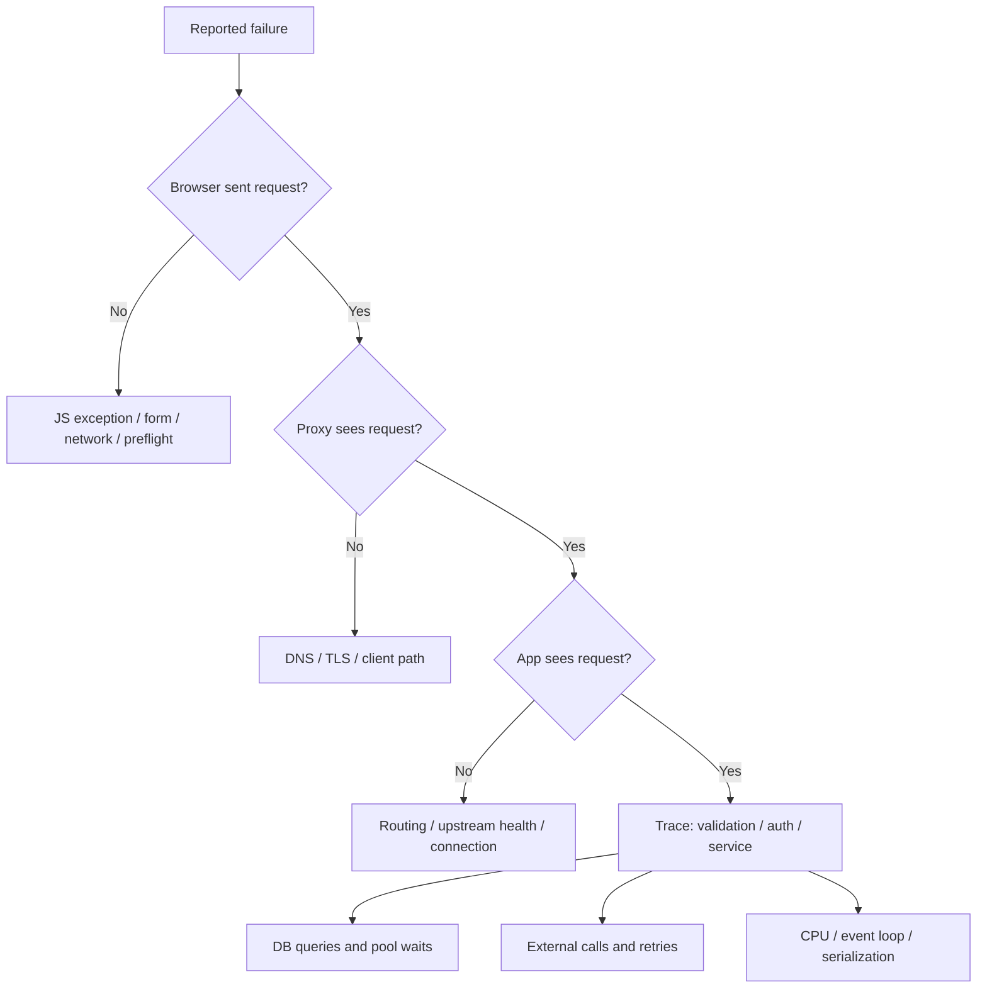

# API aur production debugging — evidence se root cause tak

[Roadmap](../README.md) · [FastAPI](../00-start-here/02-fastapi-quick-guide.md)

## 1. Debugging ka repeatable answer

“Main impact aur timeline establish karunga, recent changes check karunga, request/trace ID se browser → proxy → API → DB/external service correlate karunga. Pehle safe mitigation, phir evidence-based root cause aur regression test.”

**Collect:** UTC timestamp, environment/build version, endpoint/method, status, redacted input shape, affected scope, request ID, expected vs actual. Password/token/private data logs/tickets mein paste mat karo. Single user's report ko browser issue assume mat karo; data/permissions/feature-flag specific backend bug ho sakta hai.



## 2. Browser Network tab ko kaise read karna hai?

- URL/method/query/payload/headers expected? Wrong base URL, undefined ID, stale feature flag?
- OPTIONS fail toh CORS preflight inspect; actual API request ho bhi nahi sakti.
- Cookie sent? Domain/path/expiry/Secure/SameSite, fetch credentials aur browser blocked-cookie reason.
- Queue/stall, DNS/connect/TLS, waiting, download alag timings. High TTFB mein network/proxy/server sab contribute kar sakte hain; DB guilty automatically nahi.
- Response correct but UI wrong? response adapter, cache key, race, stale closure, rendering error.
- Disable cache experiment se compare; fix cache policy mein karo, permanent user cache-clearing ritual nahi.

cURL/Postman success browser CORS prove nahi karta. Same endpoint ko browser and server-to-server paths se compare karo. HAR files cookies/tokens carry kar sakti hain; redact before sharing.

## 3. HTTP failure matrix

| Symptom | Evidence | Common next step |
|---|---|---|
| 401 | missing/expired/wrong issuer-audience credential | token policy, clock, refresh flow |
| 403 | authenticated but denied | role, ownership, tenant, CSRF/Origin policy |
| 404 | wrong route or missing/hidden resource | version/base path + scoped lookup |
| 409 | conflict / version / uniqueness | expected state, idempotency scope |
| 422 | FastAPI input location/message | query vs body, shape/coercion, JSON decode |
| 429 | gateway/app limits and key | Retry-After, burst policy, shared limiter |
| 500 | application exception | trace + sanitized stack + DB failure |
| 502 | proxy invalid upstream response | process crash, reset, wrong port/protocol |
| 503 | unavailable/overloaded/not ready | capacity, readiness, rollout |
| 504 | gateway deadline exceeded | upstream span + timeout budget |

Status creator identify karo; response body alone application emitted status prove nahi karti. Server response-schema bug usually 500-class issue hai, request 422 se different.

## 4. Latency breakdown: pool wait ≠ query duration

Practice example, measured production claim nahi:

```text
API 1800 ms
  auth                  20 ms
  DB pool checkout     900 ms
  SQL                  100 ms
  external call        650 ms
  serialize/other      130 ms
```

SQL ko 100→50 ms improve karna 900 ms pool wait solve nahi karega. Pool checked-out connections kahan retained hain? Long transaction, leaked session, DB lock, external await while transaction open, burst concurrency?

p95 means 95% observations at/below that latency, not 5% distinct users necessarily. Same interval, route, status, load compare karo. Throughput/errors/saturation saath dekho—failed-fast requests average improve kar sakti hain while service worse ho.

## 5. Scenario: slow FastAPI under load

1. Baseline load arrival rate + latency percentiles + failures.
2. Event-loop lag/CPU high? `requests`, `time.sleep`, CPU loop, giant JSON serialization in async route inspect.
3. DB pool wait high? connection capacity formula, session lifetime, transaction duration.
4. SQL high? query count, EXPLAIN, rows, locks, stale stats, missing index.
5. External span high? connect/read/pool timeout, upstream saturation, uncontrolled retries.
6. Fix one bottleneck; same representative load retest, correct result/error rate preserve.

“More workers” memory aur DB pools multiply karta hai. “Make everything async” sync driver convert nahi karta. “Timeout increase” symptomatic relief ho sakta hai, capacity fix nahi.

## 6. Read-only PostgreSQL triage queries

Appropriate monitoring permissions needed; query texts sensitive ho sakte hain. These inspect, they do not cancel/kill sessions.

```sql
SELECT pid, state, wait_event_type, wait_event,
       now() - xact_start AS transaction_age,
       now() - query_start AS query_age,
       pg_blocking_pids(pid) AS blocked_by
FROM pg_stat_activity
WHERE datname = current_database()
  AND pid <> pg_backend_pid()
ORDER BY xact_start NULLS LAST;
```

`idle in transaction` open transaction without current query ho sakta hai; its query text last statement hota hai. `wait_event_type='Lock'` blocker inspect karne ka signal. Query text and permission visibility role-dependent. [PostgreSQL monitoring](https://www.postgresql.org/docs/current/monitoring-stats.html).

```sql
-- Requires installed/configured pg_stat_statements; columns vary by PG version.
SELECT query, calls, total_exec_time, mean_exec_time, rows
FROM pg_stat_statements
ORDER BY total_exec_time DESC LIMIT 10;
```

High total time hot aggregate workload; high mean rare expensive query. `pg_stat_statements` aggregate stats deta hai, automatically “all >250 ms queries log” nahi; slow-query logging separate server config.

## 7. Scenario: memory grows / process OOM

RSS aur Python traced allocation same metric nahi. Containers limits, process count, memory timeline, request size, workload correlate karo. Heap snapshots compare; unbounded caches, retained lists, unclosed clients, tasks/stream buffers inspect. `tracemalloc` tracked Python allocations dikhata hai; native allocations all captured nahi hote. RSS high rehna alone leak proof nahi—allocator retains arenas/cache bhi ho sakta hai.

Mitigation: size limits, bounded concurrency/cache, stream batches, rollback bad release if supported. Restart may restore service temporarily; capture evidence and fix source. Realistic load + repeated cycles se verify memory plateaus.

## 8. Scenario: save twice / payment duplicate

Button disable useful UX, correctness server par. Trace duplicate request IDs/idempotency keys/provider event IDs. App “if not processed” check race ho sakta hai: DB unique constraint + atomic side-effect transaction. External provider operation ko idempotency key; local DB/provider mismatch reconciliation. Network timeout ke baad unknown outcome ko definitely-failed assume mat karo.

## 9. Scenario: works locally, fails only for one user

Compare affected vs unaffected: data shape/volume, timezone/locale, permissions, tenant, old account migrations, feature flags, app build, browser, extensions, service worker/cache. Synthetic sanitized equivalent fixture create karo; production user impersonation/change casually mat karo. Session replay enabled ho toh privacy masking/access policy follow karo.

Other prod differences: Python/package versions, env config, resource limits, filesystem case sensitivity, proxy buffering, HTTPS/cookies, concurrency and real data cardinality. Subdomains often same-site; don't prescribe SameSite=None blindly.

## 10. Scenario: streaming hangs or partial output disappears

Backend sends valid SSE records ending blank line? Proxy buffering/compression? Client accumulates partial chunks/UTF-8 boundaries correctly? A TCP chunk is not one SSE event. Track time-to-first-byte/token vs total duration, disconnect cancellation and heartbeat. Response headers sent ho gaye toh status cannot simply change to 500; application error event/connection close semantics define karo.

## 11. Incident response aur postmortem

Declare scope/severity, owner, rollback/feature-flag/rate-limit mitigation, update timeline. Rollback schema-compatible hai? Validate recovery with user journey + latency/errors, not “pod green”. Root cause, contributing factors, detection gap, action owner and deadline document karo. Logs/metrics/traces ideally same identifiers and release tags carry karein; trace sampling missing trace ka possible reason hai.

**Example answer template:** “Observed [symptom]. Trace showed [evidence], so hypothesis [cause]. Mitigated using [reversible change]. Verified [metric + correctness]. Added [regression guard].” Brackets actual experience se fill karo; fabricated outage story memorize mat karo.

## Self-test: interviewer push

- DB query 20 ms but API 2 sec: pool/network/serialization/external time kahan?
- 401 after key rotation: stale JWKS vs bad aud/iss, how distinguish?
- p50 stable, p99 bad: locks, queueing, GC, upstream tails?
- Health checks pass, users fail: shallow probe, tenant-specific path, dependencies?
- CPU low but requests timeout: waiting/blocking/backpressure rather than compute?
