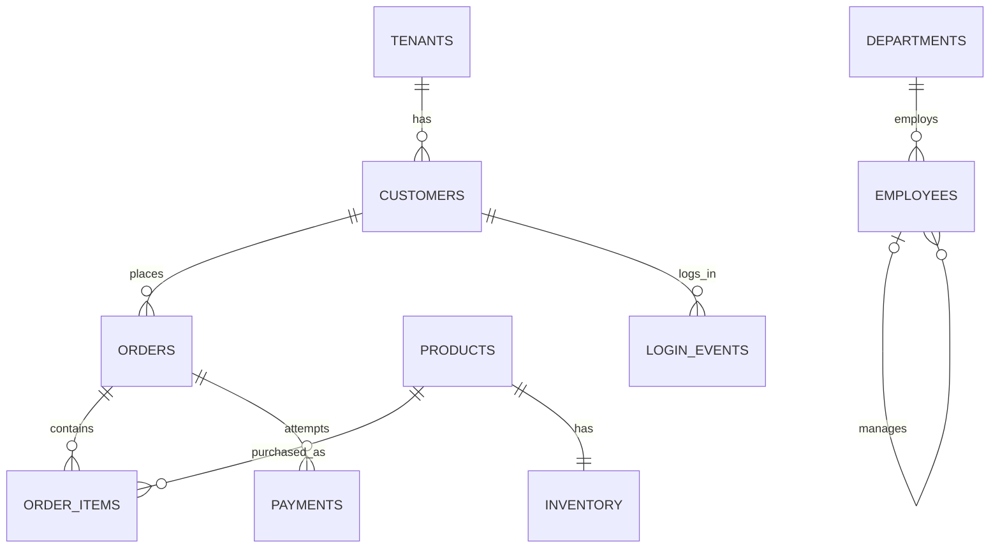

# PostgreSQL practice lab — tables, data, queries aur debugging

**Start:** create a separate training database → run schema → seed → exercises. PostgreSQL **15+** syntax; Docker example uses 17. Embedded checks ran on PostgreSQL 18.3/PGlite 0.5.8. Koi external extension required nahi for core exercises.

## Files and order

| File | Purpose |
|---|---|
| [01-schema.sql](01-schema.sql) | 11 related tables + order_totals view, constraints |
| [02-seed.sql](02-seed.sql) | deterministic sample INSERTs, edge cases |
| [03-exercises.md](03-exercises.md) | 40 questions, basics → window functions/recursive CTE |
| [04-solutions.sql](04-solutions.sql) | answers + why |
| [EXPECTED-RESULTS.md](EXPECTED-RESULTS.md) | expected result tables for all 40 |
| [05-indexing-lab.sql](05-indexing-lab.sql) | separate 100k-row table, EXPLAIN before/after |
| [06-concurrency-labs.md](06-concurrency-labs.md) | 8 interactive labs, independent sessions |
| [07-verify.sql](07-verify.sql) | seed sanity checks |
| [99-reset.sql](99-reset.sql) | explicit deletion of practice schema only |
| [verify.mjs](verify.mjs) | optional automated embedded PostgreSQL verification |

## Option A — already have PostgreSQL / pgAdmin / DBeaver

Create/connect to a dedicated database named `interview_practice`. In GUI query editor, run full [schema](01-schema.sql), then [seed](02-seed.sql), then [verify](07-verify.sql). These are plain SQL; `00-setup.sql` includes psql-specific commands and is **not** for GUI query tools.

psql alternative, from repository root (authentication via your usual PostgreSQL config):

```bash
createdb interview_practice
psql -X -v ON_ERROR_STOP=1 -d interview_practice -f postgres-practice/00-setup.sql
```

Existing database user/host not default? Add your `-h`, `-p`, `-U`. Schema must not already exist; setup deliberately refuses to overwrite work. After a script error in GUI, `ROLLBACK;` before retry. No production connection.

## Option B — Docker (local only)

With Docker Desktop/daemon running, from repository root:

```bash
docker compose -f postgres-practice/compose.yaml up -d --wait
docker compose -f postgres-practice/compose.yaml exec -T postgres psql -X -v ON_ERROR_STOP=1 -U practice -d interview_practice < postgres-practice/01-schema.sql
docker compose -f postgres-practice/compose.yaml exec -T postgres psql -X -v ON_ERROR_STOP=1 -U practice -d interview_practice < postgres-practice/02-seed.sql
docker compose -f postgres-practice/compose.yaml exec -T postgres psql -X -v ON_ERROR_STOP=1 -U practice -d interview_practice < postgres-practice/07-verify.sql
```

GUI connection: host `127.0.0.1`, port `55432`, DB `interview_practice`, user `practice`, password `practice_local_only`. This credential is a disposable local example. Data named Docker volume mein persists. Port occupied ho toh compose host port change karo. Stop via `docker compose -f postgres-practice/compose.yaml stop` (data retained).

## Every practice tab mein

```sql
SET search_path = interview_lab, public;
SET TIME ZONE 'UTC';
SELECT * FROM customers ORDER BY id;
```

Schema-qualified `interview_lab.customers` bhi use kar sakte ho. SQL solutions same schema search path use karte hain.

## Data model



11 tables: tenants, customers, products, orders, order_items, payments, departments, employees, login_events, inventory, webhook_events. Products shared catalog hain; composite order FK prevents customer from another tenant. Application auth/RLS still separate topic.

Seed has 8 customers, 12 orders, 15 line items, 10 payment attempts, 8 employees. Duplicate **names**, NULL cities, no-order customers, same-time orders, salary ties, empty department, failed-then-successful payment, repeat logins intentional hain. Emails/IDs constrained.

Revenue exercise definition: `orders.status='paid'`, purchase `unit_price × quantity`; pending/cancelled/refunded excluded. **Paid revenue = 18,300.00**, Alpha=4,900; Beta=13,400. Simplified learning model, not full accounting ledger. Dates fixed hain, output current date se change nahi hota.

## Practice plan

Day 1 Q1–10 basics/joins; day 2 Q11–20 aggregate/window/hierarchy; day 3 Q21–30 reconciliation/ranking; day 4 Q31–40 JSONB/pagination/streaks; day 5 indexing lab; day 6 concurrency labs; day 7 timed SQL mock and explain your choices aloud.

Har query mein: expected rows? duplicates? NULL? tie? wrong tenant? index? query scope? Wrong answer ko solutions se compare karne ke baad next day fresh likho.

## Index/concurrency labs ka execution

Index lab base dataset untouched rakhta hai. Run statements individually, especially VACUUM outside transactions. Plan choice and timing machine/version/cache ke across vary; no hardcoded “index always faster”. Two-session labs real PostgreSQL connections use karte hain, not two cursors on the same connection.

Reset only when ready to erase lab work: manually run [99-reset.sql](99-reset.sql), then schema + seed. It drops **all objects in interview_lab**, including your extra practice tables. No automatic reset on setup.

## Automated verification (optional)

From this folder: `npm install` then `npm test`. Requires Node.js 20+ and downloads the pinned dev dependency; actual PostgreSQL server installation not needed for these checks. Database is memory-only. Runner executes schema, all 40 answers, independent expected-value checks, integrity failures, sequential stock reservation and the 100k-row indexing SQL, then regenerates expected-result Markdown.

**Verified here:** all above checks passed in PGlite. **Not executed here:** real two-client lock/deadlock/serializable schedules or Docker startup (daemon was not running). PGlite verifies PostgreSQL SQL behavior for this dataset, not production server capacity/network/concurrency.
